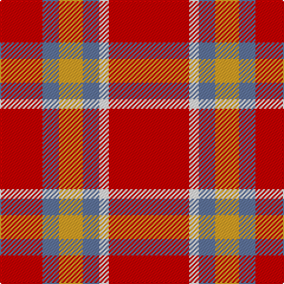

**Bands:** [RBYBWR](/stripes/rbybwr/) · **Stripes:** [R T LO T W R](/stripes/stripes6/) R T LO T W R

This was sourced from register-of-tartans.  It is a [6 band tartan](/bands/bands6/).

Original link https://www.tartanregister.gov.uk/tartanDetails.aspx?ref=11034

## Register references

External register numbers recorded for this tartan.

- Scottish Register of Tartans: [11034](https://www.tartanregister.gov.uk/tartanDetails.aspx?ref=11034)

## Thread count
R/36 B14 Y20 B14 W8 R/68

## Palette
Each colour and its ΔE from the base-6 reference it is a variant of.

| Colour | Shade | Base | ΔE (OKLab) |
|---|---|---|---|
| B | <code style="background-color:#5F749C;">#5F749C</code> `#5F749C` | B <code style="background-color:#2A418A;">#2A418A</code> | 0.17 |
| R | <code style="background-color:#C80000;">#C80000</code> `#C80000` | R <code style="background-color:#CC0000;">#CC0000</code> | 0.01 |
| W | <code style="background-color:#FCFCFC;">#FCFCFC</code> `#FCFCFC` | W <code style="background-color:#F7F7F7;">#F7F7F7</code> | 0.01 |
| Y | <code style="background-color:#E0A126;">#E0A126</code> `#E0A126` | Y <code style="background-color:#F2BF00;">#F2BF00</code> | 0.08 |

# Sample pattern

## Nearest tartans

The nearest existing variants by ΔTartan distance.

1. [Ploysongsang, Edward Thiravej (Pers](/setts/s6/r34w4t7ly10t7r18~x2/) — ΔT 0.73
1. [Claus of the North Pole (Restricted)](/setts/s7/r21g3r21g16lo3w2lo3~x2/) — ΔT 1.25
1. [Menzies #2](/setts/s5/r22g17w2lg6r19~x2/) — ΔT 1.47
1. [Auld Reekie](/setts/s6/db4r3db3r22g8r2~x2/) — ΔT 1.58
1. [Sinclair Dress](/setts/s5/r28dg16k4lb7r28/) — ΔT 1.58
1. [McPeek (Fashion)](/setts/s4/r125k26lb20lo16/) — ΔT 1.62
1. [Queen Alexandra](/setts/s10/dg4r2dg2r16lr2r3lr2r3lr8r3~x2/) — ΔT 1.66
1. [Queen Alexandra (Fashion)](/setts/s10/dg4r2dg2r16lr2r3lr2r3lr8r3~x4/) — ΔT 1.66
1. [Sinclair](/setts/s5/r30dg12k5lb8r30/) — ΔT 1.70
1. [Goodwillie (Fashion)](/setts/s8/r15dt5k2dt5r15p3r15w2~x2/) — ΔT 1.73

## Neighbour map

Every grey dot is one of 14313 variants placed by the first two principal components of the ΔTartan feature space (44% of its variance). Red is this tartan; blue dots are its nearest — click one to open its page.

<svg viewBox="0 0 640 380" role="img" style="max-width:100%;height:auto;border:1px solid #e0e0e0;border-radius:4px;display:block" xmlns="http://www.w3.org/2000/svg"><image href="/nn/cloud.v1.png" width="640" height="380"/><a href="/setts/s6/r34w4t7ly10t7r18~x2/"><circle cx="353.8" cy="200.6" r="4" fill="#3465a4"><title>Ploysongsang, Edward Thiravej (Pers</title></circle></a><a href="/setts/s7/r21g3r21g16lo3w2lo3~x2/"><circle cx="356.8" cy="192.2" r="4" fill="#3465a4"><title>Claus of the North Pole (Restricted)</title></circle></a><a href="/setts/s5/r22g17w2lg6r19~x2/"><circle cx="341.6" cy="229.0" r="4" fill="#3465a4"><title>Menzies #2</title></circle></a><a href="/setts/s6/db4r3db3r22g8r2~x2/"><circle cx="417.7" cy="207.4" r="4" fill="#3465a4"><title>Auld Reekie</title></circle></a><a href="/setts/s5/r28dg16k4lb7r28/"><circle cx="347.7" cy="234.1" r="4" fill="#3465a4"><title>Sinclair Dress</title></circle></a><a href="/setts/s4/r125k26lb20lo16/"><circle cx="377.1" cy="201.0" r="4" fill="#3465a4"><title>McPeek (Fashion)</title></circle></a><a href="/setts/s10/dg4r2dg2r16lr2r3lr2r3lr8r3~x2/"><circle cx="352.3" cy="189.2" r="4" fill="#3465a4"><title>Queen Alexandra</title></circle></a><a href="/setts/s10/dg4r2dg2r16lr2r3lr2r3lr8r3~x4/"><circle cx="352.3" cy="189.2" r="4" fill="#3465a4"><title>Queen Alexandra (Fashion)</title></circle></a><a href="/setts/s5/r30dg12k5lb8r30/"><circle cx="365.0" cy="234.7" r="4" fill="#3465a4"><title>Sinclair</title></circle></a><a href="/setts/s8/r15dt5k2dt5r15p3r15w2~x2/"><circle cx="397.7" cy="193.7" r="4" fill="#3465a4"><title>Goodwillie (Fashion)</title></circle></a><circle cx="374.6" cy="210.9" r="5" fill="#c00000"/></svg>

ID: /setts/s6/r34w4t7lo10t7r18~x2/
