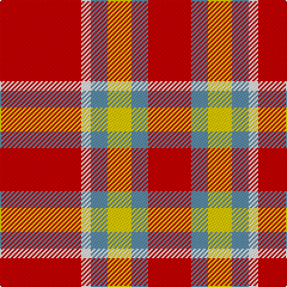

This page is one **sett** — a single exact thread-count. It belongs to the [tartan](/tartans/r34w4t7ly10t7r18/)
(the same proportion at any scale), whose colour order is pattern [RBYBWR](/stripes/rbybwr/).

Sourced from tartans-authority.  It is a [6 stripe tartan](/stripes/stripes6/).

Original link http://www.tartansauthority.com/tartan-ferret/display/11034/

## Also known as

This cloth is also recorded under:

- Ploysongsang, Edward Thiravej (Pers

## Thread count
R/68 W8 B14 Y20 B14 R/36

## Palette

Palette: <strong>Tartan Register</strong>
<table><thead><tr><th>Colour</th><th>Threads</th><th>Shade</th><th>Base</th><th>OKLCh</th></tr></thead><tbody><tr><td>R/</td><td style="text-align:right;font-variant-numeric:tabular-nums">68</td><td><code style="background-color:#C80000;">#C80000</code> <small style="color:#888">#C80000</small></td><td>R <code style="background-color:#CC0000;">#CC0000</code></td><td><small style="color:#888">oklch(52.3% 0.215 29.2)</small></td></tr><tr><td>W</td><td style="text-align:right;font-variant-numeric:tabular-nums">8</td><td><code style="background-color:#FCFCFC;">#FCFCFC</code> <small style="color:#888">#FCFCFC</small></td><td>W <code style="background-color:#F7F7F7;">#F7F7F7</code></td><td><small style="color:#888">oklch(99.1% 0.000 89.9)</small></td></tr><tr><td>B</td><td style="text-align:right;font-variant-numeric:tabular-nums">14</td><td><code style="background-color:#5C8CA8;">#5C8CA8</code> <small style="color:#888">#5C8CA8</small></td><td>B <code style="background-color:#2A418A;">#2A418A</code></td><td><small style="color:#888">oklch(61.7% 0.067 235.0)</small></td></tr><tr><td>Y</td><td style="text-align:right;font-variant-numeric:tabular-nums">20</td><td><code style="background-color:#FCCC00;">#FCCC00</code> <small style="color:#888">#FCCC00</small></td><td>Y <code style="background-color:#F2BF00;">#F2BF00</code></td><td><small style="color:#888">oklch(86.2% 0.176 91.5)</small></td></tr><tr><td>B</td><td style="text-align:right;font-variant-numeric:tabular-nums">14</td><td><code style="background-color:#5C8CA8;">#5C8CA8</code> <small style="color:#888">#5C8CA8</small></td><td>B <code style="background-color:#2A418A;">#2A418A</code></td><td><small style="color:#888">oklch(61.7% 0.067 235.0)</small></td></tr><tr><td>R/</td><td style="text-align:right;font-variant-numeric:tabular-nums">36</td><td><code style="background-color:#C80000;">#C80000</code> <small style="color:#888">#C80000</small></td><td>R <code style="background-color:#CC0000;">#CC0000</code></td><td><small style="color:#888">oklch(52.3% 0.215 29.2)</small></td></tr></tbody></table>

# Sample pattern

## Nearest tartans

The nearest existing variants by ΔTartan distance, with this tartan at the top so the swatches line up against it.

ΔTartan

Tartan

Sett

—

<a href="/ttd/edit/#slug=r34w4t7ly10t7r18~x2">Ploysongsang, Edward Thiravej (Pers</a> <a class="nn-out" href="/setts/s6/r34w4t7ly10t7r18~x2/" title="open its dictionary page">↗</a>

0.73

<a href="/ttd/edit/#slug=r34w4t7lo10t7r18~x2">Ploysongsang, Edward Thiravej (Personal)</a> <a class="nn-out" href="/setts/s6/r34w4t7lo10t7r18~x2/" title="open its dictionary page">↗</a>

1.20

<a href="/ttd/edit/#slug=r21g3r21g16lo3w2lo3~x2">Claus of the North Pole (Restricted)</a> <a class="nn-out" href="/setts/s7/r21g3r21g16lo3w2lo3~x2/" title="open its dictionary page">↗</a>

1.34

<a href="/ttd/edit/#slug=r28dg16k4lb7r28">Sinclair Dress</a> <a class="nn-out" href="/setts/s5/r28dg16k4lb7r28/" title="open its dictionary page">↗</a>

1.36

<a href="/ttd/edit/#slug=r22g17w2lg6r19~x2">Menzies #2</a> <a class="nn-out" href="/setts/s5/r22g17w2lg6r19~x2/" title="open its dictionary page">↗</a>

1.37

<a href="/ttd/edit/#slug=r125k26lb20lo16">McPeek (Fashion)</a> <a class="nn-out" href="/setts/s4/r125k26lb20lo16/" title="open its dictionary page">↗</a>

1.47

<a href="/ttd/edit/#slug=r30dg12k5lb8r30">Sinclair</a> <a class="nn-out" href="/setts/s5/r30dg12k5lb8r30/" title="open its dictionary page">↗</a>

1.53

<a href="/ttd/edit/#slug=r5g3lb3db5r16ly3~x2">McCartney (2015)</a> <a class="nn-out" href="/setts/s6/r5g3lb3db5r16ly3~x2/" title="open its dictionary page">↗</a>

1.59

<a href="/ttd/edit/#slug=w11r40g13r5g12r5~x2">Makhtoum</a> <a class="nn-out" href="/setts/s6/w11r40g13r5g12r5~x2/" title="open its dictionary page">↗</a>

1.60

<a href="/ttd/edit/#slug=dg4r2dg2r16lr2r3lr2r3lr8r3~x2">Queen Alexandra</a> <a class="nn-out" href="/setts/s10/dg4r2dg2r16lr2r3lr2r3lr8r3~x2/" title="open its dictionary page">↗</a>

1.60

<a href="/ttd/edit/#slug=dg4r2dg2r16lr2r3lr2r3lr8r3~x4">Queen Alexandra (Fashion)</a> <a class="nn-out" href="/setts/s10/dg4r2dg2r16lr2r3lr2r3lr8r3~x4/" title="open its dictionary page">↗</a>

## Neighbour map

Every grey dot is one of 14299 variants placed by the first two principal components of the ΔTartan feature space (44% of its variance). Red is this tartan; blue dots are its nearest — click one to open its page.

<svg viewBox="0 0 640 380" role="img" style="max-width:100%;height:auto;border:1px solid #e0e0e0;border-radius:4px;display:block" xmlns="http://www.w3.org/2000/svg"><image href="/nn/cloud.v1.png" width="640" height="380"/><a href="/setts/s6/r34w4t7lo10t7r18~x2/"><circle cx="374.1" cy="210.7" r="4" fill="#3465a4"><title>Ploysongsang, Edward Thiravej (Personal)</title></circle></a><a href="/setts/s7/r21g3r21g16lo3w2lo3~x2/"><circle cx="356.4" cy="192.1" r="4" fill="#3465a4"><title>Claus of the North Pole (Restricted)</title></circle></a><a href="/setts/s5/r28dg16k4lb7r28/"><circle cx="347.4" cy="233.8" r="4" fill="#3465a4"><title>Sinclair Dress</title></circle></a><a href="/setts/s5/r22g17w2lg6r19~x2/"><circle cx="341.3" cy="228.8" r="4" fill="#3465a4"><title>Menzies #2</title></circle></a><a href="/setts/s4/r125k26lb20lo16/"><circle cx="376.6" cy="200.7" r="4" fill="#3465a4"><title>McPeek (Fashion)</title></circle></a><a href="/setts/s5/r30dg12k5lb8r30/"><circle cx="364.7" cy="234.4" r="4" fill="#3465a4"><title>Sinclair</title></circle></a><a href="/setts/s6/r5g3lb3db5r16ly3~x2/"><circle cx="271.9" cy="199.0" r="4" fill="#3465a4"><title>McCartney (2015)</title></circle></a><a href="/setts/s6/w11r40g13r5g12r5~x2/"><circle cx="328.7" cy="216.4" r="4" fill="#3465a4"><title>Makhtoum</title></circle></a><a href="/setts/s10/dg4r2dg2r16lr2r3lr2r3lr8r3~x2/"><circle cx="351.8" cy="189.0" r="4" fill="#3465a4"><title>Queen Alexandra</title></circle></a><a href="/setts/s10/dg4r2dg2r16lr2r3lr2r3lr8r3~x4/"><circle cx="351.8" cy="189.0" r="4" fill="#3465a4"><title>Queen Alexandra (Fashion)</title></circle></a><circle cx="353.4" cy="200.3" r="5" fill="#c00000"/></svg>

ID: /setts/s6/r34w4t7ly10t7r18~x2/
