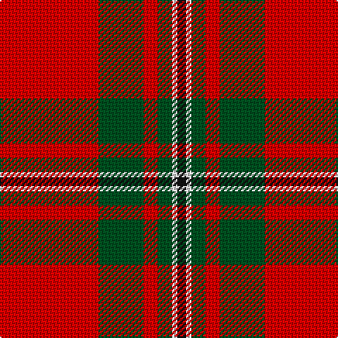

This page is one **sett** — a single exact thread-count. It belongs to the [tartan](/tartans/r35dg16r5dg5w2k3/)
(the same proportion at any scale), whose colour order is pattern [KWGRGR](/stripes/kwgrgr/).

Sourced from register-of-tartans.  It is a [6 stripe tartan](/stripes/stripes6/).

Original link https://www.tartanregister.gov.uk/tartanDetails.aspx?ref=2449

## Register references

External register numbers recorded for this tartan.

- Scottish Register of Tartans: [2449](https://www.tartanregister.gov.uk/tartanDetails.aspx?ref=2449)
- Scottish Tartans World Register: 1114

## Thread count
R/70 G32 R10 G10 LN4 K/6

## Palette

Palette: <strong>Tartan Register</strong>
<table><thead><tr><th>Colour</th><th>Threads</th><th>Shade</th><th>Base</th><th>OKLCh</th></tr></thead><tbody><tr><td>R/</td><td style="text-align:right;font-variant-numeric:tabular-nums">70</td><td><code style="background-color:#DC0000;">#DC0000</code> <small style="color:#888">#DC0000</small></td><td>R <code style="background-color:#CC0000;">#CC0000</code></td><td><small style="color:#888">oklch(56.2% 0.230 29.2)</small></td></tr><tr><td>G</td><td style="text-align:right;font-variant-numeric:tabular-nums">32</td><td><code style="background-color:#005020;">#005020</code> <small style="color:#888">#005020</small></td><td>G <code style="background-color:#006100;">#006100</code></td><td><small style="color:#888">oklch(37.7% 0.105 149.6)</small></td></tr><tr><td>R</td><td style="text-align:right;font-variant-numeric:tabular-nums">10</td><td><code style="background-color:#DC0000;">#DC0000</code> <small style="color:#888">#DC0000</small></td><td>R <code style="background-color:#CC0000;">#CC0000</code></td><td><small style="color:#888">oklch(56.2% 0.230 29.2)</small></td></tr><tr><td>G</td><td style="text-align:right;font-variant-numeric:tabular-nums">10</td><td><code style="background-color:#005020;">#005020</code> <small style="color:#888">#005020</small></td><td>G <code style="background-color:#006100;">#006100</code></td><td><small style="color:#888">oklch(37.7% 0.105 149.6)</small></td></tr><tr><td>LN</td><td style="text-align:right;font-variant-numeric:tabular-nums">4</td><td><code style="background-color:#E0E0E0;">#E0E0E0</code> <small style="color:#888">#E0E0E0</small></td><td>W <code style="background-color:#F7F7F7;">#F7F7F7</code></td><td><small style="color:#888">oklch(90.7% 0.000 89.9)</small></td></tr><tr><td>K/</td><td style="text-align:right;font-variant-numeric:tabular-nums">6</td><td><code style="background-color:#101010;">#101010</code> <small style="color:#888">#101010</small></td><td>K <code style="background-color:#000000;">#000000</code></td><td><small style="color:#888">oklch(17.3% 0.000 89.9)</small></td></tr></tbody></table>

# Sample pattern

## Nearest tartans

The nearest existing variants by ΔTartan distance, with this tartan at the top so the swatches line up against it.

ΔTartan

Tartan

Sett

—

<a href="/ttd/edit/#slug=r35dg16r5dg5w2k3~x2">MacGregor</a> <a class="nn-out" href="/setts/s6/r35dg16r5dg5w2k3~x2/" title="open its dictionary page">↗</a>

0.65

<a href="/ttd/edit/#slug=r35g16r5g5w2k3~x2">MacGregor</a> <a class="nn-out" href="/setts/s6/r35g16r5g5w2k3~x2/" title="open its dictionary page">↗</a>

0.95

<a href="/ttd/edit/#slug=r48k12o7k5w3~x2">Turner (Personal)</a> <a class="nn-out" href="/setts/s5/r48k12o7k5w3~x2/" title="open its dictionary page">↗</a>

0.97

<a href="/ttd/edit/#slug=r60k2w3dg20r10dg20~x2">Greig (Personal)</a> <a class="nn-out" href="/setts/s6/r60k2w3dg20r10dg20~x2/" title="open its dictionary page">↗</a>

0.98

<a href="/ttd/edit/#slug=r3g16r4k6r28g2lo3~x2">McInally (Name)</a> <a class="nn-out" href="/setts/s7/r3g16r4k6r28g2lo3~x2/" title="open its dictionary page">↗</a>

0.99

<a href="/ttd/edit/#slug=k1r18dg12r2dg12r18w1~x2">MacKinnon #4</a> <a class="nn-out" href="/setts/s7/k1r18dg12r2dg12r18w1~x2/" title="open its dictionary page">↗</a>

1.01

<a href="/ttd/edit/#slug=r5g20r5g3r4g5r36do2w4~x2">Baluch Regiment (Military)</a> <a class="nn-out" href="/setts/s9/r5g20r5g3r4g5r36do2w4~x2/" title="open its dictionary page">↗</a>

1.07

<a href="/ttd/edit/#slug=db4r50dg25w2~x2">Unidentified Locket</a> <a class="nn-out" href="/setts/s4/db4r50dg25w2~x2/" title="open its dictionary page">↗</a>

1.10

<a href="/ttd/edit/#slug=r100k15g48db5r7db16~x2">Plummer (Personal)</a> <a class="nn-out" href="/setts/s6/r100k15g48db5r7db16~x2/" title="open its dictionary page">↗</a>

1.11

<a href="/ttd/edit/#slug=r12g6k1g2k1g1k6r24w2~x4">Stuart of Bute, The Htg (Clan)</a> <a class="nn-out" href="/setts/s9/r12g6k1g2k1g1k6r24w2~x4/" title="open its dictionary page">↗</a>

1.11

<a href="/ttd/edit/#slug=r36dg18r4dg6k1w2~x2">MacGregor #3</a> <a class="nn-out" href="/setts/s6/r36dg18r4dg6k1w2~x2/" title="open its dictionary page">↗</a>

## Neighbour map

Every grey dot is one of 14359 variants placed by the first two principal components of the ΔTartan feature space (44% of its variance). Red is this tartan; blue dots are its nearest — click one to open its page.

<svg viewBox="0 0 640 380" role="img" style="max-width:100%;height:auto;border:1px solid #e0e0e0;border-radius:4px;display:block" xmlns="http://www.w3.org/2000/svg"><image href="/nn/cloud.v1.png" width="640" height="380"/><a href="/setts/s6/r35g16r5g5w2k3~x2/"><circle cx="379.2" cy="162.1" r="4" fill="#3465a4"><title>MacGregor</title></circle></a><a href="/setts/s5/r48k12o7k5w3~x2/"><circle cx="393.7" cy="161.6" r="4" fill="#3465a4"><title>Turner (Personal)</title></circle></a><a href="/setts/s6/r60k2w3dg20r10dg20~x2/"><circle cx="418.3" cy="151.3" r="4" fill="#3465a4"><title>Greig (Personal)</title></circle></a><a href="/setts/s7/r3g16r4k6r28g2lo3~x2/"><circle cx="344.4" cy="171.9" r="4" fill="#3465a4"><title>McInally (Name)</title></circle></a><a href="/setts/s7/k1r18dg12r2dg12r18w1~x2/"><circle cx="372.7" cy="180.1" r="4" fill="#3465a4"><title>MacKinnon #4</title></circle></a><a href="/setts/s9/r5g20r5g3r4g5r36do2w4~x2/"><circle cx="382.7" cy="141.7" r="4" fill="#3465a4"><title>Baluch Regiment (Military)</title></circle></a><a href="/setts/s4/db4r50dg25w2~x2/"><circle cx="413.4" cy="175.5" r="4" fill="#3465a4"><title>Unidentified Locket</title></circle></a><a href="/setts/s6/r100k15g48db5r7db16~x2/"><circle cx="355.2" cy="163.9" r="4" fill="#3465a4"><title>Plummer (Personal)</title></circle></a><a href="/setts/s9/r12g6k1g2k1g1k6r24w2~x4/"><circle cx="415.3" cy="125.3" r="4" fill="#3465a4"><title>Stuart of Bute, The Htg (Clan)</title></circle></a><a href="/setts/s6/r36dg18r4dg6k1w2~x2/"><circle cx="420.6" cy="134.5" r="4" fill="#3465a4"><title>MacGregor #3</title></circle></a><circle cx="386.2" cy="161.0" r="5" fill="#c00000"/></svg>

ID: /setts/s6/r35dg16r5dg5w2k3~x2/
