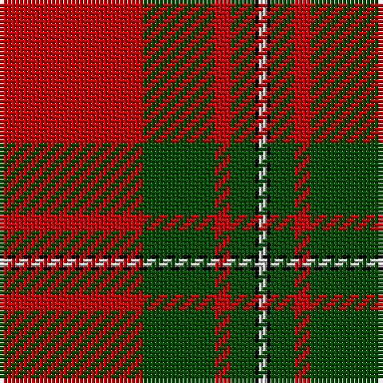

This page is one **sett** — a single exact thread-count. It belongs to the [tartan](/tartans/r36g18r4g6k1n2/)
(the same proportion at any scale), whose colour order is pattern [RGRGKW](/stripes/rgrgkw/).

Sourced from weddslist.  It is a [6 stripe tartan](/stripes/stripes6/).

Original link http://www.weddslist.com/cgi-bin/tartans/pg.pl?source=rb

## Thread count
R/36 G18 R4 G6 K1 N/2

## Palette
Each colour and the base-6 reference it is a variant of.

| Colour | Shade | Base |
|---|---|---|
| G | <code style="background-color:#004C00;">#004C00</code> `oklch(36.1% 0.123 142.5)` <small>#004C00</small> | G <code style="background-color:#006100;">#006100</code> |
| K | <code style="background-color:#000000;">#000000</code> `oklch(0.0% 0.000 0.0)` <small>#000000</small> | K <code style="background-color:#000000;">#000000</code> |
| N | <code style="background-color:#D0D0D0;">#D0D0D0</code> `oklch(85.8% 0.000 89.9)` <small>#D0D0D0</small> | W <code style="background-color:#F7F7F7;">#F7F7F7</code> |
| R | <code style="background-color:#C80000;">#C80000</code> `oklch(52.3% 0.215 29.2)` <small>#C80000</small> | R <code style="background-color:#CC0000;">#CC0000</code> |

# Sample pattern

## Nearest tartans

The nearest existing variants by ΔTartan distance, with this tartan at the top so the swatches line up against it.

ΔTartan

Tartan

Sett

—

<a href="/ttd/edit/#slug=r36dg18r4dg6k1lb2">MacGregor</a> <a class="nn-out" href="/setts/s6/r36dg18r4dg6k1lb2/" title="open its dictionary page">↗</a>

0.39

<a href="/ttd/edit/#slug=r36dg18r4dg6k1w2~x2">MacGregor #3</a> <a class="nn-out" href="/setts/s6/r36dg18r4dg6k1w2~x2/" title="open its dictionary page">↗</a>

0.48

<a href="/ttd/edit/#slug=r41g19r7g8k1w3~x2">MacGregor #4</a> <a class="nn-out" href="/setts/s6/r41g19r7g8k1w3~x2/" title="open its dictionary page">↗</a>

0.62

<a href="/ttd/edit/#slug=r36g18r4g6k1w2~x2">MacGregor</a> <a class="nn-out" href="/setts/s6/r36g18r4g6k1w2~x2/" title="open its dictionary page">↗</a>

0.63

<a href="/ttd/edit/#slug=r60k2w3dg20r10dg20~x2">Greig (Personal)</a> <a class="nn-out" href="/setts/s6/r60k2w3dg20r10dg20~x2/" title="open its dictionary page">↗</a>

0.97

<a href="/ttd/edit/#slug=r36dg18r4dg6k1lr2~x2">MacGregor</a> <a class="nn-out" href="/setts/s6/r36dg18r4dg6k1lr2~x2/" title="open its dictionary page">↗</a>

0.97

<a href="/ttd/edit/#slug=r36dg18r4dg6k1lr2">MacGregor</a> <a class="nn-out" href="/setts/s6/r36dg18r4dg6k1lr2/" title="open its dictionary page">↗</a>

0.99

<a href="/ttd/edit/#slug=r36g18r4g6k1lb2k1g2~x2">Strang (Personal)</a> <a class="nn-out" href="/setts/s8/r36g18r4g6k1lb2k1g2~x2/" title="open its dictionary page">↗</a>

1.05

<a href="/ttd/edit/#slug=r3g16r4k6r28g1r3~x2">Maxwell</a> <a class="nn-out" href="/setts/s7/r3g16r4k6r28g1r3~x2/" title="open its dictionary page">↗</a>

1.09

<a href="/ttd/edit/#slug=r57g21r8g8k1w3~x2">MacGregor - 1800 (Clan)</a> <a class="nn-out" href="/setts/s6/r57g21r8g8k1w3~x2/" title="open its dictionary page">↗</a>

1.09

<a href="/ttd/edit/#slug=r96g42r16g17k4y6">MacGregor, Glengyle</a> <a class="nn-out" href="/setts/s6/r96g42r16g17k4y6/" title="open its dictionary page">↗</a>

## Neighbour map

Every grey dot is one of 14299 variants placed by the first two principal components of the ΔTartan feature space (44% of its variance). Red is this tartan; blue dots are its nearest — click one to open its page.

<svg viewBox="0 0 640 380" role="img" style="max-width:100%;height:auto;border:1px solid #e0e0e0;border-radius:4px;display:block" xmlns="http://www.w3.org/2000/svg"><image href="/nn/cloud.v1.png" width="640" height="380"/><a href="/setts/s6/r36dg18r4dg6k1w2~x2/"><circle cx="422.0" cy="134.2" r="4" fill="#3465a4"><title>MacGregor #3</title></circle></a><a href="/setts/s6/r41g19r7g8k1w3~x2/"><circle cx="428.4" cy="137.8" r="4" fill="#3465a4"><title>MacGregor #4</title></circle></a><a href="/setts/s6/r36g18r4g6k1w2~x2/"><circle cx="422.3" cy="138.7" r="4" fill="#3465a4"><title>MacGregor</title></circle></a><a href="/setts/s6/r60k2w3dg20r10dg20~x2/"><circle cx="419.6" cy="150.9" r="4" fill="#3465a4"><title>Greig (Personal)</title></circle></a><a href="/setts/s6/r36dg18r4dg6k1lr2~x2/"><circle cx="451.1" cy="156.3" r="4" fill="#3465a4"><title>MacGregor</title></circle></a><a href="/setts/s6/r36dg18r4dg6k1lr2/"><circle cx="451.1" cy="156.3" r="4" fill="#3465a4"><title>MacGregor</title></circle></a><a href="/setts/s8/r36g18r4g6k1lb2k1g2~x2/"><circle cx="423.0" cy="123.2" r="4" fill="#3465a4"><title>Strang (Personal)</title></circle></a><a href="/setts/s7/r3g16r4k6r28g1r3~x2/"><circle cx="436.9" cy="163.2" r="4" fill="#3465a4"><title>Maxwell</title></circle></a><a href="/setts/s6/r57g21r8g8k1w3~x2/"><circle cx="478.8" cy="120.5" r="4" fill="#3465a4"><title>MacGregor - 1800 (Clan)</title></circle></a><a href="/setts/s6/r96g42r16g17k4y6/"><circle cx="422.6" cy="167.4" r="4" fill="#3465a4"><title>MacGregor, Glengyle</title></circle></a><circle cx="426.0" cy="139.6" r="5" fill="#c00000"/></svg>

ID: /setts/s6/r36dg18r4dg6k1lb2/
