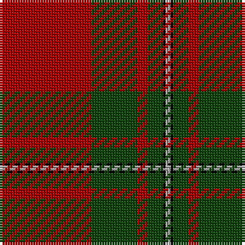

In pattern [RGRGKY](/stripes/rgrgky/).

This was sourced from weddslist.  It is a [6 stripe tartan](/stripes/stripes6/).

Original link http://www.weddslist.com/cgi-bin/tartans/pg.pl?source=x

## Thread count
DR/36 DG18 DR4 DG6 K1 N/2

## Palette
Each colour and the base-6 reference it is a variant of.

| Colour | Shade | Base |
|---|---|---|
| DG | <code style="background-color:#11450D;">#11450D</code> `oklch(34.4% 0.101 142.1)` <small>#11450D</small> | G <code style="background-color:#006100;">#006100</code> |
| DR | <code style="background-color:#AA0000;">#AA0000</code> `oklch(46.3% 0.190 29.2)` <small>#AA0000</small> | R <code style="background-color:#CC0000;">#CC0000</code> |
| K | <code style="background-color:#000000;">#000000</code> `oklch(0.0% 0.000 0.0)` <small>#000000</small> | K <code style="background-color:#000000;">#000000</code> |
| N | <code style="background-color:#AAAAAA;">#AAAAAA</code> `oklch(73.8% 0.000 89.9)` <small>#AAAAAA</small> | Y <code style="background-color:#F2BF00;">#F2BF00</code> |

# Sample pattern

## Nearest tartans

The nearest existing variants by ΔTartan distance, with this tartan at the top so the swatches line up against it.

ΔTartan

Tartan

Sett

—

<a href="/ttd/edit/#slug=r36dg18r4dg6k1lr2">MacGregor</a> <a class="nn-out" href="/setts/s6/r36dg18r4dg6k1lr2/" title="open its dictionary page">↗</a>

0.00

<a href="/ttd/edit/#slug=r36dg18r4dg6k1lr2~x2">MacGregor</a> <a class="nn-out" href="/setts/s6/r36dg18r4dg6k1lr2~x2/" title="open its dictionary page">↗</a>

0.97

<a href="/ttd/edit/#slug=r36dg18r4dg6k1lb2">MacGregor</a> <a class="nn-out" href="/setts/s6/r36dg18r4dg6k1lb2/" title="open its dictionary page">↗</a>

1.01

<a href="/ttd/edit/#slug=r96g42r16g17k4y6">MacGregor, Glengyle</a> <a class="nn-out" href="/setts/s6/r96g42r16g17k4y6/" title="open its dictionary page">↗</a>

1.08

<a href="/ttd/edit/#slug=r36g18r4g6k1lb2k1g2~x2">Strang (Personal)</a> <a class="nn-out" href="/setts/s8/r36g18r4g6k1lb2k1g2~x2/" title="open its dictionary page">↗</a>

1.13

<a href="/ttd/edit/#slug=r60k2w3dg20r10dg20~x2">Greig (Personal)</a> <a class="nn-out" href="/setts/s6/r60k2w3dg20r10dg20~x2/" title="open its dictionary page">↗</a>

1.14

<a href="/ttd/edit/#slug=r4k2dg28r38k1ly4~x2">Wcwm 9275 5471-1</a> <a class="nn-out" href="/setts/s6/r4k2dg28r38k1ly4~x2/" title="open its dictionary page">↗</a>

1.16

<a href="/ttd/edit/#slug=m96g42m16g17k4lb6">MacGregor Hunting Glengyle Clan Tartan Tartan Number: 1285. Earliest known date: 1960 This is the usual MacGregor sett but with a darker crimson background colour. The story goes that Alasdair MacGregor of Cardney wanted to make tartan from the wool of his own sheep. His initial dyeing attempt produced a shocking pink colour, so he dyed the wool a second time to get this dark crimson colour. He liked the result so much that he had a bolt of cloth woven and the Cardney MacGregors have worn it ever since. The addition of the term 'Hunting' to the name is, apparently a commercial attribution. Notes from the STA, quoting Sir Malcolm MacGregor of MacGregor (2006) See products available Copyright © Blair Urquhart, Comrie, 2015</a> <a class="nn-out" href="/setts/s6/m96g42m16g17k4lb6/" title="open its dictionary page">↗</a>

1.17

<a href="/ttd/edit/#slug=dg4r3k1r28dg14r4dg4lr3dg4r4~x2">Scott</a> <a class="nn-out" href="/setts/s10/dg4r3k1r28dg14r4dg4lr3dg4r4~x2/" title="open its dictionary page">↗</a>

1.19

<a href="/ttd/edit/#slug=r41g19r7g8k1w3~x2">MacGregor #4</a> <a class="nn-out" href="/setts/s6/r41g19r7g8k1w3~x2/" title="open its dictionary page">↗</a>

1.26

<a href="/ttd/edit/#slug=r36dg18r4dg6k1w2~x2">MacGregor #3</a> <a class="nn-out" href="/setts/s6/r36dg18r4dg6k1w2~x2/" title="open its dictionary page">↗</a>

## Neighbour map

Every grey dot is one of 14299 variants placed by the first two principal components of the ΔTartan feature space (44% of its variance). Red is this tartan; blue dots are its nearest — click one to open its page.

<svg viewBox="0 0 640 380" role="img" style="max-width:100%;height:auto;border:1px solid #e0e0e0;border-radius:4px;display:block" xmlns="http://www.w3.org/2000/svg"><image href="/nn/cloud.v1.png" width="640" height="380"/><a href="/setts/s6/r36dg18r4dg6k1lr2~x2/"><circle cx="451.1" cy="156.3" r="4" fill="#3465a4"><title>MacGregor</title></circle></a><a href="/setts/s6/r36dg18r4dg6k1lb2/"><circle cx="426.0" cy="139.6" r="4" fill="#3465a4"><title>MacGregor</title></circle></a><a href="/setts/s6/r96g42r16g17k4y6/"><circle cx="422.6" cy="167.4" r="4" fill="#3465a4"><title>MacGregor, Glengyle</title></circle></a><a href="/setts/s8/r36g18r4g6k1lb2k1g2~x2/"><circle cx="423.0" cy="123.2" r="4" fill="#3465a4"><title>Strang (Personal)</title></circle></a><a href="/setts/s6/r60k2w3dg20r10dg20~x2/"><circle cx="419.6" cy="150.9" r="4" fill="#3465a4"><title>Greig (Personal)</title></circle></a><a href="/setts/s6/r4k2dg28r38k1ly4~x2/"><circle cx="413.6" cy="158.3" r="4" fill="#3465a4"><title>Wcwm 9275 5471-1</title></circle></a><a href="/setts/s6/m96g42m16g17k4lb6/"><circle cx="429.7" cy="167.8" r="4" fill="#3465a4"><title>MacGregor Hunting Glengyle Clan Tartan Tartan Number: 1285. Earliest known date: 1960 This is the usual MacGregor sett but with a darker crimson background colour. The story goes that Alasdair MacGregor of Cardney wanted to make tartan from the wool of his own sheep. His initial dyeing attempt produced a shocking pink colour, so he dyed the wool a second time to get this dark crimson colour. He liked the result so much that he had a bolt of cloth woven and the Cardney MacGregors have worn it ever since. The addition of the term 'Hunting' to the name is, apparently a commercial attribution. Notes from the STA, quoting Sir Malcolm MacGregor of MacGregor (2006) See products available Copyright © Blair Urquhart, Comrie, 2015</title></circle></a><a href="/setts/s10/dg4r3k1r28dg14r4dg4lr3dg4r4~x2/"><circle cx="408.5" cy="141.2" r="4" fill="#3465a4"><title>Scott</title></circle></a><a href="/setts/s6/r41g19r7g8k1w3~x2/"><circle cx="428.4" cy="137.8" r="4" fill="#3465a4"><title>MacGregor #4</title></circle></a><a href="/setts/s6/r36dg18r4dg6k1w2~x2/"><circle cx="422.0" cy="134.2" r="4" fill="#3465a4"><title>MacGregor #3</title></circle></a><circle cx="451.1" cy="156.3" r="5" fill="#c00000"/></svg>

ID: /setts/s6/r36dg18r4dg6k1lr2/
