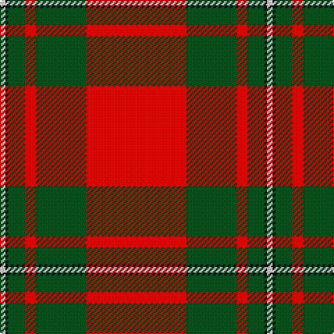

**Bands:** [RGRGKW](/stripes/rgrgkw/) · **Stripes:** [R DG R DG K W](/stripes/stripes6/) R DG R DG K W

This was sourced from register-of-tartans.  It is a [6 band tartan](/bands/bands6/).

Original link https://www.tartanregister.gov.uk/tartanDetails.aspx?ref=2451

## Register references

External register numbers recorded for this tartan.

- Scottish Register of Tartans: [2451](https://www.tartanregister.gov.uk/tartanDetails.aspx?ref=2451)
- Scottish Tartans World Register: 1526

## Thread count
LN/4 K2 G12 R8 G36 R/72

## Palette
Each colour and its ΔE from the base-6 reference it is a variant of.

| Colour | Shade | Base | ΔE (OKLab) |
|---|---|---|---|
| G | <code style="background-color:#005020;">#005020</code> `#005020` | G <code style="background-color:#006100;">#006100</code> | 0.07 |
| K | <code style="background-color:#101010;">#101010</code> `#101010` | K <code style="background-color:#000000;">#000000</code> | 0.17 |
| LN | <code style="background-color:#E0E0E0;">#E0E0E0</code> `#E0E0E0` | W <code style="background-color:#F7F7F7;">#F7F7F7</code> | 0.07 |
| R | <code style="background-color:#DC0000;">#DC0000</code> `#DC0000` | R <code style="background-color:#CC0000;">#CC0000</code> | 0.03 |

# Sample pattern

## Nearest tartans

The nearest existing variants by ΔTartan distance.

1. [MacGregor](/setts/s6/r36dg18r4dg6k1lb2~x2/) — ΔT 0.39
1. [MacGregor #4](/setts/s6/r41g19r7g8k1w3~x2/) — ΔT 0.47
1. [Greig (Personal)](/setts/s6/r60k2w3dg20r10dg20~x2/) — ΔT 0.64
1. [MacGregor](/setts/s6/r36g18r4g6k1w2~x2/) — ΔT 0.73
1. [MacGregor - 1800 (Clan)](/setts/s6/r57g21r8g8k1w3~x2/) — ΔT 0.99
1. [National Defense](/setts/s6/r40w2db2w2r1ly20~x2/) — ΔT 1.04
1. [Robertson](/setts/s6/r2dg20r2db8r36dg1~x2/) — ΔT 1.07
1. [Maxwell Ancient](/setts/s7/r3dg16r4k6r28dg1r3~x2/) — ΔT 1.08
1. [Maxwell](/setts/s7/r3g16r4k6r28g1r3~x2/) — ΔT 1.11
1. [MacGregor](/setts/s6/r35dg16r5dg5w2k3~x2/) — ΔT 1.11

## Neighbour map

Every grey dot is one of 14313 variants placed by the first two principal components of the ΔTartan feature space (44% of its variance). Red is this tartan; blue dots are its nearest — click one to open its page.

<svg viewBox="0 0 640 380" role="img" style="max-width:100%;height:auto;border:1px solid #e0e0e0;border-radius:4px;display:block" xmlns="http://www.w3.org/2000/svg"><image href="/nn/cloud.v1.png" width="640" height="380"/><a href="/setts/s6/r36dg18r4dg6k1lb2~x2/"><circle cx="426.4" cy="139.8" r="4" fill="#3465a4"><title>MacGregor</title></circle></a><a href="/setts/s6/r41g19r7g8k1w3~x2/"><circle cx="428.9" cy="138.0" r="4" fill="#3465a4"><title>MacGregor #4</title></circle></a><a href="/setts/s6/r60k2w3dg20r10dg20~x2/"><circle cx="420.0" cy="151.1" r="4" fill="#3465a4"><title>Greig (Personal)</title></circle></a><a href="/setts/s6/r36g18r4g6k1w2~x2/"><circle cx="422.7" cy="138.9" r="4" fill="#3465a4"><title>MacGregor</title></circle></a><a href="/setts/s6/r57g21r8g8k1w3~x2/"><circle cx="479.4" cy="120.8" r="4" fill="#3465a4"><title>MacGregor - 1800 (Clan)</title></circle></a><a href="/setts/s6/r40w2db2w2r1ly20~x2/"><circle cx="409.9" cy="104.4" r="4" fill="#3465a4"><title>National Defense</title></circle></a><a href="/setts/s6/r2dg20r2db8r36dg1~x2/"><circle cx="425.3" cy="154.2" r="4" fill="#3465a4"><title>Robertson</title></circle></a><a href="/setts/s7/r3dg16r4k6r28dg1r3~x2/"><circle cx="429.1" cy="156.3" r="4" fill="#3465a4"><title>Maxwell Ancient</title></circle></a><a href="/setts/s7/r3g16r4k6r28g1r3~x2/"><circle cx="437.3" cy="163.5" r="4" fill="#3465a4"><title>Maxwell</title></circle></a><a href="/setts/s6/r35dg16r5dg5w2k3~x2/"><circle cx="388.0" cy="160.7" r="4" fill="#3465a4"><title>MacGregor</title></circle></a><circle cx="422.5" cy="134.4" r="5" fill="#c00000"/></svg>

ID: /setts/s6/r36dg18r4dg6k1w2~x2/
