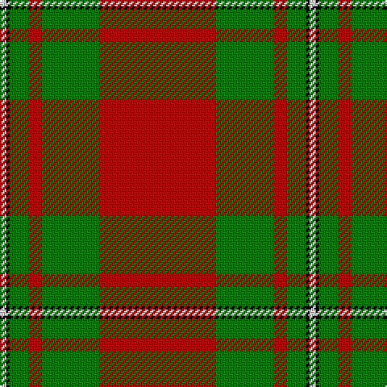

This page is one **sett** — a single exact thread-count. It belongs to the [tartan](/tartans/r36g18r4g6k1w2/)
(the same proportion at any scale), whose colour order is pattern [RGRGKW](/stripes/rgrgkw/).

Sourced from weddslist.  It is a [6 stripe tartan](/stripes/stripes6/).

Original link http://www.weddslist.com/cgi-bin/tartans/pg.pl?source=sts

2 attestations — the source records this cloth was collapsed from (oldest owns this page)

<ul>
<li>undated — MacGregor (weddslist, <a href="http://www.weddslist.com/cgi-bin/tartans/pg.pl?source=sts">record</a>)</li>
<li>undated — MacGregor Clan Tartan Tartan Number: 1526. Earliest known date: 1815 A sample of this tartan can be seen in the Cockburn Collection (1810-20) in the Mitchell library in Glasgow. MacGregor is one of the patterns labelled in 1815 in General Cockburn's hand writing. The same pattern is recorded by Wilson in the Key pattern book dating 1819 under the name 'MacGregor Murray Tartan'. Logan (1831) calls it simply 'MacGregor'. There is also a certified MacGregor tartan (for undress) called 'Rob Roy', a simple red and black check. See products available Copyright © Blair Urquhart, Comrie, 2015 (house-of-tartan, <a href="http://www.house-of-tartan.scotland.net/house/TartanViewjs.asp?colr=Def&tnam=1526">record</a>)</li>
</ul>

## Thread count
R/72 G36 R8 G12 K2 LN/4

## Palette

Palette: <strong>Tartan Register</strong> <small style="color:#888">(2 of 4 colours)</small>
<table><thead><tr><th>Colour</th><th>Threads</th><th>Shade</th><th>Base</th><th>OKLCh</th></tr></thead><tbody><tr><td>R/</td><td style="text-align:right;font-variant-numeric:tabular-nums">72</td><td><code style="background-color:#C00000;">#C00000</code> <small style="color:#888">#C00000</small></td><td>R <code style="background-color:#CC0000;">#CC0000</code></td><td><small style="color:#888">oklch(50.7% 0.208 29.2)</small></td></tr><tr><td>G</td><td style="text-align:right;font-variant-numeric:tabular-nums">36</td><td><code style="background-color:#008000;">#008000</code> <small style="color:#888">#008000</small></td><td>G <code style="background-color:#006100;">#006100</code></td><td><small style="color:#888">oklch(52.0% 0.177 142.5)</small></td></tr><tr><td>R</td><td style="text-align:right;font-variant-numeric:tabular-nums">8</td><td><code style="background-color:#C00000;">#C00000</code> <small style="color:#888">#C00000</small></td><td>R <code style="background-color:#CC0000;">#CC0000</code></td><td><small style="color:#888">oklch(50.7% 0.208 29.2)</small></td></tr><tr><td>G</td><td style="text-align:right;font-variant-numeric:tabular-nums">12</td><td><code style="background-color:#008000;">#008000</code> <small style="color:#888">#008000</small></td><td>G <code style="background-color:#006100;">#006100</code></td><td><small style="color:#888">oklch(52.0% 0.177 142.5)</small></td></tr><tr><td>K</td><td style="text-align:right;font-variant-numeric:tabular-nums">2</td><td><code style="background-color:#000000;">#000000</code> <small style="color:#888">#000000</small></td><td>K <code style="background-color:#000000;">#000000</code></td><td><small style="color:#888">oklch(0.0% 0.000 0.0)</small></td></tr><tr><td>LN/</td><td style="text-align:right;font-variant-numeric:tabular-nums">4</td><td><code style="background-color:#E0E0E0;">#E0E0E0</code> <small style="color:#888">#E0E0E0</small></td><td>W <code style="background-color:#F7F7F7;">#F7F7F7</code></td><td><small style="color:#888">oklch(90.7% 0.000 89.9)</small></td></tr></tbody></table>

# Sample pattern

## Nearest tartans

The nearest existing variants by ΔTartan distance, with this tartan at the top so the swatches line up against it.

ΔTartan

Tartan

Sett

—

<a href="/ttd/edit/#slug=r36g18r4g6k1w2~x2">MacGregor</a> <a class="nn-out" href="/setts/s6/r36g18r4g6k1w2~x2/" title="open its dictionary page">↗</a>

0.48

<a href="/ttd/edit/#slug=r41g19r7g8k1w3~x2">MacGregor #4</a> <a class="nn-out" href="/setts/s6/r41g19r7g8k1w3~x2/" title="open its dictionary page">↗</a>

0.61

<a href="/ttd/edit/#slug=r36dg18r4dg6k1lb2">MacGregor</a> <a class="nn-out" href="/setts/s6/r36dg18r4dg6k1lb2/" title="open its dictionary page">↗</a>

0.72

<a href="/ttd/edit/#slug=r36dg18r4dg6k1w2~x2">MacGregor #3</a> <a class="nn-out" href="/setts/s6/r36dg18r4dg6k1w2~x2/" title="open its dictionary page">↗</a>

0.97

<a href="/ttd/edit/#slug=g10r4g46r69k2w6">Colchester &amp; District Pipes &amp; Drums</a> <a class="nn-out" href="/setts/s6/g10r4g46r69k2w6/" title="open its dictionary page">↗</a>

1.01

<a href="/ttd/edit/#slug=r57g21r8g8k1w3~x2">MacGregor - 1800 (Clan)</a> <a class="nn-out" href="/setts/s6/r57g21r8g8k1w3~x2/" title="open its dictionary page">↗</a>

1.02

<a href="/ttd/edit/#slug=r36g18r4g6k1lb2k1g2~x2">Strang (Personal)</a> <a class="nn-out" href="/setts/s8/r36g18r4g6k1lb2k1g2~x2/" title="open its dictionary page">↗</a>

1.14

<a href="/ttd/edit/#slug=r60k2w3dg20r10dg20~x2">Greig (Personal)</a> <a class="nn-out" href="/setts/s6/r60k2w3dg20r10dg20~x2/" title="open its dictionary page">↗</a>

1.16

<a href="/ttd/edit/#slug=db4r50g25w2~x2">Unidentified, Locket</a> <a class="nn-out" href="/setts/s4/db4r50g25w2~x2/" title="open its dictionary page">↗</a>

1.18

<a href="/ttd/edit/#slug=r4g4w3g4r4g14r28k1r3g4~x2">Scott - 1842 (Clan)</a> <a class="nn-out" href="/setts/s10/r4g4w3g4r4g14r28k1r3g4~x2/" title="open its dictionary page">↗</a>

1.18

<a href="/ttd/edit/#slug=r35g16r5g5w2k3~x2">MacGregor</a> <a class="nn-out" href="/setts/s6/r35g16r5g5w2k3~x2/" title="open its dictionary page">↗</a>

## Neighbour map

Every grey dot is one of 14359 variants placed by the first two principal components of the ΔTartan feature space (44% of its variance). Red is this tartan; blue dots are its nearest — click one to open its page.

<svg viewBox="0 0 640 380" role="img" style="max-width:100%;height:auto;border:1px solid #e0e0e0;border-radius:4px;display:block" xmlns="http://www.w3.org/2000/svg"><image href="/nn/cloud.v1.png" width="640" height="380"/><a href="/setts/s6/r41g19r7g8k1w3~x2/"><circle cx="427.1" cy="138.0" r="4" fill="#3465a4"><title>MacGregor #4</title></circle></a><a href="/setts/s6/r36dg18r4dg6k1lb2/"><circle cx="424.7" cy="139.9" r="4" fill="#3465a4"><title>MacGregor</title></circle></a><a href="/setts/s6/r36dg18r4dg6k1w2~x2/"><circle cx="420.6" cy="134.5" r="4" fill="#3465a4"><title>MacGregor #3</title></circle></a><a href="/setts/s6/g10r4g46r69k2w6/"><circle cx="377.6" cy="129.2" r="4" fill="#3465a4"><title>Colchester &amp; District Pipes &amp; Drums</title></circle></a><a href="/setts/s6/r57g21r8g8k1w3~x2/"><circle cx="477.2" cy="120.6" r="4" fill="#3465a4"><title>MacGregor - 1800 (Clan)</title></circle></a><a href="/setts/s8/r36g18r4g6k1lb2k1g2~x2/"><circle cx="421.8" cy="123.4" r="4" fill="#3465a4"><title>Strang (Personal)</title></circle></a><a href="/setts/s6/r60k2w3dg20r10dg20~x2/"><circle cx="418.3" cy="151.3" r="4" fill="#3465a4"><title>Greig (Personal)</title></circle></a><a href="/setts/s4/db4r50g25w2~x2/"><circle cx="418.6" cy="182.2" r="4" fill="#3465a4"><title>Unidentified, Locket</title></circle></a><a href="/setts/s10/r4g4w3g4r4g14r28k1r3g4~x2/"><circle cx="380.5" cy="123.6" r="4" fill="#3465a4"><title>Scott - 1842 (Clan)</title></circle></a><a href="/setts/s6/r35g16r5g5w2k3~x2/"><circle cx="379.2" cy="162.1" r="4" fill="#3465a4"><title>MacGregor</title></circle></a><circle cx="420.9" cy="138.9" r="5" fill="#c00000"/></svg>

ID: /setts/s6/r36g18r4g6k1w2~x2/
