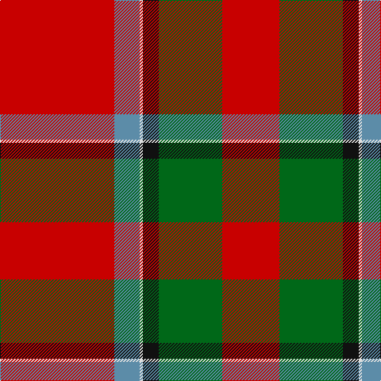

This page is one **sett** — a single exact thread-count. It belongs to the [tartan](/tartans/r36t8w1k5g20r18/)
(the same proportion at any scale), whose colour order is pattern [RBWKGR](/stripes/rbwkgr/).

Sourced from logan-1831.  It is a [6 stripe tartan](/stripes/stripes6/).

Original link /posts/logans-scottish-gael/

## Provenance

<figure class="logan-scan">

<figcaption>Logan, The Scottish Gaël (1831), vol. II p. 408 — page-scan crop (349,1294)–(605,1556)</figcaption>
</figure>

James Logan recorded the **Sinclair** sett in 1831, on page 408 of the *Table of Clan Tartans* in *The Scottish Gaël* — the earliest systematic published collection of clan setts. Logan gives the stripe widths in eighths of an inch, measured across the cloth and reflected about each end (a half-sett):

> 9 red · 10 green · 2½ black · ½ white · 4 azure · 18 red

In threads (at 8 to the eighth-inch) that is `R/72 G80 K20 W4 A32 R/144`. Logan named his colours rather than dyeing to a standard, so the palette here is the Dictionary's modern reading of his names.

See [Logan's Scottish Gaël](/posts/logans-scottish-gael/) for the full table and method.

## Related setts

Later records of the **Sinclair** name adjusted Logan's counts: [Sinclair (Logan)](/setts/s6/r28g16k4w1b6r28~b202060-g006818-k101010-rc80000-we0e0e0~x2/); [Sinclair](/setts/s10/r30g12k5w2b6r30b12w2k5g12~b2c2c80-g006818-k101010-rc80000-we0e0e0~x2/); [Sinclair Dress (Dance)](/setts/s12/b4r2b31k10g4w21g2w21g4k10b31r2~b38409c-g006818-k101010-rc80000-we0e0e0~x2/); [Sinclair Green (Personal)](/setts/s7/g4r2g30b15w2ba15r4~b5c5c5c-ba1c0070-g006818-r880000-wfcfcfc~x2/). Compare their thread counts with Logan's above.

## Thread count
R/144 B32 LN4 K20 G80 R/72

## Palette

Palette: <strong>Tartan Register</strong>
<table><thead><tr><th>Colour</th><th>Threads</th><th>Shade</th><th>Base</th><th>OKLCh</th></tr></thead><tbody><tr><td>R/</td><td style="text-align:right;font-variant-numeric:tabular-nums">144</td><td><code style="background-color:#C80000;">#C80000</code> <small style="color:#888">#C80000</small></td><td>R <code style="background-color:#CC0000;">#CC0000</code></td><td><small style="color:#888">oklch(52.3% 0.215 29.2)</small></td></tr><tr><td>B</td><td style="text-align:right;font-variant-numeric:tabular-nums">32</td><td><code style="background-color:#5C8CA8;">#5C8CA8</code> <small style="color:#888">#5C8CA8</small></td><td>B <code style="background-color:#2A418A;">#2A418A</code></td><td><small style="color:#888">oklch(61.7% 0.067 235.0)</small></td></tr><tr><td>LN</td><td style="text-align:right;font-variant-numeric:tabular-nums">4</td><td><code style="background-color:#E0E0E0;">#E0E0E0</code> <small style="color:#888">#E0E0E0</small></td><td>W <code style="background-color:#F7F7F7;">#F7F7F7</code></td><td><small style="color:#888">oklch(90.7% 0.000 89.9)</small></td></tr><tr><td>K</td><td style="text-align:right;font-variant-numeric:tabular-nums">20</td><td><code style="background-color:#101010;">#101010</code> <small style="color:#888">#101010</small></td><td>K <code style="background-color:#000000;">#000000</code></td><td><small style="color:#888">oklch(17.3% 0.000 89.9)</small></td></tr><tr><td>G</td><td style="text-align:right;font-variant-numeric:tabular-nums">80</td><td><code style="background-color:#006818;">#006818</code> <small style="color:#888">#006818</small></td><td>G <code style="background-color:#006100;">#006100</code></td><td><small style="color:#888">oklch(45.0% 0.142 145.0)</small></td></tr><tr><td>R/</td><td style="text-align:right;font-variant-numeric:tabular-nums">72</td><td><code style="background-color:#C80000;">#C80000</code> <small style="color:#888">#C80000</small></td><td>R <code style="background-color:#CC0000;">#CC0000</code></td><td><small style="color:#888">oklch(52.3% 0.215 29.2)</small></td></tr></tbody></table>

# Sample pattern

## Nearest tartans

The nearest existing variants by ΔTartan distance, with this tartan at the top so the swatches line up against it.

ΔTartan

Tartan

Sett

—

<a href="/ttd/edit/#slug=r36t8w1k5g20r18~x4">Sinclair</a> <a class="nn-out" href="/setts/s6/r36t8w1k5g20r18~x4/" title="open its dictionary page">↗</a>

0.71

<a href="/ttd/edit/#slug=g15k10r30dp2r20w1~x2">Kinnaird (Name)</a> <a class="nn-out" href="/setts/s6/g15k10r30dp2r20w1~x2/" title="open its dictionary page">↗</a>

0.94

<a href="/ttd/edit/#slug=r28g16k4w1t6r28~x2">Sinclair</a> <a class="nn-out" href="/setts/s6/r28g16k4w1t6r28~x2/" title="open its dictionary page">↗</a>

0.96

<a href="/ttd/edit/#slug=r28g16k4w1db6r28~x2">Sinclair (Logan)</a> <a class="nn-out" href="/setts/s6/r28g16k4w1db6r28~x2/" title="open its dictionary page">↗</a>

1.01

<a href="/ttd/edit/#slug=r40b8r6g24t1k4~x2">MacPhail (Blue Bands)</a> <a class="nn-out" href="/setts/s6/r40b8r6g24t1k4~x2/" title="open its dictionary page">↗</a>

1.11

<a href="/ttd/edit/#slug=r28dg16k4lr1b6r28~x2">Sinclair Dress</a> <a class="nn-out" href="/setts/s6/r28dg16k4lr1b6r28~x2/" title="open its dictionary page">↗</a>

1.11

<a href="/ttd/edit/#slug=r28dg16k4lr1b6r28">Sinclair Dress</a> <a class="nn-out" href="/setts/s6/r28dg16k4lr1b6r28/" title="open its dictionary page">↗</a>

1.27

<a href="/ttd/edit/#slug=r25db7r3g13t1k2~x4">MacPhail</a> <a class="nn-out" href="/setts/s6/r25db7r3g13t1k2~x4/" title="open its dictionary page">↗</a>

1.31

<a href="/ttd/edit/#slug=r52b16k16g22r16lo3r16~x2">Sturrock, Blue/Black (Clan)</a> <a class="nn-out" href="/setts/s7/r52b16k16g22r16lo3r16~x2/" title="open its dictionary page">↗</a>

1.32

<a href="/ttd/edit/#slug=r41g19r7g8k1w3~x2">MacGregor #4</a> <a class="nn-out" href="/setts/s6/r41g19r7g8k1w3~x2/" title="open its dictionary page">↗</a>

1.36

<a href="/setts/s8/r24t3w1g9r12~x8/">Menzies</a>

## Neighbour map

Every grey dot is one of 14299 variants placed by the first two principal components of the ΔTartan feature space (44% of its variance). Red is this tartan; blue dots are its nearest — click one to open its page.

<svg viewBox="0 0 640 380" role="img" style="max-width:100%;height:auto;border:1px solid #e0e0e0;border-radius:4px;display:block" xmlns="http://www.w3.org/2000/svg"><image href="/nn/cloud.v1.png" width="640" height="380"/><a href="/setts/s6/g15k10r30dp2r20w1~x2/"><circle cx="397.5" cy="161.6" r="4" fill="#3465a4"><title>Kinnaird (Name)</title></circle></a><a href="/setts/s6/r28g16k4w1t6r28~x2/"><circle cx="404.0" cy="151.7" r="4" fill="#3465a4"><title>Sinclair</title></circle></a><a href="/setts/s6/r28g16k4w1db6r28~x2/"><circle cx="416.0" cy="156.4" r="4" fill="#3465a4"><title>Sinclair (Logan)</title></circle></a><a href="/setts/s6/r40b8r6g24t1k4~x2/"><circle cx="364.3" cy="130.5" r="4" fill="#3465a4"><title>MacPhail (Blue Bands)</title></circle></a><a href="/setts/s6/r28dg16k4lr1b6r28~x2/"><circle cx="424.1" cy="165.5" r="4" fill="#3465a4"><title>Sinclair Dress</title></circle></a><a href="/setts/s6/r28dg16k4lr1b6r28/"><circle cx="424.1" cy="165.5" r="4" fill="#3465a4"><title>Sinclair Dress</title></circle></a><a href="/setts/s6/r25db7r3g13t1k2~x4/"><circle cx="328.4" cy="142.6" r="4" fill="#3465a4"><title>MacPhail</title></circle></a><a href="/setts/s7/r52b16k16g22r16lo3r16~x2/"><circle cx="317.0" cy="172.8" r="4" fill="#3465a4"><title>Sturrock, Blue/Black (Clan)</title></circle></a><a href="/setts/s6/r41g19r7g8k1w3~x2/"><circle cx="428.4" cy="137.8" r="4" fill="#3465a4"><title>MacGregor #4</title></circle></a><a href="/setts/s8/r24t3w1g9r12~x8/"><circle cx="374.1" cy="154.9" r="4" fill="#3465a4"><title>Menzies</title></circle></a><circle cx="380.1" cy="147.4" r="5" fill="#c00000"/></svg>

ID: /setts/s6/r36t8w1k5g20r18~x4/
