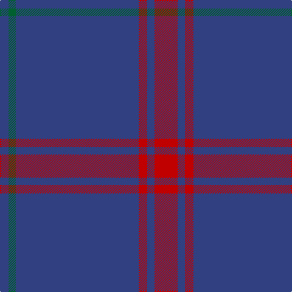

In pattern [BGBRBR](/patterns/bgbrbr/).

This was sourced from weddslist.  It is a [6 stripes tartan](/stripes/stripes6/).

Original link http://www.weddslist.com/cgi-bin/tartans/pg.pl?source=sts

## Thread count
B/14 G12 B202 R14 B12 R/38

## Palette
Each colour and its ΔE from the base-6 reference it is a variant of.

| Colour | Shade | Base | ΔE (OKLab) |
|---|---|---|---|
| B | <code style="background-color:#304080;">#304080</code> `#304080` | B <code style="background-color:#2C4084;">#2C4084</code> | 0.01 |
| G | <code style="background-color:#006030;">#006030</code> `#006030` | G <code style="background-color:#006400;">#006400</code> | 0.04 |
| R | <code style="background-color:#C00000;">#C00000</code> `#C00000` | R <code style="background-color:#C80000;">#C80000</code> | 0.02 |

# Sample pattern

## Nearest tartans

The nearest existing variants by ΔTartan distance.

1. [Lynch](/setts/s6/r12b8r4b72g4b8-b2c2c80-g007c00-rc80000/) — ΔT 1.13
1. [Lynch Family Tartan Tartan Number: 2163. Earliest known date: 1994 Information from Dr. Phil Smith, Narvon, USA. See products available Copyright © Blair Urquhart, Comrie, 2015](/setts/s6/r19b6r14b101g7b7-b2c2c80-g006818-rc80000/) — ΔT 1.30
1. [GulfMark](/setts/s5/b144ba12b24ba34w12-b3c4266-ba6675a0-wffffff/) — ΔT 1.53
1. [Auchairne (Corporate)](/setts/s6/b22ba14b6ba140w8ba12-b1474b4-ba1c1c50-w98c8e8/) — ΔT 1.66
1. [Norsemen, The](/setts/s6/b130k4b8ka4b20r48-b36648b-k101010-ka000000-r800000/) — ΔT 1.68
1. [Lochaber #3](/setts/s4/b2ba2b16r2-b2c4084-ba3c82af-rdc0000/) — ΔT 1.80
1. [Seletar Shipping (Corporate)](/setts/s10/b12y4b14g8b6g12b4g8b78ya4-b2c2c80-g006818-ya08858-yae8c000/) — ΔT 1.88
1. [United French Freemasons (Corporate](/setts/s6/b144r9ba44b4ba4b4-b202060-ba2888c4-r880000/) — ΔT 1.88
1. [MacLaine of Lochbuie Hunting](/setts/s5/b64r6b8k4y6-b14283c-k101010-r880000-yd09800/) — ΔT 1.90
1. [Burnett's & Struth (Corporate)](/setts/s5/b136ba14b32k32y8-b24486c-ba1870a4-k101010-ybc8c00/) — ΔT 1.90

## Neighbour map

Every grey dot is one of 15726 variants placed by the first two principal components of the ΔTartan feature space (44% of its variance). Red is this tartan; blue dots are its nearest — click one to open its page.

<svg viewBox="0 0 640 380" role="img" style="max-width:100%;height:auto;border:1px solid #e0e0e0;border-radius:4px;display:block" xmlns="http://www.w3.org/2000/svg"><image href="/nn/cloud.v1.png" width="640" height="380"/><a href="/setts/s6/r12b8r4b72g4b8-b2c2c80-g007c00-rc80000/"><circle cx="601.5" cy="201.2" r="4" fill="#3465a4"><title>Lynch</title></circle></a><a href="/setts/s6/r19b6r14b101g7b7-b2c2c80-g006818-rc80000/"><circle cx="530.0" cy="195.2" r="4" fill="#3465a4"><title>Lynch Family Tartan Tartan Number: 2163. Earliest known date: 1994 Information from Dr. Phil Smith, Narvon, USA. See products available Copyright © Blair Urquhart, Comrie, 2015</title></circle></a><a href="/setts/s5/b144ba12b24ba34w12-b3c4266-ba6675a0-wffffff/"><circle cx="511.5" cy="233.0" r="4" fill="#3465a4"><title>GulfMark</title></circle></a><a href="/setts/s6/b22ba14b6ba140w8ba12-b1474b4-ba1c1c50-w98c8e8/"><circle cx="611.6" cy="193.9" r="4" fill="#3465a4"><title>Auchairne (Corporate)</title></circle></a><a href="/setts/s6/b130k4b8ka4b20r48-b36648b-k101010-ka000000-r800000/"><circle cx="550.6" cy="171.7" r="4" fill="#3465a4"><title>Norsemen, The</title></circle></a><a href="/setts/s4/b2ba2b16r2-b2c4084-ba3c82af-rdc0000/"><circle cx="591.0" cy="273.9" r="4" fill="#3465a4"><title>Lochaber #3</title></circle></a><a href="/setts/s10/b12y4b14g8b6g12b4g8b78ya4-b2c2c80-g006818-ya08858-yae8c000/"><circle cx="522.1" cy="158.2" r="4" fill="#3465a4"><title>Seletar Shipping (Corporate)</title></circle></a><a href="/setts/s6/b144r9ba44b4ba4b4-b202060-ba2888c4-r880000/"><circle cx="555.0" cy="171.3" r="4" fill="#3465a4"><title>United French Freemasons (Corporate</title></circle></a><a href="/setts/s5/b64r6b8k4y6-b14283c-k101010-r880000-yd09800/"><circle cx="584.7" cy="208.1" r="4" fill="#3465a4"><title>MacLaine of Lochbuie Hunting</title></circle></a><a href="/setts/s5/b136ba14b32k32y8-b24486c-ba1870a4-k101010-ybc8c00/"><circle cx="546.2" cy="232.7" r="4" fill="#3465a4"><title>Burnett's &amp; Struth (Corporate)</title></circle></a><circle cx="593.8" cy="205.9" r="5" fill="#c00000"/></svg>

ID: /setts/s6/r38b12r14b202g12b14-b304080-g006030-rc00000/
