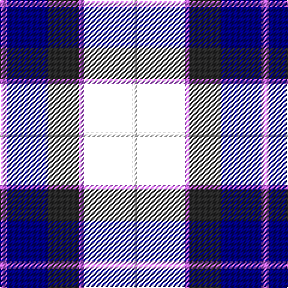

In pattern [RBBRKW](/patterns/rbbrkw/).

This was sourced from register-of-tartans.  It is a [6 stripes tartan](/stripes/stripes6/).

Original link https://www.tartanregister.gov.uk/tartanDetails.aspx?ref=4920

## Thread count
P/6 DB34 K26 P4 BN40 W/4

## Palette
Each colour and its ΔE from the base-6 reference it is a variant of.

| Colour | Shade | Base | ΔE (OKLab) |
|---|---|---|---|
| DB | <code style="background-color:#000080;">#000080</code> `#000080` | B <code style="background-color:#2A418A;">#2A418A</code> | 0.14 |
| K | <code style="background-color:#292929;">#292929</code> `#292929` | B <code style="background-color:#2A418A;">#2A418A</code> | 0.17 |
| P | <code style="background-color:#C464FA;">#C464FA</code> `#C464FA` | R <code style="background-color:#CC0000;">#CC0000</code> | 0.31 |
| W | <code style="background-color:#FFFFFF;">#FFFFFF</code> `#FFFFFF` | W <code style="background-color:#F7F7F7;">#F7F7F7</code> | 0.02 |

# Sample pattern

## Nearest tartans

The nearest existing variants by ΔTartan distance.

1. [CALA Homes](/setts/s6/y5b24k8ba18y6r3~b000050-ba304080-k000000-r806050-yf0c000/) — ΔT 1.16
1. [Davidson of Tulloch](/setts/s5/r6b35k36ba36w6~b000050-ba304080-k000000-rc00000-we0e0e0/) — ΔT 1.19
1. [Wallace Blue Dress Tartan Tartan Number: 6569. Earliest known date: See products available Copyright © Blair Urquhart, Comrie, 2015](/setts/s5/b1ba9b4k9g1x6~b2888c4-ba2c2c80-g006818-k000000/) — ΔT 1.20
1. [Herd](/setts/s6/b4g25k24w3ba24w4x2~b300030-ba000050-g003000-k000000-we0e0e0/) — ΔT 1.29
1. [MacCorquodale](/setts/s7/r7k4b28k24ba24k4b4x2~b304080-ba5480b0-k000000-rc00000/) — ΔT 1.33
1. [Leslie Hunting](/setts/s6/r2b8k8w1g8k1x2~b000064-g004c00-k000000-rc80000-wd0d0d0/) — ΔT 1.37
1. [The Open Championship](/setts/s6/w2b15g2ba20r9w2x2~b304080-ba000050-g808080-rc00000-we0e0e0/) — ΔT 1.42
1. [American Express](/setts/s6/b2ba9r1b9g9w2x4~b000050-ba8080d0-g003000-r802040-we0e0e0/) — ΔT 1.42
1. [Scottish Claymores](/setts/s10/k9w2k24ka8w5ka8b15ka3b15ka2x2~b304080-k000030-ka000000-we0e0e0/) — ΔT 1.43
1. [Gracey (2013)](/setts/s7/b3k3ba17k20g20bb8bc3x2~b688cc0-ba040498-bb3c104c-bc880078-g00643c-k000000/) — ΔT 1.44

## Neighbour map

Every grey dot is one of 15726 variants placed by the first two principal components of the ΔTartan feature space (44% of its variance). Red is this tartan; blue dots are its nearest — click one to open its page.

<svg viewBox="0 0 640 380" role="img" style="max-width:100%;height:auto;border:1px solid #e0e0e0;border-radius:4px;display:block" xmlns="http://www.w3.org/2000/svg"><image href="/nn/cloud.v1.png" width="640" height="380"/><a href="/setts/s6/y5b24k8ba18y6r3~b000050-ba304080-k000000-r806050-yf0c000/"><circle cx="119.2" cy="204.6" r="4" fill="#3465a4"><title>CALA Homes</title></circle></a><a href="/setts/s5/r6b35k36ba36w6~b000050-ba304080-k000000-rc00000-we0e0e0/"><circle cx="99.4" cy="244.2" r="4" fill="#3465a4"><title>Davidson of Tulloch</title></circle></a><a href="/setts/s5/b1ba9b4k9g1x6~b2888c4-ba2c2c80-g006818-k000000/"><circle cx="179.7" cy="232.8" r="4" fill="#3465a4"><title>Wallace Blue Dress Tartan Tartan Number: 6569. Earliest known date: See products available Copyright © Blair Urquhart, Comrie, 2015</title></circle></a><a href="/setts/s6/b4g25k24w3ba24w4x2~b300030-ba000050-g003000-k000000-we0e0e0/"><circle cx="111.4" cy="214.5" r="4" fill="#3465a4"><title>Herd</title></circle></a><a href="/setts/s7/r7k4b28k24ba24k4b4x2~b304080-ba5480b0-k000000-rc00000/"><circle cx="140.4" cy="219.0" r="4" fill="#3465a4"><title>MacCorquodale</title></circle></a><a href="/setts/s6/r2b8k8w1g8k1x2~b000064-g004c00-k000000-rc80000-wd0d0d0/"><circle cx="120.8" cy="216.9" r="4" fill="#3465a4"><title>Leslie Hunting</title></circle></a><a href="/setts/s6/w2b15g2ba20r9w2x2~b304080-ba000050-g808080-rc00000-we0e0e0/"><circle cx="173.9" cy="187.6" r="4" fill="#3465a4"><title>The Open Championship</title></circle></a><a href="/setts/s6/b2ba9r1b9g9w2x4~b000050-ba8080d0-g003000-r802040-we0e0e0/"><circle cx="122.8" cy="206.4" r="4" fill="#3465a4"><title>American Express</title></circle></a><a href="/setts/s10/k9w2k24ka8w5ka8b15ka3b15ka2x2~b304080-k000030-ka000000-we0e0e0/"><circle cx="164.8" cy="194.8" r="4" fill="#3465a4"><title>Scottish Claymores</title></circle></a><a href="/setts/s7/b3k3ba17k20g20bb8bc3x2~b688cc0-ba040498-bb3c104c-bc880078-g00643c-k000000/"><circle cx="80.0" cy="200.6" r="4" fill="#3465a4"><title>Gracey (2013)</title></circle></a><circle cx="138.9" cy="199.0" r="5" fill="#c00000"/></svg>

ID: /setts/s6/r3b17ba13r2k20w2x2~b000080-ba292929-k000000-rc464fa-wffffff/
