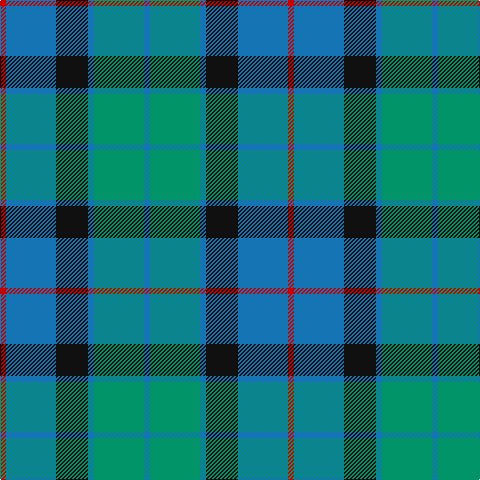

In pattern [BGBKBR](/stripes/bgbkbr/).

This was sourced from register-of-tartans.  It is a [6 stripe tartan](/stripes/stripes6/).

Original link https://www.tartanregister.gov.uk/tartanDetails.aspx?ref=1210

## Attestations

This cloth appears in 2 source records; the oldest owns this page.

- 01/01/1990 — Flower of Scotland (register-of-tartans, [record](https://www.tartanregister.gov.uk/tartanDetails.aspx?ref=1210))
- 1990 — Flower of Scotland (Universal) (tartans-authority, [record](http://www.tartansauthority.com/tartan-ferret/display/2059/))

## Register references

External register numbers recorded for this tartan.

- Scottish Register of Tartans: [1210](https://www.tartanregister.gov.uk/tartanDetails.aspx?ref=1210)
- Scottish Tartans Authority (ITI): 2059
- Scottish Tartans World Register: 2059

## Thread count
R/6 Ba50 K32 Ba6 B50 Ba/6

## Palette
Each colour and the base-6 reference it is a variant of.

| Colour | Shade | Base |
|---|---|---|
| B | <code style="background-color:#009468;">#009468</code> `oklch(59.0% 0.126 163.6)` <small>#009468</small> | G <code style="background-color:#006100;">#006100</code> |
| Ba | <code style="background-color:#1474B4;">#1474B4</code> `oklch(54.0% 0.129 245.1)` <small>#1474B4</small> | B <code style="background-color:#2A418A;">#2A418A</code> |
| G | <code style="background-color:#006818;">#006818</code> `oklch(45.0% 0.142 145.0)` <small>#006818</small> | G <code style="background-color:#006100;">#006100</code> |
| K | <code style="background-color:#101010;">#101010</code> `oklch(17.3% 0.000 89.9)` <small>#101010</small> | K <code style="background-color:#000000;">#000000</code> |
| R | <code style="background-color:#C80000;">#C80000</code> `oklch(52.3% 0.215 29.2)` <small>#C80000</small> | R <code style="background-color:#CC0000;">#CC0000</code> |

# Sample pattern

## Nearest tartans

The nearest existing variants by ΔTartan distance, with this tartan at the top so the swatches line up against it.

ΔTartan

Tartan

Sett

—

<a href="/ttd/edit/#slug=r3b25k16b3g25b3~x2">Flower of Scotland</a> <a class="nn-out" href="/setts/s6/r3b25k16b3g25b3~x2/" title="open its dictionary page">↗</a>

0.90

<a href="/ttd/edit/#slug=g24b6lb3k6b12k15g4~x2">Blaylock Annandale</a> <a class="nn-out" href="/setts/s7/g24b6lb3k6b12k15g4~x2/" title="open its dictionary page">↗</a>

0.96

<a href="/ttd/edit/#slug=r2g23db11db22r2~x2">Skibo</a> <a class="nn-out" href="/setts/s5/r2g23db11db22r2~x2/" title="open its dictionary page">↗</a>

1.02

<a href="/ttd/edit/#slug=b30dt15lb4dg12lb9b8lb3~x2">Newall (Personal)</a> <a class="nn-out" href="/setts/s7/b30dt15lb4dg12lb9b8lb3~x2/" title="open its dictionary page">↗</a>

1.05

<a href="/ttd/edit/#slug=db20k6lo4db3g20w2~x2">DeLoughery (Personal)</a> <a class="nn-out" href="/setts/s6/db20k6lo4db3g20w2~x2/" title="open its dictionary page">↗</a>

1.05

<a href="/ttd/edit/#slug=t2db29t12g29w2~x2">Wallace Blue (Fashion)</a> <a class="nn-out" href="/setts/s5/t2db29t12g29w2~x2/" title="open its dictionary page">↗</a>

1.12

<a href="/ttd/edit/#slug=r5db25w5db3g25db3~x2">Thayer USA (Name)</a> <a class="nn-out" href="/setts/s6/r5db25w5db3g25db3~x2/" title="open its dictionary page">↗</a>

1.13

<a href="/ttd/edit/#slug=b11k4g4m1g4k1r1~x4">Ednie (Personal)</a> <a class="nn-out" href="/setts/s7/b11k4g4m1g4k1r1~x4/" title="open its dictionary page">↗</a>

1.13

<a href="/ttd/edit/#slug=g3t1db7t1g3k1~x8">Scott Green (Sir Walter)</a> <a class="nn-out" href="/setts/s6/g3t1db7t1g3k1~x8/" title="open its dictionary page">↗</a>

1.16

<a href="/ttd/edit/#slug=o1b7k4b1g7b1~x4">Flower of Scotland Commemorative Tartan Tartan Number: 2059. Earliest known date: September 1990 Designed as a tribute to Roy Williamson, writer of the words and music of 'The Flower of Scotland'. Roy wore the Gunn tartan which has been used as the framework of the new tartan. Cornflower blue and Zephyr green have been used to suggest the bluebell and the thistle. Worn by the Seafield and District pipe band, Strathallan Games, 1994 (UK Reg. Design No.600421) See products available Copyright © Blair Urquhart, Comrie, 2015</a> <a class="nn-out" href="/setts/s6/o1b7k4b1g7b1~x4/" title="open its dictionary page">↗</a>

1.16

<a href="/ttd/edit/#slug=o1b7k4b1g7b1~x2">Flower of Scotland MINI Tartan Tartan Number: 20599. Earliest known date: Dupion Silk. Generated only for display purposes. reduced copy of the original 2059 Flower of Scotland. See products available Copyright © Blair Urquhart, Comrie, 2015</a> <a class="nn-out" href="/setts/s6/o1b7k4b1g7b1~x2/" title="open its dictionary page">↗</a>

## Neighbour map

Every grey dot is one of 14299 variants placed by the first two principal components of the ΔTartan feature space (44% of its variance). Red is this tartan; blue dots are its nearest — click one to open its page.

<svg viewBox="0 0 640 380" role="img" style="max-width:100%;height:auto;border:1px solid #e0e0e0;border-radius:4px;display:block" xmlns="http://www.w3.org/2000/svg"><image href="/nn/cloud.v1.png" width="640" height="380"/><a href="/setts/s7/g24b6lb3k6b12k15g4~x2/"><circle cx="189.5" cy="235.8" r="4" fill="#3465a4"><title>Blaylock Annandale</title></circle></a><a href="/setts/s5/r2g23db11db22r2~x2/"><circle cx="216.4" cy="231.8" r="4" fill="#3465a4"><title>Skibo</title></circle></a><a href="/setts/s7/b30dt15lb4dg12lb9b8lb3~x2/"><circle cx="215.7" cy="215.3" r="4" fill="#3465a4"><title>Newall (Personal)</title></circle></a><a href="/setts/s6/db20k6lo4db3g20w2~x2/"><circle cx="206.8" cy="203.1" r="4" fill="#3465a4"><title>DeLoughery (Personal)</title></circle></a><a href="/setts/s5/t2db29t12g29w2~x2/"><circle cx="249.0" cy="223.1" r="4" fill="#3465a4"><title>Wallace Blue (Fashion)</title></circle></a><a href="/setts/s6/r5db25w5db3g25db3~x2/"><circle cx="251.8" cy="215.9" r="4" fill="#3465a4"><title>Thayer USA (Name)</title></circle></a><a href="/setts/s7/b11k4g4m1g4k1r1~x4/"><circle cx="213.1" cy="194.5" r="4" fill="#3465a4"><title>Ednie (Personal)</title></circle></a><a href="/setts/s6/g3t1db7t1g3k1~x8/"><circle cx="249.7" cy="252.0" r="4" fill="#3465a4"><title>Scott Green (Sir Walter)</title></circle></a><a href="/setts/s6/o1b7k4b1g7b1~x4/"><circle cx="238.7" cy="252.6" r="4" fill="#3465a4"><title>Flower of Scotland Commemorative Tartan Tartan Number: 2059. Earliest known date: September 1990 Designed as a tribute to Roy Williamson, writer of the words and music of 'The Flower of Scotland'. Roy wore the Gunn tartan which has been used as the framework of the new tartan. Cornflower blue and Zephyr green have been used to suggest the bluebell and the thistle. Worn by the Seafield and District pipe band, Strathallan Games, 1994 (UK Reg. Design No.600421) See products available Copyright © Blair Urquhart, Comrie, 2015</title></circle></a><a href="/setts/s6/o1b7k4b1g7b1~x2/"><circle cx="238.7" cy="252.6" r="4" fill="#3465a4"><title>Flower of Scotland MINI Tartan Tartan Number: 20599. Earliest known date: Dupion Silk. Generated only for display purposes. reduced copy of the original 2059 Flower of Scotland. See products available Copyright © Blair Urquhart, Comrie, 2015</title></circle></a><circle cx="210.4" cy="230.2" r="5" fill="#c00000"/></svg>

ID: /setts/s6/r3b25k16b3g25b3~x2/
