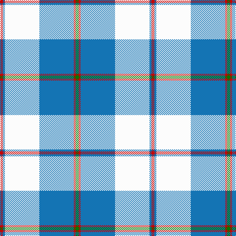

This page is one **sett** — a single exact thread-count. It belongs to the [tartan](/tartans/r3b2w35b35r2g3/)
(the same proportion at any scale), whose colour order is pattern [GRBWBR](/stripes/grbwbr/).

Sourced from tartans-authority.  It is a [6 stripe tartan](/stripes/stripes6/).

Original link http://www.tartansauthority.com/tartan-ferret/display/4953/

## Thread count
R/6 B4 W70 B70 R4 G/6

## Palette

Palette: <strong>Tartan Register</strong>
<table><thead><tr><th>Colour</th><th>Threads</th><th>Shade</th><th>Base</th><th>OKLCh</th></tr></thead><tbody><tr><td>R/</td><td style="text-align:right;font-variant-numeric:tabular-nums">6</td><td><code style="background-color:#C80000;">#C80000</code> <small style="color:#888">#C80000</small></td><td>R <code style="background-color:#CC0000;">#CC0000</code></td><td><small style="color:#888">oklch(52.3% 0.215 29.2)</small></td></tr><tr><td>B</td><td style="text-align:right;font-variant-numeric:tabular-nums">4</td><td><code style="background-color:#1474B4;">#1474B4</code> <small style="color:#888">#1474B4</small></td><td>B <code style="background-color:#2A418A;">#2A418A</code></td><td><small style="color:#888">oklch(54.0% 0.129 245.1)</small></td></tr><tr><td>W</td><td style="text-align:right;font-variant-numeric:tabular-nums">70</td><td><code style="background-color:#FCFCFC;">#FCFCFC</code> <small style="color:#888">#FCFCFC</small></td><td>W <code style="background-color:#F7F7F7;">#F7F7F7</code></td><td><small style="color:#888">oklch(99.1% 0.000 89.9)</small></td></tr><tr><td>B</td><td style="text-align:right;font-variant-numeric:tabular-nums">70</td><td><code style="background-color:#1474B4;">#1474B4</code> <small style="color:#888">#1474B4</small></td><td>B <code style="background-color:#2A418A;">#2A418A</code></td><td><small style="color:#888">oklch(54.0% 0.129 245.1)</small></td></tr><tr><td>R</td><td style="text-align:right;font-variant-numeric:tabular-nums">4</td><td><code style="background-color:#C80000;">#C80000</code> <small style="color:#888">#C80000</small></td><td>R <code style="background-color:#CC0000;">#CC0000</code></td><td><small style="color:#888">oklch(52.3% 0.215 29.2)</small></td></tr><tr><td>G/</td><td style="text-align:right;font-variant-numeric:tabular-nums">6</td><td><code style="background-color:#007800;">#007800</code> <small style="color:#888">#007800</small></td><td>G <code style="background-color:#006100;">#006100</code></td><td><small style="color:#888">oklch(49.6% 0.169 142.5)</small></td></tr></tbody></table>

# Sample pattern

## Nearest tartans

The nearest existing variants by ΔTartan distance, with this tartan at the top so the swatches line up against it.

ΔTartan

Tartan

Sett

—

<a href="/ttd/edit/#slug=r3b2w35b35r2g3~x2">Galloway (Dance)</a> <a class="nn-out" href="/setts/s6/r3b2w35b35r2g3~x2/" title="open its dictionary page">↗</a>

0.87

<a href="/ttd/edit/#slug=dt3n2w2n30w30r2w3~x2">Torridon, Royal Blue (Dance)</a> <a class="nn-out" href="/setts/s7/dt3n2w2n30w30r2w3~x2/" title="open its dictionary page">↗</a>

0.95

<a href="/ttd/edit/#slug=w2db1w15t12w1ly3db1~x6">St. John's (Corporate)</a> <a class="nn-out" href="/setts/s7/w2db1w15t12w1ly3db1~x6/" title="open its dictionary page">↗</a>

1.07

<a href="/ttd/edit/#slug=w4k2w26t23w3t8p3~x2">MacPherson Turquoise Dress Tartan Tartan Number: 8183. Earliest known date: Threadcount and colours aren't 100% original. Generated manually. See products available Copyright © Blair Urquhart, Comrie, 2015</a> <a class="nn-out" href="/setts/s7/w4k2w26t23w3t8p3~x2/" title="open its dictionary page">↗</a>

1.13

<a href="/setts/s10/r3b2w35b35r2g3~x2/">Galloway (Dance)</a>

1.18

<a href="/ttd/edit/#slug=t8db2t24db5w26k2w8~x2">Lennox Turquoise Dress District Tartan Tartan Number: 8190. Earliest known date: pre 2003 Families with the surname 'Lennox' are usually considered related to Clans Stewart or MacFarlane. Some of this surname also choose to wear the distinctive and ancient 'Lennox' tartan. D W Stewart reproduced the sett from a 'lost' portrait of the Countess of Lennox dating from the 16th century./Threadcount and colours aren't 100% original. Generated manually./ See products available Copyright © Blair Urquhart, Comrie, 2015</a> <a class="nn-out" href="/setts/s7/t8db2t24db5w26k2w8~x2/" title="open its dictionary page">↗</a>

1.19

<a href="/ttd/edit/#slug=t42k2w2k2t5n12w32t4~x2">Longniddry, dress (Turquoise)</a> <a class="nn-out" href="/setts/s8/t42k2w2k2t5n12w32t4~x2/" title="open its dictionary page">↗</a>

1.35

<a href="/ttd/edit/#slug=t53k2w53k2r4ly7~x2">Galicia</a> <a class="nn-out" href="/setts/s6/t53k2w53k2r4ly7~x2/" title="open its dictionary page">↗</a>

1.38

<a href="/ttd/edit/#slug=t2db1k1db20w20db1w2~x4">Cunningham, Dress Blue (Dance) Fashion Tartan Tartan Number: 4642. Earliest known date: 01/01/2002 Like so many of the invented 'Dance' tartans this one is not known by the relevant Clan Cunningham Association (USA). /Threadcount and colours aren't 100% original. Generated manually./ See products available Copyright © Blair Urquhart, Comrie, 2015</a> <a class="nn-out" href="/setts/s7/t2db1k1db20w20db1w2~x4/" title="open its dictionary page">↗</a>

1.42

<a href="/ttd/edit/#slug=ly5k2w16k5lg29k2ly2k2~x2">Children's Wish Foundation of Canada</a> <a class="nn-out" href="/setts/s8/ly5k2w16k5lg29k2ly2k2~x2/" title="open its dictionary page">↗</a>

1.45

<a href="/ttd/edit/#slug=w5db32g12db2w30k4~x2">Bonnie Royal</a> <a class="nn-out" href="/setts/s6/w5db32g12db2w30k4~x2/" title="open its dictionary page">↗</a>

## Neighbour map

Every grey dot is one of 14299 variants placed by the first two principal components of the ΔTartan feature space (44% of its variance). Red is this tartan; blue dots are its nearest — click one to open its page.

<svg viewBox="0 0 640 380" role="img" style="max-width:100%;height:auto;border:1px solid #e0e0e0;border-radius:4px;display:block" xmlns="http://www.w3.org/2000/svg"><image href="/nn/cloud.v1.png" width="640" height="380"/><a href="/setts/s7/dt3n2w2n30w30r2w3~x2/"><circle cx="285.2" cy="141.8" r="4" fill="#3465a4"><title>Torridon, Royal Blue (Dance)</title></circle></a><a href="/setts/s7/w2db1w15t12w1ly3db1~x6/"><circle cx="287.3" cy="154.0" r="4" fill="#3465a4"><title>St. John's (Corporate)</title></circle></a><a href="/setts/s7/w4k2w26t23w3t8p3~x2/"><circle cx="278.6" cy="172.4" r="4" fill="#3465a4"><title>MacPherson Turquoise Dress Tartan Tartan Number: 8183. Earliest known date: Threadcount and colours aren't 100% original. Generated manually. See products available Copyright © Blair Urquhart, Comrie, 2015</title></circle></a><a href="/setts/s10/r3b2w35b35r2g3~x2/"><circle cx="271.2" cy="131.2" r="4" fill="#3465a4"><title>Galloway (Dance)</title></circle></a><a href="/setts/s7/t8db2t24db5w26k2w8~x2/"><circle cx="249.7" cy="177.0" r="4" fill="#3465a4"><title>Lennox Turquoise Dress District Tartan Tartan Number: 8190. Earliest known date: pre 2003 Families with the surname 'Lennox' are usually considered related to Clans Stewart or MacFarlane. Some of this surname also choose to wear the distinctive and ancient 'Lennox' tartan. D W Stewart reproduced the sett from a 'lost' portrait of the Countess of Lennox dating from the 16th century./Threadcount and colours aren't 100% original. Generated manually./ See products available Copyright © Blair Urquhart, Comrie, 2015</title></circle></a><a href="/setts/s8/t42k2w2k2t5n12w32t4~x2/"><circle cx="297.4" cy="137.8" r="4" fill="#3465a4"><title>Longniddry, dress (Turquoise)</title></circle></a><a href="/setts/s6/t53k2w53k2r4ly7~x2/"><circle cx="261.2" cy="110.3" r="4" fill="#3465a4"><title>Galicia</title></circle></a><a href="/setts/s7/t2db1k1db20w20db1w2~x4/"><circle cx="289.3" cy="128.7" r="4" fill="#3465a4"><title>Cunningham, Dress Blue (Dance) Fashion Tartan Tartan Number: 4642. Earliest known date: 01/01/2002 Like so many of the invented 'Dance' tartans this one is not known by the relevant Clan Cunningham Association (USA). /Threadcount and colours aren't 100% original. Generated manually./ See products available Copyright © Blair Urquhart, Comrie, 2015</title></circle></a><a href="/setts/s8/ly5k2w16k5lg29k2ly2k2~x2/"><circle cx="216.2" cy="134.4" r="4" fill="#3465a4"><title>Children's Wish Foundation of Canada</title></circle></a><a href="/setts/s6/w5db32g12db2w30k4~x2/"><circle cx="197.9" cy="161.8" r="4" fill="#3465a4"><title>Bonnie Royal</title></circle></a><circle cx="271.6" cy="144.0" r="5" fill="#c00000"/></svg>

ID: /setts/s6/r3b2w35b35r2g3~x2/
