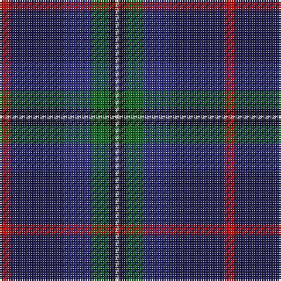

This page is one **sett** — a single exact thread-count. It belongs to the [tartan](/tartans/r3db15db8g5k2w1/)
(the same proportion at any scale), whose colour order is pattern [RBBGKW](/stripes/rbbgkw/).

Sourced from tartans-authority.  It is a [6 stripe tartan](/stripes/stripes6/).

Original link http://www.tartansauthority.com/tartan-ferret/display/7967/

## Thread count
R/6 DBa30 DB16 G10 K4 LN/2

## Palette

Palette: <strong>Tartan Register</strong>
<table><thead><tr><th>Colour</th><th>Threads</th><th>Shade</th><th>Base</th><th>OKLCh</th></tr></thead><tbody><tr><td>R/</td><td style="text-align:right;font-variant-numeric:tabular-nums">6</td><td><code style="background-color:#C80000;">#C80000</code> <small style="color:#888">#C80000</small></td><td>R <code style="background-color:#CC0000;">#CC0000</code></td><td><small style="color:#888">oklch(52.3% 0.215 29.2)</small></td></tr><tr><td>DBa</td><td style="text-align:right;font-variant-numeric:tabular-nums">30</td><td><code style="background-color:#1C1C50;">#1C1C50</code> <small style="color:#888">#1C1C50</small></td><td>B <code style="background-color:#2A418A;">#2A418A</code></td><td><small style="color:#888">oklch(26.2% 0.093 277.9)</small></td></tr><tr><td>DB</td><td style="text-align:right;font-variant-numeric:tabular-nums">16</td><td><code style="background-color:#2C2C80;">#2C2C80</code> <small style="color:#888">#2C2C80</small></td><td>B <code style="background-color:#2A418A;">#2A418A</code></td><td><small style="color:#888">oklch(35.0% 0.138 276.6)</small></td></tr><tr><td>G</td><td style="text-align:right;font-variant-numeric:tabular-nums">10</td><td><code style="background-color:#006818;">#006818</code> <small style="color:#888">#006818</small></td><td>G <code style="background-color:#006100;">#006100</code></td><td><small style="color:#888">oklch(45.0% 0.142 145.0)</small></td></tr><tr><td>K</td><td style="text-align:right;font-variant-numeric:tabular-nums">4</td><td><code style="background-color:#101010;">#101010</code> <small style="color:#888">#101010</small></td><td>K <code style="background-color:#000000;">#000000</code></td><td><small style="color:#888">oklch(17.3% 0.000 89.9)</small></td></tr><tr><td>LN/</td><td style="text-align:right;font-variant-numeric:tabular-nums">2</td><td><code style="background-color:#E0E0E0;">#E0E0E0</code> <small style="color:#888">#E0E0E0</small></td><td>W <code style="background-color:#F7F7F7;">#F7F7F7</code></td><td><small style="color:#888">oklch(90.7% 0.000 89.9)</small></td></tr></tbody></table>

# Sample pattern

## Nearest tartans

The nearest existing variants by ΔTartan distance, with this tartan at the top so the swatches line up against it.

ΔTartan

Tartan

Sett

—

<a href="/ttd/edit/#slug=r3db15db8g5k2w1~x2">Nicolson of Harris (Clan?)</a> <a class="nn-out" href="/setts/s6/r3db15db8g5k2w1~x2/" title="open its dictionary page">↗</a>

0.68

<a href="/ttd/edit/#slug=lo4k28r2db22b8dy3~x2">Loch Long One Design (Corporate)</a> <a class="nn-out" href="/setts/s6/lo4k28r2db22b8dy3~x2/" title="open its dictionary page">↗</a>

1.11

<a href="/ttd/edit/#slug=r3dt24k7db11g11ly2~x2">Cowie</a> <a class="nn-out" href="/setts/s6/r3dt24k7db11g11ly2~x2/" title="open its dictionary page">↗</a>

1.14

<a href="/ttd/edit/#slug=r4o10k9o2k9db33dt7g4~x2">Anne Arundel County</a> <a class="nn-out" href="/setts/s8/r4o10k9o2k9db33dt7g4~x2/" title="open its dictionary page">↗</a>

1.16

<a href="/ttd/edit/#slug=b11db5g4w3r3k16db28b2~x2">Scottish Italian</a> <a class="nn-out" href="/setts/s8/b11db5g4w3r3k16db28b2~x2/" title="open its dictionary page">↗</a>

1.19

<a href="/ttd/edit/#slug=k6dg11w2db22r2k4~x2">Leslie Hebridean Artifact Tartan Tartan Number: 1111. Earliest known date: 1740 From the Telfer Dunbar collection and said to date to C.1740s. See products available Copyright © Blair Urquhart, Comrie, 2015</a> <a class="nn-out" href="/setts/s6/k6dg11w2db22r2k4~x2/" title="open its dictionary page">↗</a>

1.20

<a href="/ttd/edit/#slug=dp4db2t8db25k8g13ly4~x2">Renfrewshire</a> <a class="nn-out" href="/setts/s7/dp4db2t8db25k8g13ly4~x2/" title="open its dictionary page">↗</a>

1.24

<a href="/ttd/edit/#slug=dg10w2dt10lo5db35r6~x2">Hatfield &amp; Mize (Personal)</a> <a class="nn-out" href="/setts/s6/dg10w2dt10lo5db35r6~x2/" title="open its dictionary page">↗</a>

1.29

<a href="/ttd/edit/#slug=dg10w2dt3g2m14dt26dg2dt6~x2">Spirit of Fife (Corporate)</a> <a class="nn-out" href="/setts/s8/dg10w2dt3g2m14dt26dg2dt6~x2/" title="open its dictionary page">↗</a>

1.31

<a href="/ttd/edit/#slug=dp24dt2g3m2g3k11dt29w2~x2">Alba</a> <a class="nn-out" href="/setts/s8/dp24dt2g3m2g3k11dt29w2~x2/" title="open its dictionary page">↗</a>

1.31

<a href="/ttd/edit/#slug=r2db23k14dg16k2w2~x2">MacPhail Hunting</a> <a class="nn-out" href="/setts/s6/r2db23k14dg16k2w2~x2/" title="open its dictionary page">↗</a>

## Neighbour map

Every grey dot is one of 14299 variants placed by the first two principal components of the ΔTartan feature space (44% of its variance). Red is this tartan; blue dots are its nearest — click one to open its page.

<svg viewBox="0 0 640 380" role="img" style="max-width:100%;height:auto;border:1px solid #e0e0e0;border-radius:4px;display:block" xmlns="http://www.w3.org/2000/svg"><image href="/nn/cloud.v1.png" width="640" height="380"/><a href="/setts/s6/lo4k28r2db22b8dy3~x2/"><circle cx="216.4" cy="177.8" r="4" fill="#3465a4"><title>Loch Long One Design (Corporate)</title></circle></a><a href="/setts/s6/r3dt24k7db11g11ly2~x2/"><circle cx="197.1" cy="207.8" r="4" fill="#3465a4"><title>Cowie</title></circle></a><a href="/setts/s8/r4o10k9o2k9db33dt7g4~x2/"><circle cx="196.4" cy="143.2" r="4" fill="#3465a4"><title>Anne Arundel County</title></circle></a><a href="/setts/s8/b11db5g4w3r3k16db28b2~x2/"><circle cx="208.4" cy="156.1" r="4" fill="#3465a4"><title>Scottish Italian</title></circle></a><a href="/setts/s6/k6dg11w2db22r2k4~x2/"><circle cx="261.6" cy="208.0" r="4" fill="#3465a4"><title>Leslie Hebridean Artifact Tartan Tartan Number: 1111. Earliest known date: 1740 From the Telfer Dunbar collection and said to date to C.1740s. See products available Copyright © Blair Urquhart, Comrie, 2015</title></circle></a><a href="/setts/s7/dp4db2t8db25k8g13ly4~x2/"><circle cx="168.2" cy="173.8" r="4" fill="#3465a4"><title>Renfrewshire</title></circle></a><a href="/setts/s6/dg10w2dt10lo5db35r6~x2/"><circle cx="254.4" cy="156.5" r="4" fill="#3465a4"><title>Hatfield &amp; Mize (Personal)</title></circle></a><a href="/setts/s8/dg10w2dt3g2m14dt26dg2dt6~x2/"><circle cx="252.4" cy="167.7" r="4" fill="#3465a4"><title>Spirit of Fife (Corporate)</title></circle></a><a href="/setts/s8/dp24dt2g3m2g3k11dt29w2~x2/"><circle cx="237.1" cy="154.0" r="4" fill="#3465a4"><title>Alba</title></circle></a><a href="/setts/s6/r2db23k14dg16k2w2~x2/"><circle cx="214.9" cy="209.8" r="4" fill="#3465a4"><title>MacPhail Hunting</title></circle></a><circle cx="222.3" cy="184.8" r="5" fill="#c00000"/></svg>

ID: /setts/s6/r3db15db8g5k2w1~x2/
