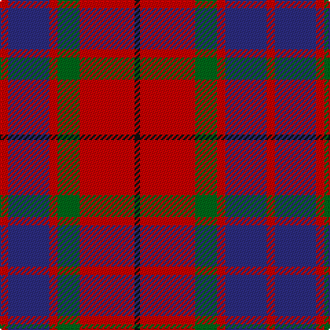

In pattern [KRGRBR](/stripes/krgrbr/).

This was sourced from register-of-tartans.  It is a [6 stripe tartan](/stripes/stripes6/).

Original link https://www.tartanregister.gov.uk/tartanDetails.aspx?ref=1185

## Attestations

This cloth appears in 2 source records; the oldest owns this page.

- 01/01/2005 — Finnigan (Estimated threadcount) (register-of-tartans, [record](https://www.tartanregister.gov.uk/tartanDetails.aspx?ref=1185))
- pre 2005 — Finnigan (Name?) (tartans-authority, [record](http://www.tartansauthority.com/tartan-ferret/display/6752/))

## Register references

External register numbers recorded for this tartan.

- Scottish Register of Tartans: [1185](https://www.tartanregister.gov.uk/tartanDetails.aspx?ref=1185)
- Scottish Tartans Authority (ITI): 6752

## Thread count
R/6 DB30 R6 G16 R40 K/4

## Palette
Each colour and the base-6 reference it is a variant of.

| Colour | Shade | Base |
|---|---|---|
| DB | <code style="background-color:#2C2C80;">#2C2C80</code> `oklch(35.0% 0.138 276.6)` <small>#2C2C80</small> | B <code style="background-color:#2A418A;">#2A418A</code> |
| G | <code style="background-color:#006818;">#006818</code> `oklch(45.0% 0.142 145.0)` <small>#006818</small> | G <code style="background-color:#006100;">#006100</code> |
| K | <code style="background-color:#101010;">#101010</code> `oklch(17.3% 0.000 89.9)` <small>#101010</small> | K <code style="background-color:#000000;">#000000</code> |
| R | <code style="background-color:#C80000;">#C80000</code> `oklch(52.3% 0.215 29.2)` <small>#C80000</small> | R <code style="background-color:#CC0000;">#CC0000</code> |

# Sample pattern

## Nearest tartans

The nearest existing variants by ΔTartan distance, with this tartan at the top so the swatches line up against it.

ΔTartan

Tartan

Sett

—

<a href="/ttd/edit/#slug=r3db15r3g8r20k2~x2">Finnigan (Estimated threadcount)</a> <a class="nn-out" href="/setts/s6/r3db15r3g8r20k2~x2/" title="open its dictionary page">↗</a>

0.60

<a href="/ttd/edit/#slug=r1db6r1dg6r12w1~x2">Fraser Red Clan Tartan Tartan Number: 1424. Earliest known date: 1842 Early references include Wilson's of Bannockburn, but Wilson did not name the sett. D W Stewart contends that this is in fact an early Grant tartan which he traced to a portrait of Robert Grant of Lurg (1678-1771), hanging at Troup House before it was closed around 1894. It is undoubtedly the most popular Fraser pattern today. See products available Copyright © Blair Urquhart, Comrie, 2015</a> <a class="nn-out" href="/setts/s6/r1db6r1dg6r12w1~x2/" title="open its dictionary page">↗</a>

0.77

<a href="/ttd/edit/#slug=r1db6r1dg6r12lr1~x2">Fraser VS</a> <a class="nn-out" href="/setts/s6/r1db6r1dg6r12lr1~x2/" title="open its dictionary page">↗</a>

0.78

<a href="/ttd/edit/#slug=r28db12r3dg20t2dg2r7~x2">Carrick (Strathmore) District Tartan Tartan Number: 3216. Earliest known date: c.1999 Sales help Princess Diana Memorial Trust See products available Copyright © Blair Urquhart, Comrie, 2015</a> <a class="nn-out" href="/setts/s7/r28db12r3dg20t2dg2r7~x2/" title="open its dictionary page">↗</a>

0.83

<a href="/ttd/edit/#slug=k2r12db6r3dg12r4db1~x2">MacBean/MacElvain</a> <a class="nn-out" href="/setts/s7/k2r12db6r3dg12r4db1~x2/" title="open its dictionary page">↗</a>

0.85

<a href="/ttd/edit/#slug=m10dy60dt13lo24dt24dy8">Bronte House Check</a> <a class="nn-out" href="/setts/s6/m10dy60dt13lo24dt24dy8/" title="open its dictionary page">↗</a>

0.89

<a href="/ttd/edit/#slug=r1db6r1dg6r12lb1">Fraser VS</a> <a class="nn-out" href="/setts/s6/r1db6r1dg6r12lb1/" title="open its dictionary page">↗</a>

0.92

<a href="/ttd/edit/#slug=r4k2r24k6db6dg16r3~x2">MacDuff #4</a> <a class="nn-out" href="/setts/s7/r4k2r24k6db6dg16r3~x2/" title="open its dictionary page">↗</a>

0.97

<a href="/ttd/edit/#slug=r6dg16r4db12r16t1r2~x2">MacQuarrie #6</a> <a class="nn-out" href="/setts/s7/r6dg16r4db12r16t1r2~x2/" title="open its dictionary page">↗</a>

1.01

<a href="/ttd/edit/#slug=r36lb3r5k21db24k3~x2">Graham of Menteith (Red)</a> <a class="nn-out" href="/setts/s6/r36lb3r5k21db24k3~x2/" title="open its dictionary page">↗</a>

1.05

<a href="/ttd/edit/#slug=db24r3db4r6g8r3g8r30k3~x2">Gates</a> <a class="nn-out" href="/setts/s9/db24r3db4r6g8r3g8r30k3~x2/" title="open its dictionary page">↗</a>

## Neighbour map

Every grey dot is one of 14299 variants placed by the first two principal components of the ΔTartan feature space (44% of its variance). Red is this tartan; blue dots are its nearest — click one to open its page.

<svg viewBox="0 0 640 380" role="img" style="max-width:100%;height:auto;border:1px solid #e0e0e0;border-radius:4px;display:block" xmlns="http://www.w3.org/2000/svg"><image href="/nn/cloud.v1.png" width="640" height="380"/><a href="/setts/s6/r1db6r1dg6r12w1~x2/"><circle cx="293.5" cy="188.1" r="4" fill="#3465a4"><title>Fraser Red Clan Tartan Tartan Number: 1424. Earliest known date: 1842 Early references include Wilson's of Bannockburn, but Wilson did not name the sett. D W Stewart contends that this is in fact an early Grant tartan which he traced to a portrait of Robert Grant of Lurg (1678-1771), hanging at Troup House before it was closed around 1894. It is undoubtedly the most popular Fraser pattern today. See products available Copyright © Blair Urquhart, Comrie, 2015</title></circle></a><a href="/setts/s6/r1db6r1dg6r12lr1~x2/"><circle cx="298.9" cy="196.9" r="4" fill="#3465a4"><title>Fraser VS</title></circle></a><a href="/setts/s7/r28db12r3dg20t2dg2r7~x2/"><circle cx="308.9" cy="185.2" r="4" fill="#3465a4"><title>Carrick (Strathmore) District Tartan Tartan Number: 3216. Earliest known date: c.1999 Sales help Princess Diana Memorial Trust See products available Copyright © Blair Urquhart, Comrie, 2015</title></circle></a><a href="/setts/s7/k2r12db6r3dg12r4db1~x2/"><circle cx="260.0" cy="198.1" r="4" fill="#3465a4"><title>MacBean/MacElvain</title></circle></a><a href="/setts/s6/m10dy60dt13lo24dt24dy8/"><circle cx="248.8" cy="222.4" r="4" fill="#3465a4"><title>Bronte House Check</title></circle></a><a href="/setts/s6/r1db6r1dg6r12lb1/"><circle cx="281.5" cy="184.5" r="4" fill="#3465a4"><title>Fraser VS</title></circle></a><a href="/setts/s7/r4k2r24k6db6dg16r3~x2/"><circle cx="279.0" cy="182.9" r="4" fill="#3465a4"><title>MacDuff #4</title></circle></a><a href="/setts/s7/r6dg16r4db12r16t1r2~x2/"><circle cx="285.2" cy="190.3" r="4" fill="#3465a4"><title>MacQuarrie #6</title></circle></a><a href="/setts/s6/r36lb3r5k21db24k3~x2/"><circle cx="249.2" cy="194.7" r="4" fill="#3465a4"><title>Graham of Menteith (Red)</title></circle></a><a href="/setts/s9/db24r3db4r6g8r3g8r30k3~x2/"><circle cx="270.4" cy="179.2" r="4" fill="#3465a4"><title>Gates</title></circle></a><circle cx="286.5" cy="207.5" r="5" fill="#c00000"/></svg>

ID: /setts/s6/r3db15r3g8r20k2~x2/
