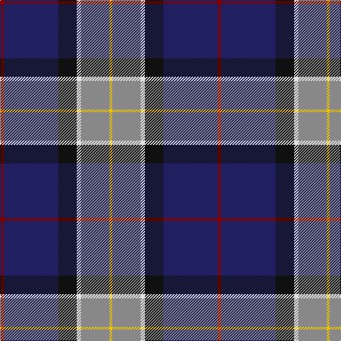

This page is one **sett** — a single exact thread-count. It belongs to the [tartan](/tartans/r3db38k13w3o20ly2/)
(the same proportion at any scale), whose colour order is pattern [RBKWRY](/stripes/rbkwry/).

Sourced from house-of-tartan.  It is a [6 stripe tartan](/stripes/stripes6/).

Original link http://www.house-of-tartan.scotland.net/house/TartanViewjs.asp?colr=Def&tnam=5771

## Thread count
DR/6 DB76 K26 LN6 N40 Y/4

## Palette

Palette: <strong>Tartan Register</strong> <small style="color:#888">(4 of 6 colours)</small>
<table><thead><tr><th>Colour</th><th>Threads</th><th>Shade</th><th>Base</th><th>OKLCh</th></tr></thead><tbody><tr><td>DR/</td><td style="text-align:right;font-variant-numeric:tabular-nums">6</td><td><code style="background-color:#800000;">#800000</code> <small style="color:#888">#800000</small></td><td>R <code style="background-color:#CC0000;">#CC0000</code></td><td><small style="color:#888">oklch(37.7% 0.155 29.2)</small></td></tr><tr><td>DB</td><td style="text-align:right;font-variant-numeric:tabular-nums">76</td><td><code style="background-color:#202060;">#202060</code> <small style="color:#888">#202060</small></td><td>B <code style="background-color:#2A418A;">#2A418A</code></td><td><small style="color:#888">oklch(28.9% 0.111 276.9)</small></td></tr><tr><td>K</td><td style="text-align:right;font-variant-numeric:tabular-nums">26</td><td><code style="background-color:#101010;">#101010</code> <small style="color:#888">#101010</small></td><td>K <code style="background-color:#000000;">#000000</code></td><td><small style="color:#888">oklch(17.3% 0.000 89.9)</small></td></tr><tr><td>LN</td><td style="text-align:right;font-variant-numeric:tabular-nums">6</td><td><code style="background-color:#E0E0E0;">#E0E0E0</code> <small style="color:#888">#E0E0E0</small></td><td>W <code style="background-color:#F7F7F7;">#F7F7F7</code></td><td><small style="color:#888">oklch(90.7% 0.000 89.9)</small></td></tr><tr><td>N</td><td style="text-align:right;font-variant-numeric:tabular-nums">40</td><td><code style="background-color:#888888;">#888888</code> <small style="color:#888">#888888</small></td><td>R <code style="background-color:#CC0000;">#CC0000</code></td><td><small style="color:#888">oklch(62.7% 0.000 89.9)</small></td></tr><tr><td>Y/</td><td style="text-align:right;font-variant-numeric:tabular-nums">4</td><td><code style="background-color:#F0C400;">#F0C400</code> <small style="color:#888">#F0C400</small></td><td>Y <code style="background-color:#F2BF00;">#F2BF00</code></td><td><small style="color:#888">oklch(83.5% 0.171 92.4)</small></td></tr></tbody></table>

# Sample pattern

## Nearest tartans

The nearest existing variants by ΔTartan distance, with this tartan at the top so the swatches line up against it.

ΔTartan

Tartan

Sett

—

<a href="/ttd/edit/#slug=r3db38k13w3o20ly2~x2">LLoyd of Astargus Canadian Family Tartan Tartan Number: 5771. Earliest known date: 2001 The designer of this tartan is of Welsh &amp; Scottish blood and sees this tartan as being appropriate for any Lloyds with Scottish blood. The 'Astargus' derives from Gaelic - 'Astar' being said to mean &quot;travelling or making distance&quot; and 'gus' meaning &quot;until I come back&quot; See products available Copyright © Blair Urquhart, Comrie, 2015</a> <a class="nn-out" href="/setts/s6/r3db38k13w3o20ly2~x2/" title="open its dictionary page">↗</a>

0.68

<a href="/ttd/edit/#slug=dg10w2dt10lo5db35r6~x2">Hatfield &amp; Mize (Personal)</a> <a class="nn-out" href="/setts/s6/dg10w2dt10lo5db35r6~x2/" title="open its dictionary page">↗</a>

0.75

<a href="/ttd/edit/#slug=k4n4dt32r4t17w2~x2">Shearer (2016)</a> <a class="nn-out" href="/setts/s6/k4n4dt32r4t17w2~x2/" title="open its dictionary page">↗</a>

0.82

<a href="/ttd/edit/#slug=r3w2g5k35db40ly3~x2">Italian National</a> <a class="nn-out" href="/setts/s6/r3w2g5k35db40ly3~x2/" title="open its dictionary page">↗</a>

0.83

<a href="/setts/s6/t12dp35lr4w3ki11k5~x2/">Ferster, James Carney</a>

0.85

<a href="/ttd/edit/#slug=dg10w2k10ly10db35r6~x2">Hatfield &amp; Mize (Personal)</a> <a class="nn-out" href="/setts/s6/dg10w2k10ly10db35r6~x2/" title="open its dictionary page">↗</a>

0.92

<a href="/ttd/edit/#slug=t2g13r2k6db23w1~x4">Gamblin Thompson (Personal)</a> <a class="nn-out" href="/setts/s6/t2g13r2k6db23w1~x4/" title="open its dictionary page">↗</a>

0.94

<a href="/ttd/edit/#slug=k33ly4w3db33r2g2~x2">Atlantic Police Academy (Corporate)</a> <a class="nn-out" href="/setts/s6/k33ly4w3db33r2g2~x2/" title="open its dictionary page">↗</a>

0.97

<a href="/ttd/edit/#slug=dg4t2db18r2k4r6t1w1~x4">Glenn</a> <a class="nn-out" href="/setts/s8/dg4t2db18r2k4r6t1w1~x4/" title="open its dictionary page">↗</a>

1.02

<a href="/ttd/edit/#slug=w4db54k53dp4t8ly4">Pipers' Trail, The</a> <a class="nn-out" href="/setts/s6/w4db54k53dp4t8ly4/" title="open its dictionary page">↗</a>

1.06

<a href="/ttd/edit/#slug=b11db5g4w3r3k16db28b2~x2">Scottish Italian</a> <a class="nn-out" href="/setts/s8/b11db5g4w3r3k16db28b2~x2/" title="open its dictionary page">↗</a>

## Neighbour map

Every grey dot is one of 14359 variants placed by the first two principal components of the ΔTartan feature space (44% of its variance). Red is this tartan; blue dots are its nearest — click one to open its page.

<svg viewBox="0 0 640 380" role="img" style="max-width:100%;height:auto;border:1px solid #e0e0e0;border-radius:4px;display:block" xmlns="http://www.w3.org/2000/svg"><image href="/nn/cloud.v1.png" width="640" height="380"/><a href="/setts/s6/dg10w2dt10lo5db35r6~x2/"><circle cx="254.0" cy="157.2" r="4" fill="#3465a4"><title>Hatfield &amp; Mize (Personal)</title></circle></a><a href="/setts/s6/k4n4dt32r4t17w2~x2/"><circle cx="249.0" cy="151.1" r="4" fill="#3465a4"><title>Shearer (2016)</title></circle></a><a href="/setts/s6/r3w2g5k35db40ly3~x2/"><circle cx="260.3" cy="144.0" r="4" fill="#3465a4"><title>Italian National</title></circle></a><a href="/setts/s6/t12dp35lr4w3ki11k5~x2/"><circle cx="222.4" cy="168.0" r="4" fill="#3465a4"><title>Ferster, James Carney</title></circle></a><a href="/setts/s6/dg10w2k10ly10db35r6~x2/"><circle cx="201.6" cy="149.8" r="4" fill="#3465a4"><title>Hatfield &amp; Mize (Personal)</title></circle></a><a href="/setts/s6/t2g13r2k6db23w1~x4/"><circle cx="268.1" cy="149.6" r="4" fill="#3465a4"><title>Gamblin Thompson (Personal)</title></circle></a><a href="/setts/s6/k33ly4w3db33r2g2~x2/"><circle cx="244.8" cy="149.4" r="4" fill="#3465a4"><title>Atlantic Police Academy (Corporate)</title></circle></a><a href="/setts/s8/dg4t2db18r2k4r6t1w1~x4/"><circle cx="237.0" cy="128.4" r="4" fill="#3465a4"><title>Glenn</title></circle></a><a href="/setts/s6/w4db54k53dp4t8ly4/"><circle cx="232.4" cy="159.6" r="4" fill="#3465a4"><title>Pipers' Trail, The</title></circle></a><a href="/setts/s8/b11db5g4w3r3k16db28b2~x2/"><circle cx="208.2" cy="156.9" r="4" fill="#3465a4"><title>Scottish Italian</title></circle></a><circle cx="236.4" cy="146.3" r="5" fill="#c00000"/></svg>

ID: /setts/s6/r3db38k13w3o20ly2~x2/
