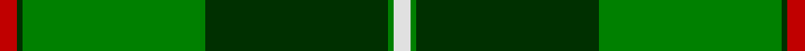
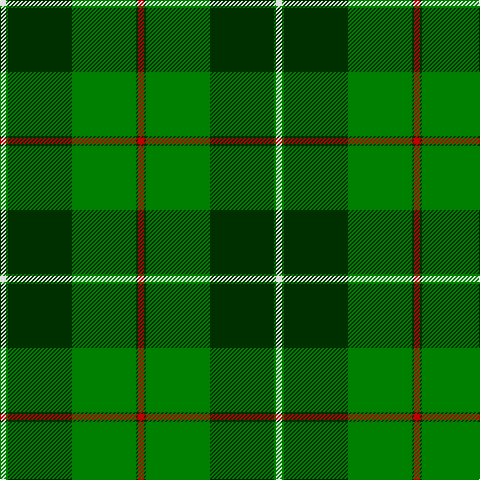

In pattern [RGGGGW](/stripes/rggggw/).

This was sourced from weddslist.  It is a [6 stripe tartan](/stripes/stripes6/).

Original link http://www.weddslist.com/cgi-bin/tartans/pg.pl?source=sts

## Thread count
R/6 DG2 G64 DG64 G2 LN/6

## Palette
Each colour and the base-6 reference it is a variant of.

| Colour | Shade | Base |
|---|---|---|
| DG | <code style="background-color:#003000;">#003000</code> `oklch(26.8% 0.091 142.5)` <small>#003000</small> | G <code style="background-color:#006100;">#006100</code> |
| G | <code style="background-color:#008000;">#008000</code> `oklch(52.0% 0.177 142.5)` <small>#008000</small> | G <code style="background-color:#006100;">#006100</code> |
| LN | <code style="background-color:#E0E0E0;">#E0E0E0</code> `oklch(90.7% 0.000 89.9)` <small>#E0E0E0</small> | W <code style="background-color:#F7F7F7;">#F7F7F7</code> |
| R | <code style="background-color:#C00000;">#C00000</code> `oklch(50.7% 0.208 29.2)` <small>#C00000</small> | R <code style="background-color:#CC0000;">#CC0000</code> |

# Sample pattern

## Nearest tartans

The nearest existing variants by ΔTartan distance.

1. [Galloway](/setts/s6/r3dg1g32dg32g1ly3~x2/) — ΔT 0.27
1. [Moran (Name)](/setts/s6/g55k17r9k11ly2k4~x2/) — ΔT 1.42
1. [MacArthur-Fox Htg (Personal)](/setts/s6/r3g30k12g1k16lo2~x2/) — ΔT 1.46
1. [Herbage Family Tartan Tartan Number: 811. Earliest known date: 1983 Designed by the Scottish Tartans Society for Mr Herbage, Laggan. See products available Copyright © Blair Urquhart, Comrie, 2015](/setts/s5/g25k8o10r1o3~x4/) — ΔT 1.56
1. [Johnston (Clan)](/setts/s8/ly3g2k1g30b24k2b2k2~x2/) — ΔT 1.57
1. [O'Donoghue](/setts/s5/g62k40ly3k3w3~x2/) — ΔT 1.59
1. [Oliphant](/setts/s6/db4k4db24g32w1g2~x2/) — ΔT 1.61
1. [Herbage](/setts/s5/g25k8y10r1y3~x4/) — ΔT 1.64
1. [Moran Family Tartan Tartan Number: 675. Earliest known date: 1986 The designers requested that the threadcount be Restricted. See products available Copyright © Blair Urquhart, Comrie, 2015](/setts/s6/g55k17r9k11ly2db4~x2/) — ΔT 1.68
1. [Mackie (2016)](/setts/s8/g2k1db6k11g26k1g1lo2~x2/) — ΔT 1.69

## Neighbour map

Every grey dot is one of 14299 variants placed by the first two principal components of the ΔTartan feature space (44% of its variance). Red is this tartan; blue dots are its nearest — click one to open its page.

<svg viewBox="0 0 640 380" role="img" style="max-width:100%;height:auto;border:1px solid #e0e0e0;border-radius:4px;display:block" xmlns="http://www.w3.org/2000/svg"><image href="/nn/cloud.v1.png" width="640" height="380"/><a href="/setts/s6/r3dg1g32dg32g1ly3~x2/"><circle cx="350.8" cy="168.8" r="4" fill="#3465a4"><title>Galloway</title></circle></a><a href="/setts/s6/g55k17r9k11ly2k4~x2/"><circle cx="369.9" cy="171.1" r="4" fill="#3465a4"><title>Moran (Name)</title></circle></a><a href="/setts/s6/r3g30k12g1k16lo2~x2/"><circle cx="348.3" cy="184.8" r="4" fill="#3465a4"><title>MacArthur-Fox Htg (Personal)</title></circle></a><a href="/setts/s5/g25k8o10r1o3~x4/"><circle cx="339.6" cy="198.8" r="4" fill="#3465a4"><title>Herbage Family Tartan Tartan Number: 811. Earliest known date: 1983 Designed by the Scottish Tartans Society for Mr Herbage, Laggan. See products available Copyright © Blair Urquhart, Comrie, 2015</title></circle></a><a href="/setts/s8/ly3g2k1g30b24k2b2k2~x2/"><circle cx="331.3" cy="141.4" r="4" fill="#3465a4"><title>Johnston (Clan)</title></circle></a><a href="/setts/s5/g62k40ly3k3w3~x2/"><circle cx="362.9" cy="187.4" r="4" fill="#3465a4"><title>O'Donoghue</title></circle></a><a href="/setts/s6/db4k4db24g32w1g2~x2/"><circle cx="350.3" cy="166.0" r="4" fill="#3465a4"><title>Oliphant</title></circle></a><a href="/setts/s5/g25k8y10r1y3~x4/"><circle cx="301.9" cy="181.5" r="4" fill="#3465a4"><title>Herbage</title></circle></a><a href="/setts/s6/g55k17r9k11ly2db4~x2/"><circle cx="345.4" cy="155.8" r="4" fill="#3465a4"><title>Moran Family Tartan Tartan Number: 675. Earliest known date: 1986 The designers requested that the threadcount be Restricted. See products available Copyright © Blair Urquhart, Comrie, 2015</title></circle></a><a href="/setts/s8/g2k1db6k11g26k1g1lo2~x2/"><circle cx="380.7" cy="157.4" r="4" fill="#3465a4"><title>Mackie (2016)</title></circle></a><circle cx="344.0" cy="165.6" r="5" fill="#c00000"/></svg>

ID: /setts/s6/r3dg1g32dg32g1w3~x2/
