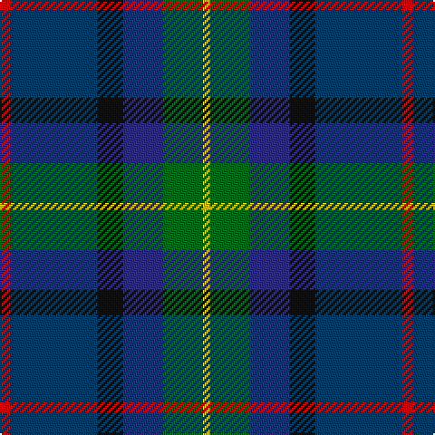

**Bands:** [RBKBGY](/stripes/rbkbgy/) · **Stripes:** [R DT K DB G LY](/stripes/stripes6/) R DT K DB G LY

This was sourced from register-of-tartans.  It is a [6 band tartan](/bands/bands6/).

Original link https://www.tartanregister.gov.uk/tartanDetails.aspx?ref=4265

## Attestations

This cloth appears in 2 source records; the oldest owns this page.

- 01/08/2005 — Cowie (register-of-tartans, [record](https://www.tartanregister.gov.uk/tartanDetails.aspx?ref=4265))
- 2005 August — Cowie (Name) (tartans-authority, [record](http://www.tartansauthority.com/tartan-ferret/display/6868/))

## Register references

External register numbers recorded for this tartan.

- Scottish Register of Tartans: [4265](https://www.tartanregister.gov.uk/tartanDetails.aspx?ref=4265)
- Scottish Tartans Authority (ITI): 6868

## Thread count
R/6 DBa48 K14 DB22 G22 Y/4

## Palette
Each colour and its ΔE from the base-6 reference it is a variant of.

| Colour | Shade | Base | ΔE (OKLab) |
|---|---|---|---|
| DB | <code style="background-color:#2C2C80;">#2C2C80</code> `#2C2C80` | B <code style="background-color:#2A418A;">#2A418A</code> | 0.06 |
| DBa | <code style="background-color:#003C64;">#003C64</code> `#003C64` | B <code style="background-color:#2A418A;">#2A418A</code> | 0.08 |
| G | <code style="background-color:#006818;">#006818</code> `#006818` | G <code style="background-color:#006100;">#006100</code> | 0.02 |
| K | <code style="background-color:#101010;">#101010</code> `#101010` | K <code style="background-color:#000000;">#000000</code> | 0.17 |
| R | <code style="background-color:#C80000;">#C80000</code> `#C80000` | R <code style="background-color:#CC0000;">#CC0000</code> | 0.01 |
| Y | <code style="background-color:#E8C000;">#E8C000</code> `#E8C000` | Y <code style="background-color:#F2BF00;">#F2BF00</code> | 0.02 |

# Sample pattern

## Nearest tartans

The nearest existing variants by ΔTartan distance.

1. [Meeson Hunting](/setts/s6/k26n10dt19r6ly2db9~x2/) — ΔT 0.92
1. [Porteous Family Tartan Tartan Number: 1264. Earliest known date: 1978 Designed for the Porteous Family Association, and submitted to the Monitoring Committee of the Scottish Tartan Society by Captain Barry Porteous who was president of the association at that time. See products available Copyright © Blair Urquhart, Comrie, 2015](/setts/s6/k1ly1db8g10db7w1~x2/) — ΔT 1.00
1. [Blairmore House](/setts/s8/db17w2db2r2db2do12dg16lo3~x4/) — ΔT 1.06
1. [Blairmore House (Corporate)](/setts/s8/db17lb2db2r2db2do12dg16lo3~x4/) — ΔT 1.08
1. [Nicolson of Harris (Clan?)](/setts/s6/r3db15db8g5k2w1~x2/) — ΔT 1.11
1. [Lenaghan (Personal)](/setts/s7/db10dg5g5k1ly2k1db10~x2/) — ΔT 1.16
1. [Westbrook (2013)](/setts/s9/dg15y3dr2y3dg8b12db20r2db4~x2/) — ΔT 1.18
1. [Scottish Odyssey (Fashion)](/setts/s7/db7b12k3b12dy12g25dt3~x2/) — ΔT 1.19
1. [MacPhail Hunting](/setts/s6/r2db23k14dg16k2w2~x2/) — ΔT 1.21
1. [Lyle and Scott](/setts/s6/dg5b2dg9dt19r9ly2~x2/) — ΔT 1.24

## Neighbour map

Every grey dot is one of 14313 variants placed by the first two principal components of the ΔTartan feature space (44% of its variance). Red is this tartan; blue dots are its nearest — click one to open its page.

<svg viewBox="0 0 640 380" role="img" style="max-width:100%;height:auto;border:1px solid #e0e0e0;border-radius:4px;display:block" xmlns="http://www.w3.org/2000/svg"><image href="/nn/cloud.v1.png" width="640" height="380"/><a href="/setts/s6/k26n10dt19r6ly2db9~x2/"><circle cx="180.9" cy="214.2" r="4" fill="#3465a4"><title>Meeson Hunting</title></circle></a><a href="/setts/s6/k1ly1db8g10db7w1~x2/"><circle cx="164.9" cy="201.3" r="4" fill="#3465a4"><title>Porteous Family Tartan Tartan Number: 1264. Earliest known date: 1978 Designed for the Porteous Family Association, and submitted to the Monitoring Committee of the Scottish Tartan Society by Captain Barry Porteous who was president of the association at that time. See products available Copyright © Blair Urquhart, Comrie, 2015</title></circle></a><a href="/setts/s8/db17w2db2r2db2do12dg16lo3~x4/"><circle cx="176.7" cy="189.5" r="4" fill="#3465a4"><title>Blairmore House</title></circle></a><a href="/setts/s8/db17lb2db2r2db2do12dg16lo3~x4/"><circle cx="193.4" cy="198.3" r="4" fill="#3465a4"><title>Blairmore House (Corporate)</title></circle></a><a href="/setts/s6/r3db15db8g5k2w1~x2/"><circle cx="222.1" cy="184.6" r="4" fill="#3465a4"><title>Nicolson of Harris (Clan?)</title></circle></a><a href="/setts/s7/db10dg5g5k1ly2k1db10~x2/"><circle cx="131.3" cy="207.4" r="4" fill="#3465a4"><title>Lenaghan (Personal)</title></circle></a><a href="/setts/s9/dg15y3dr2y3dg8b12db20r2db4~x2/"><circle cx="175.7" cy="195.5" r="4" fill="#3465a4"><title>Westbrook (2013)</title></circle></a><a href="/setts/s7/db7b12k3b12dy12g25dt3~x2/"><circle cx="132.2" cy="215.3" r="4" fill="#3465a4"><title>Scottish Odyssey (Fashion)</title></circle></a><a href="/setts/s6/r2db23k14dg16k2w2~x2/"><circle cx="214.8" cy="209.7" r="4" fill="#3465a4"><title>MacPhail Hunting</title></circle></a><a href="/setts/s6/dg5b2dg9dt19r9ly2~x2/"><circle cx="220.3" cy="225.4" r="4" fill="#3465a4"><title>Lyle and Scott</title></circle></a><circle cx="196.9" cy="207.6" r="5" fill="#c00000"/></svg>

ID: /setts/s6/r3dt24k7db11g11ly2~x2/
