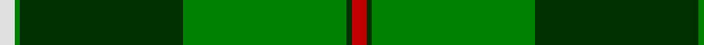

In pattern [RGGGGW](/patterns/rggggw/).

This was sourced from weddslist.  It is a [6 stripes tartan](/stripes/stripes6/).

Original link http://www.weddslist.com/cgi-bin/tartans/pg.pl?source=sts

## Thread count
LN/6 G2 DG64 G64 DG2 R/6

## Palette
Each colour and its ΔE from the base-6 reference it is a variant of.

| Colour | Shade | Base | ΔE (OKLab) |
|---|---|---|---|
| DG | <code style="background-color:#003000;">#003000</code> `#003000` | G <code style="background-color:#006100;">#006100</code> | 0.17 |
| G | <code style="background-color:#008000;">#008000</code> `#008000` | G <code style="background-color:#006100;">#006100</code> | 0.10 |
| LN | <code style="background-color:#E0E0E0;">#E0E0E0</code> `#E0E0E0` | W <code style="background-color:#F7F7F7;">#F7F7F7</code> | 0.07 |
| R | <code style="background-color:#C00000;">#C00000</code> `#C00000` | R <code style="background-color:#CC0000;">#CC0000</code> | 0.03 |

# Sample pattern

## Nearest tartans

The nearest existing variants by ΔTartan distance.

1. [Galloway](/setts/s6/r3g1ga32g32ga1y3x2~g003000-ga008000-rc00000-yf0c000/) — ΔT 0.27
1. [Moran (Name)](/setts/s6/g55k17r9k11y2k4x2~g006818-k101010-rc8002c-ye8c000/) — ΔT 1.42
1. [MacArthur-Fox Htg (Personal)](/setts/s6/r3g30k12g1k16y2x2~g006818-k101010-r880000-yd09800/) — ΔT 1.46
1. [Herbage Family Tartan Tartan Number: 811. Earliest known date: 1983 Designed by the Scottish Tartans Society for Mr Herbage, Laggan. See products available Copyright © Blair Urquhart, Comrie, 2015](/setts/s5/g25k8r10ra1r3x4~g006818-k101010-r888888-rac80000/) — ΔT 1.56
1. [Johnston (Clan)](/setts/s8/y3g2k1g30b24k2b2k2x2~b1870a4-g007800-k000000-ye8c000/) — ΔT 1.57
1. [O'Donoghue](/setts/s5/g62k40y3k3w3x2~g006818-k101010-wf8f8f8-ye8c000/) — ΔT 1.59
1. [Oliphant](/setts/s6/b4k4b24g32w1g2x2~b304080-g008000-k000000-we0e0e0/) — ΔT 1.61
1. [Herbage](/setts/s5/g25k8ga10r1ga3x4~g008000-ga808080-k000000-rc00000/) — ΔT 1.64
1. [Moran Family Tartan Tartan Number: 675. Earliest known date: 1986 The designers requested that the threadcount be Restricted. See products available Copyright © Blair Urquhart, Comrie, 2015](/setts/s6/g55k17r9k11y2b4x2~b202060-g006818-k101010-rc8002c-ye8c000/) — ΔT 1.67
1. [Mackie (2016)](/setts/s8/g2k1b6k11g26k1g1y2x2~b000080-g006818-k101010-ybc8c00/) — ΔT 1.69

## Neighbour map

Every grey dot is one of 15726 variants placed by the first two principal components of the ΔTartan feature space (44% of its variance). Red is this tartan; blue dots are its nearest — click one to open its page.

<svg viewBox="0 0 640 380" role="img" style="max-width:100%;height:auto;border:1px solid #e0e0e0;border-radius:4px;display:block" xmlns="http://www.w3.org/2000/svg"><image href="/nn/cloud.v1.png" width="640" height="380"/><a href="/setts/s6/r3g1ga32g32ga1y3x2~g003000-ga008000-rc00000-yf0c000/"><circle cx="348.0" cy="165.7" r="4" fill="#3465a4"><title>Galloway</title></circle></a><a href="/setts/s6/g55k17r9k11y2k4x2~g006818-k101010-rc8002c-ye8c000/"><circle cx="367.5" cy="170.7" r="4" fill="#3465a4"><title>Moran (Name)</title></circle></a><a href="/setts/s6/r3g30k12g1k16y2x2~g006818-k101010-r880000-yd09800/"><circle cx="345.7" cy="182.6" r="4" fill="#3465a4"><title>MacArthur-Fox Htg (Personal)</title></circle></a><a href="/setts/s5/g25k8r10ra1r3x4~g006818-k101010-r888888-rac80000/"><circle cx="337.3" cy="196.4" r="4" fill="#3465a4"><title>Herbage Family Tartan Tartan Number: 811. Earliest known date: 1983 Designed by the Scottish Tartans Society for Mr Herbage, Laggan. See products available Copyright © Blair Urquhart, Comrie, 2015</title></circle></a><a href="/setts/s8/y3g2k1g30b24k2b2k2x2~b1870a4-g007800-k000000-ye8c000/"><circle cx="327.9" cy="138.9" r="4" fill="#3465a4"><title>Johnston (Clan)</title></circle></a><a href="/setts/s5/g62k40y3k3w3x2~g006818-k101010-wf8f8f8-ye8c000/"><circle cx="360.0" cy="188.2" r="4" fill="#3465a4"><title>O'Donoghue</title></circle></a><a href="/setts/s6/b4k4b24g32w1g2x2~b304080-g008000-k000000-we0e0e0/"><circle cx="347.1" cy="164.8" r="4" fill="#3465a4"><title>Oliphant</title></circle></a><a href="/setts/s5/g25k8ga10r1ga3x4~g008000-ga808080-k000000-rc00000/"><circle cx="299.1" cy="182.9" r="4" fill="#3465a4"><title>Herbage</title></circle></a><a href="/setts/s6/g55k17r9k11y2b4x2~b202060-g006818-k101010-rc8002c-ye8c000/"><circle cx="343.0" cy="154.3" r="4" fill="#3465a4"><title>Moran Family Tartan Tartan Number: 675. Earliest known date: 1986 The designers requested that the threadcount be Restricted. See products available Copyright © Blair Urquhart, Comrie, 2015</title></circle></a><a href="/setts/s8/g2k1b6k11g26k1g1y2x2~b000080-g006818-k101010-ybc8c00/"><circle cx="377.7" cy="154.7" r="4" fill="#3465a4"><title>Mackie (2016)</title></circle></a><circle cx="341.1" cy="163.2" r="5" fill="#c00000"/></svg>

ID: /setts/s6/r3g1ga32g32ga1w3x2~g003000-ga008000-rc00000-we0e0e0/
