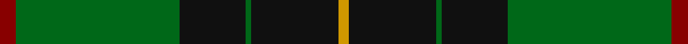

In pattern [RGKGKY](/stripes/rgkgky/).

This was sourced from tartans-authority.  It is a [6 stripe tartan](/stripes/stripes6/).

Original link http://www.tartansauthority.com/tartan-ferret/display/3611/

## Also known as

This cloth is also recorded under:

- MacArthur-Fox Hunting

## Attestations

This cloth appears in 2 source records; the oldest owns this page.

- 1997 — MacArthur-Fox Htg (Personal) (tartans-authority, [record](http://www.tartansauthority.com/tartan-ferret/display/3611/))
- undated — MacArthur-Fox Hunting (register-of-tartans, [record](https://www.tartanregister.gov.uk/tartanDetails.aspx?ref=5187))

## Register references

External register numbers recorded for this tartan.

- Scottish Register of Tartans: [5187](https://www.tartanregister.gov.uk/tartanDetails.aspx?ref=5187)
- Scottish Tartans Authority (ITI): 3611

## Thread count
DR/6 G60 K24 G2 K32 DY/4

## Palette
Each colour and the base-6 reference it is a variant of.

| Colour | Shade | Base |
|---|---|---|
| DR | <code style="background-color:#880000;">#880000</code> `oklch(39.4% 0.162 29.2)` <small>#880000</small> | R <code style="background-color:#CC0000;">#CC0000</code> |
| DY | <code style="background-color:#D09800;">#D09800</code> `oklch(71.4% 0.147 82.1)` <small>#D09800</small> | Y <code style="background-color:#F2BF00;">#F2BF00</code> |
| G | <code style="background-color:#006818;">#006818</code> `oklch(45.0% 0.142 145.0)` <small>#006818</small> | G <code style="background-color:#006100;">#006100</code> |
| K | <code style="background-color:#101010;">#101010</code> `oklch(17.3% 0.000 89.9)` <small>#101010</small> | K <code style="background-color:#000000;">#000000</code> |

# Sample pattern

## Nearest tartans

The nearest existing variants by ΔTartan distance.

1. [MacKinross](/setts/s7/k6db1k6g4k10g20r2~x2/) — ΔT 0.80
1. [Moran (Name)](/setts/s6/g55k17r9k11ly2k4~x2/) — ΔT 0.86
1. [MacDiarmid #2](/setts/s8/k83r16dg56k2w5k2dg56r5~x2/) — ΔT 1.02
1. [MacArthur (Variant)](/setts/s6/r3g30k12g6k16ly2~x2/) — ΔT 1.21
1. [Moran Family Tartan Tartan Number: 675. Earliest known date: 1986 The designers requested that the threadcount be Restricted. See products available Copyright © Blair Urquhart, Comrie, 2015](/setts/s6/g55k17r9k11ly2db4~x2/) — ΔT 1.21
1. [Wcwm 1255](/setts/s5/g3r1k14g14lo1~x4/) — ΔT 1.25
1. [O'Donoghue](/setts/s5/g62k40ly3k3w3~x2/) — ΔT 1.28
1. [Herbage Family Tartan Tartan Number: 811. Earliest known date: 1983 Designed by the Scottish Tartans Society for Mr Herbage, Laggan. See products available Copyright © Blair Urquhart, Comrie, 2015](/setts/s5/g25k8o10r1o3~x4/) — ΔT 1.28
1. [MacHardy (Clans Originaux)](/setts/s8/g4r4k12w2k12g32r4k3~x2/) — ΔT 1.37
1. [Herbage of Laggan (Personal)](/setts/s5/g68k22o28r3o12~x2/) — ΔT 1.38

## Neighbour map

Every grey dot is one of 14299 variants placed by the first two principal components of the ΔTartan feature space (44% of its variance). Red is this tartan; blue dots are its nearest — click one to open its page.

<svg viewBox="0 0 640 380" role="img" style="max-width:100%;height:auto;border:1px solid #e0e0e0;border-radius:4px;display:block" xmlns="http://www.w3.org/2000/svg"><image href="/nn/cloud.v1.png" width="640" height="380"/><a href="/setts/s7/k6db1k6g4k10g20r2~x2/"><circle cx="333.1" cy="203.8" r="4" fill="#3465a4"><title>MacKinross</title></circle></a><a href="/setts/s6/g55k17r9k11ly2k4~x2/"><circle cx="369.9" cy="171.1" r="4" fill="#3465a4"><title>Moran (Name)</title></circle></a><a href="/setts/s8/k83r16dg56k2w5k2dg56r5~x2/"><circle cx="358.6" cy="151.7" r="4" fill="#3465a4"><title>MacDiarmid #2</title></circle></a><a href="/setts/s6/r3g30k12g6k16ly2~x2/"><circle cx="319.5" cy="213.9" r="4" fill="#3465a4"><title>MacArthur (Variant)</title></circle></a><a href="/setts/s6/g55k17r9k11ly2db4~x2/"><circle cx="345.4" cy="155.8" r="4" fill="#3465a4"><title>Moran Family Tartan Tartan Number: 675. Earliest known date: 1986 The designers requested that the threadcount be Restricted. See products available Copyright © Blair Urquhart, Comrie, 2015</title></circle></a><a href="/setts/s5/g3r1k14g14lo1~x4/"><circle cx="337.7" cy="223.3" r="4" fill="#3465a4"><title>Wcwm 1255</title></circle></a><a href="/setts/s5/g62k40ly3k3w3~x2/"><circle cx="362.9" cy="187.4" r="4" fill="#3465a4"><title>O'Donoghue</title></circle></a><a href="/setts/s5/g25k8o10r1o3~x4/"><circle cx="339.6" cy="198.8" r="4" fill="#3465a4"><title>Herbage Family Tartan Tartan Number: 811. Earliest known date: 1983 Designed by the Scottish Tartans Society for Mr Herbage, Laggan. See products available Copyright © Blair Urquhart, Comrie, 2015</title></circle></a><a href="/setts/s8/g4r4k12w2k12g32r4k3~x2/"><circle cx="296.8" cy="176.4" r="4" fill="#3465a4"><title>MacHardy (Clans Originaux)</title></circle></a><a href="/setts/s5/g68k22o28r3o12~x2/"><circle cx="322.2" cy="206.6" r="4" fill="#3465a4"><title>Herbage of Laggan (Personal)</title></circle></a><circle cx="348.3" cy="184.8" r="5" fill="#c00000"/></svg>

ID: /setts/s6/r3g30k12g1k16lo2~x2/
