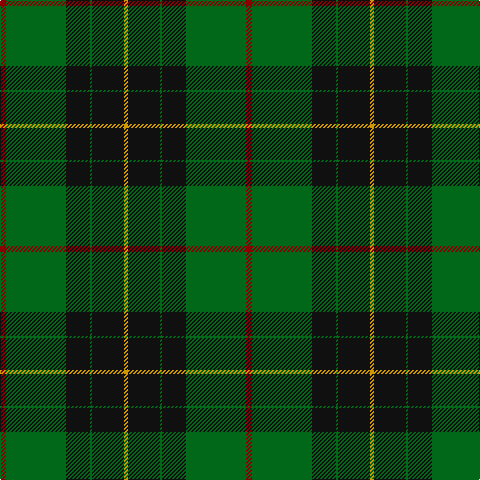

In pattern [RGKGKY](/patterns/rgkgky/).

This was sourced from tartans-authority.  It is a [6 stripes tartan](/stripes/stripes6/).

Original link http://www.tartansauthority.com/tartan-ferret/display/3611/

## Attestations

This cloth appears in 2 source records; the oldest owns this page.

- 1997 — MacArthur-Fox Htg (Personal) (tartans-authority, [record](http://www.tartansauthority.com/tartan-ferret/display/3611/))
- undated — MacArthur-Fox Hunting (register-of-tartans, [record](https://www.tartanregister.gov.uk/tartanDetails.aspx?ref=5187))

## Register references

External register numbers recorded for this tartan.

- Scottish Register of Tartans: [5187](https://www.tartanregister.gov.uk/tartanDetails.aspx?ref=5187)
- Scottish Tartans Authority (ITI): 3611

## Thread count
DR/6 G60 K24 G2 K32 DY/4

## Palette
Each colour and its ΔE from the base-6 reference it is a variant of.

| Colour | Shade | Base | ΔE (OKLab) |
|---|---|---|---|
| DR | <code style="background-color:#880000;">#880000</code> `#880000` | R <code style="background-color:#CC0000;">#CC0000</code> | 0.15 |
| DY | <code style="background-color:#D09800;">#D09800</code> `#D09800` | Y <code style="background-color:#F2BF00;">#F2BF00</code> | 0.12 |
| G | <code style="background-color:#006818;">#006818</code> `#006818` | G <code style="background-color:#006100;">#006100</code> | 0.02 |
| K | <code style="background-color:#101010;">#101010</code> `#101010` | K <code style="background-color:#000000;">#000000</code> | 0.17 |

# Sample pattern

## Nearest tartans

The nearest existing variants by ΔTartan distance.

1. [MacKinross](/setts/s7/k6b1k6g4k10g20r2~b2c2c80-g006818-k101010-rc80000~x2/) — ΔT 0.80
1. [Moran (Name)](/setts/s6/g55k17r9k11y2k4~g006818-k101010-rc8002c-ye8c000~x2/) — ΔT 0.86
1. [MacDiarmid #2](/setts/s8/k83r16g56k2w5k2g56r5~g005020-k101010-rdc0000-we0e0e0~x2/) — ΔT 1.02
1. [MacArthur (Variant)](/setts/s6/r3g30k12g6k16y2~g006818-k101010-rc80000-ye8c000~x2/) — ΔT 1.21
1. [Moran Family Tartan Tartan Number: 675. Earliest known date: 1986 The designers requested that the threadcount be Restricted. See products available Copyright © Blair Urquhart, Comrie, 2015](/setts/s6/g55k17r9k11y2b4~b202060-g006818-k101010-rc8002c-ye8c000~x2/) — ΔT 1.21
1. [Wcwm 1255](/setts/s5/g3r1k14g14y1~g006818-k101010-r880000-yd09800~x4/) — ΔT 1.25
1. [O'Donoghue](/setts/s5/g62k40y3k3w3~g006818-k101010-wf8f8f8-ye8c000~x2/) — ΔT 1.28
1. [Herbage Family Tartan Tartan Number: 811. Earliest known date: 1983 Designed by the Scottish Tartans Society for Mr Herbage, Laggan. See products available Copyright © Blair Urquhart, Comrie, 2015](/setts/s5/g25k8r10ra1r3~g006818-k101010-r888888-rac80000~x4/) — ΔT 1.28
1. [MacHardy (Clans Originaux)](/setts/s8/g4r4k12w2k12g32r4k3~g006818-k101010-rc80000-we0e0e0~x2/) — ΔT 1.37
1. [Danareth (Corporate)](/setts/s10/k7g6y3k12r19k12g62k62g12r7~g006818-k101010-r880000-yfccc00/) — ΔT 1.38

## Neighbour map

Every grey dot is one of 15726 variants placed by the first two principal components of the ΔTartan feature space (44% of its variance). Red is this tartan; blue dots are its nearest — click one to open its page.

<svg viewBox="0 0 640 380" role="img" style="max-width:100%;height:auto;border:1px solid #e0e0e0;border-radius:4px;display:block" xmlns="http://www.w3.org/2000/svg"><image href="/nn/cloud.v1.png" width="640" height="380"/><a href="/setts/s7/k6b1k6g4k10g20r2~b2c2c80-g006818-k101010-rc80000~x2/"><circle cx="330.4" cy="201.2" r="4" fill="#3465a4"><title>MacKinross</title></circle></a><a href="/setts/s6/g55k17r9k11y2k4~g006818-k101010-rc8002c-ye8c000~x2/"><circle cx="367.5" cy="170.7" r="4" fill="#3465a4"><title>Moran (Name)</title></circle></a><a href="/setts/s8/k83r16g56k2w5k2g56r5~g005020-k101010-rdc0000-we0e0e0~x2/"><circle cx="356.2" cy="149.2" r="4" fill="#3465a4"><title>MacDiarmid #2</title></circle></a><a href="/setts/s6/r3g30k12g6k16y2~g006818-k101010-rc80000-ye8c000~x2/"><circle cx="316.8" cy="213.2" r="4" fill="#3465a4"><title>MacArthur (Variant)</title></circle></a><a href="/setts/s6/g55k17r9k11y2b4~b202060-g006818-k101010-rc8002c-ye8c000~x2/"><circle cx="343.0" cy="154.3" r="4" fill="#3465a4"><title>Moran Family Tartan Tartan Number: 675. Earliest known date: 1986 The designers requested that the threadcount be Restricted. See products available Copyright © Blair Urquhart, Comrie, 2015</title></circle></a><a href="/setts/s5/g3r1k14g14y1~g006818-k101010-r880000-yd09800~x4/"><circle cx="335.1" cy="221.7" r="4" fill="#3465a4"><title>Wcwm 1255</title></circle></a><a href="/setts/s5/g62k40y3k3w3~g006818-k101010-wf8f8f8-ye8c000~x2/"><circle cx="360.0" cy="188.2" r="4" fill="#3465a4"><title>O'Donoghue</title></circle></a><a href="/setts/s5/g25k8r10ra1r3~g006818-k101010-r888888-rac80000~x4/"><circle cx="337.3" cy="196.4" r="4" fill="#3465a4"><title>Herbage Family Tartan Tartan Number: 811. Earliest known date: 1983 Designed by the Scottish Tartans Society for Mr Herbage, Laggan. See products available Copyright © Blair Urquhart, Comrie, 2015</title></circle></a><a href="/setts/s8/g4r4k12w2k12g32r4k3~g006818-k101010-rc80000-we0e0e0~x2/"><circle cx="294.1" cy="175.9" r="4" fill="#3465a4"><title>MacHardy (Clans Originaux)</title></circle></a><a href="/setts/s10/k7g6y3k12r19k12g62k62g12r7~g006818-k101010-r880000-yfccc00/"><circle cx="306.1" cy="163.5" r="4" fill="#3465a4"><title>Danareth (Corporate)</title></circle></a><circle cx="345.7" cy="182.6" r="5" fill="#c00000"/></svg>

ID: /setts/s6/r3g30k12g1k16y2~g006818-k101010-r880000-yd09800~x2/
