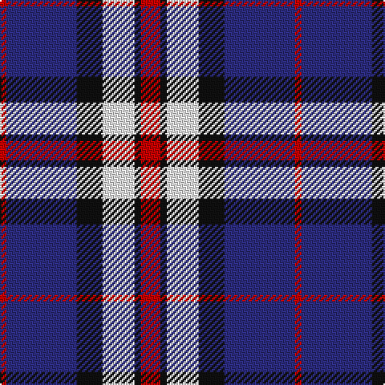

**Bands:** [RBKWKR](/stripes/rbkwkr/) · **Stripes:** [R DB K W K R](/stripes/stripes6/) R DB K W K R

This was sourced from tartans-authority.  It is a [6 band tartan](/bands/bands6/).

Original link http://www.tartansauthority.com/tartan-ferret/display/2300/

## Thread count
R/4 DB44 K16 W20 K4 R/12

## Palette
Each colour and its ΔE from the base-6 reference it is a variant of.

| Colour | Shade | Base | ΔE (OKLab) |
|---|---|---|---|
| DB | <code style="background-color:#2C2C80;">#2C2C80</code> `#2C2C80` | B <code style="background-color:#2A418A;">#2A418A</code> | 0.06 |
| K | <code style="background-color:#101010;">#101010</code> `#101010` | K <code style="background-color:#000000;">#000000</code> | 0.17 |
| R | <code style="background-color:#C80000;">#C80000</code> `#C80000` | R <code style="background-color:#CC0000;">#CC0000</code> | 0.01 |
| W | <code style="background-color:#FCFCFC;">#FCFCFC</code> `#FCFCFC` | W <code style="background-color:#F7F7F7;">#F7F7F7</code> | 0.01 |

# Sample pattern

## Nearest tartans

The nearest existing variants by ΔTartan distance.

1. [Thom(p)son, Navy](/setts/s7/r3db15w13o6db2o2r2~x2/) — ΔT 0.87
1. [Thompson Navy Trade Tartan Tartan Number: 1443. Earliest known date: Oregon Possibly designed by Councillor John Hannay himself. No other information is available. See products available Copyright © Blair Urquhart, Comrie, 2015](/setts/s7/m3db15w13dy6db2dy2m2~x2/) — ΔT 0.94
1. [Yusra Personal Tartan Tartan Number: 10455. Earliest known date: 6th April 2011 The colours used in the design are based on the colours of the Malaysian flag (blue/navy, red, yellow and white/cream) to represent the country of origin of part of the Yusra family. A woven sample of this tartan has been received by the Scottish Register of Tartans for permanent preservation in the National Archives of Scotland. See products available Copyright © Blair Urquhart, Comrie, 2015](/setts/s7/r12k3w14dt10k2dt24r2~x2/) — ΔT 1.01
1. [Lands of Liberty (Fashion)](/setts/s5/r15w10db48t32r6~x2/) — ΔT 1.03
1. [Highland Spring Dress (2004) (Corp)](/setts/s5/w4db30g10r25w2~x2/) — ΔT 1.15
1. [Hydro-Electric](/setts/s10/db11k4w5k1r3k1w5k4db11r1~x4/) — ΔT 1.20
1. [Clunie (Name)](/setts/s6/ly6k2o11k7db24w6~x2/) — ΔT 1.20
1. [Sunderland](/setts/s7/db12w4db1w4r8w2r1~x4/) — ΔT 1.23
1. [Thom(p)son, Grey](/setts/s6/r2y20k5w10k10r2~x2/) — ΔT 1.24
1. [Wilson's, No 111](/setts/s5/p19w2g12t3k4~x2/) — ΔT 1.25

## Neighbour map

Every grey dot is one of 14313 variants placed by the first two principal components of the ΔTartan feature space (44% of its variance). Red is this tartan; blue dots are its nearest — click one to open its page.

<svg viewBox="0 0 640 380" role="img" style="max-width:100%;height:auto;border:1px solid #e0e0e0;border-radius:4px;display:block" xmlns="http://www.w3.org/2000/svg"><image href="/nn/cloud.v1.png" width="640" height="380"/><a href="/setts/s7/r3db15w13o6db2o2r2~x2/"><circle cx="151.8" cy="188.9" r="4" fill="#3465a4"><title>Thom(p)son, Navy</title></circle></a><a href="/setts/s7/m3db15w13dy6db2dy2m2~x2/"><circle cx="159.6" cy="189.2" r="4" fill="#3465a4"><title>Thompson Navy Trade Tartan Tartan Number: 1443. Earliest known date: Oregon Possibly designed by Councillor John Hannay himself. No other information is available. See products available Copyright © Blair Urquhart, Comrie, 2015</title></circle></a><a href="/setts/s7/r12k3w14dt10k2dt24r2~x2/"><circle cx="228.2" cy="182.9" r="4" fill="#3465a4"><title>Yusra Personal Tartan Tartan Number: 10455. Earliest known date: 6th April 2011 The colours used in the design are based on the colours of the Malaysian flag (blue/navy, red, yellow and white/cream) to represent the country of origin of part of the Yusra family. A woven sample of this tartan has been received by the Scottish Register of Tartans for permanent preservation in the National Archives of Scotland. See products available Copyright © Blair Urquhart, Comrie, 2015</title></circle></a><a href="/setts/s5/r15w10db48t32r6~x2/"><circle cx="186.1" cy="223.0" r="4" fill="#3465a4"><title>Lands of Liberty (Fashion)</title></circle></a><a href="/setts/s5/w4db30g10r25w2~x2/"><circle cx="227.9" cy="194.3" r="4" fill="#3465a4"><title>Highland Spring Dress (2004) (Corp)</title></circle></a><a href="/setts/s10/db11k4w5k1r3k1w5k4db11r1~x4/"><circle cx="194.0" cy="170.7" r="4" fill="#3465a4"><title>Hydro-Electric</title></circle></a><a href="/setts/s6/ly6k2o11k7db24w6~x2/"><circle cx="154.7" cy="176.4" r="4" fill="#3465a4"><title>Clunie (Name)</title></circle></a><a href="/setts/s7/db12w4db1w4r8w2r1~x4/"><circle cx="212.4" cy="187.3" r="4" fill="#3465a4"><title>Sunderland</title></circle></a><a href="/setts/s6/r2y20k5w10k10r2~x2/"><circle cx="164.9" cy="190.6" r="4" fill="#3465a4"><title>Thom(p)son, Grey</title></circle></a><a href="/setts/s5/p19w2g12t3k4~x2/"><circle cx="208.9" cy="191.3" r="4" fill="#3465a4"><title>Wilson's, No 111</title></circle></a><circle cx="187.3" cy="184.9" r="5" fill="#c00000"/></svg>

ID: /setts/s6/r3k1w5k4db11r1~x4/
