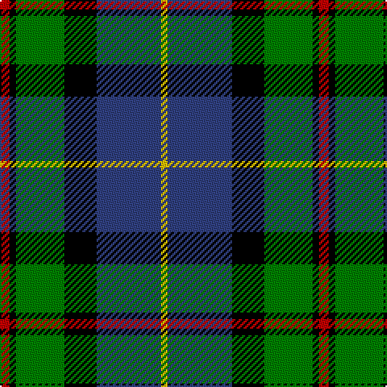

This page is one **sett** — a single exact thread-count. It belongs to the [tartan](/tartans/r3k2g15k10b20y2/)
(the same proportion at any scale), whose colour order is pattern [RKGKBY](/stripes/rkgkby/).

Sourced from weddslist.  It is a [6 stripe tartan](/stripes/stripes6/).

Original link http://www.weddslist.com/cgi-bin/tartans/pg.pl?source=sts

2 attestations — the source records this cloth was collapsed from (oldest owns this page)

<ul>
<li>undated — MacLeod of Assynt (weddslist, <a href="http://www.weddslist.com/cgi-bin/tartans/pg.pl?source=sts">record</a>)</li>
<li>undated — MacLeod of Assynt Clan Tartan Tartan Number: 1582. Earliest known date: 1906 In a portrait of the 24th chief, John Norman, painted posthumously (perhaps by Julius Jacobson, born 1811) in 1835, John Norman is shown in the costume worn for the visit of George IV to Edinburgh in 1822. The snuff-box may be evidence that the Vestiarium 'loud' design, which is very similar to that of the snuff box, had particular significance for John Norman or his wife, Ann Stephenson. (Ruairidh MacLeod, Tartans of Clan MacLeod, 1990.) See products available Copyright © Blair Urquhart, Comrie, 2015 (house-of-tartan, <a href="http://www.house-of-tartan.scotland.net/house/TartanViewjs.asp?colr=Def&tnam=1582">record</a>)</li>
</ul>

## Thread count
R/6 K4 G30 K20 B40 Y/4

## Palette
Each colour and the base-6 reference it is a variant of.

| Colour | Shade | Base |
|---|---|---|
| B | <code style="background-color:#304080;">#304080</code> `oklch(39.4% 0.109 270.2)` <small>#304080</small> | B <code style="background-color:#2A418A;">#2A418A</code> |
| G | <code style="background-color:#008000;">#008000</code> `oklch(52.0% 0.177 142.5)` <small>#008000</small> | G <code style="background-color:#006100;">#006100</code> |
| K | <code style="background-color:#000000;">#000000</code> `oklch(0.0% 0.000 0.0)` <small>#000000</small> | K <code style="background-color:#000000;">#000000</code> |
| R | <code style="background-color:#C00000;">#C00000</code> `oklch(50.7% 0.208 29.2)` <small>#C00000</small> | R <code style="background-color:#CC0000;">#CC0000</code> |
| Y | <code style="background-color:#F0C000;">#F0C000</code> `oklch(82.7% 0.169 90.5)` <small>#F0C000</small> | Y <code style="background-color:#F2BF00;">#F2BF00</code> |

# Sample pattern

## Nearest tartans

The nearest existing variants by ΔTartan distance, with this tartan at the top so the swatches line up against it.

ΔTartan

Tartan

Sett

—

<a href="/ttd/edit/#slug=r3k2g15k10db20ly2~x2">MacLeod of Assynt</a> <a class="nn-out" href="/setts/s6/r3k2g15k10db20ly2~x2/" title="open its dictionary page">↗</a>

0.41

<a href="/ttd/edit/#slug=r2db23k14g16k2w2~x2">MacPhail, hunting</a> <a class="nn-out" href="/setts/s6/r2db23k14g16k2w2~x2/" title="open its dictionary page">↗</a>

0.46

<a href="/ttd/edit/#slug=r3k2g15k10db20k2ly2~x2">MacLeod, Macleod of Harris</a> <a class="nn-out" href="/setts/s7/r3k2g15k10db20k2ly2~x2/" title="open its dictionary page">↗</a>

0.59

<a href="/ttd/edit/#slug=g9t2g1k6db6r1db1~x2">MacTaggert</a> <a class="nn-out" href="/setts/s7/g9t2g1k6db6r1db1~x2/" title="open its dictionary page">↗</a>

0.65

<a href="/ttd/edit/#slug=k2g12k12r1db12w2~x2">Russell, or Mitchell or Hunter or Galbraith</a> <a class="nn-out" href="/setts/s6/k2g12k12r1db12w2~x2/" title="open its dictionary page">↗</a>

0.65

<a href="/ttd/edit/#slug=w1db8k9g9k1ly1~x4">MacNeil 4</a> <a class="nn-out" href="/setts/s6/w1db8k9g9k1ly1~x4/" title="open its dictionary page">↗</a>

0.66

<a href="/ttd/edit/#slug=g17ly2k14r2db9r2db10~x2">MacDonald, (Flora.. )</a> <a class="nn-out" href="/setts/s7/g17ly2k14r2db9r2db10~x2/" title="open its dictionary page">↗</a>

0.69

<a href="/ttd/edit/#slug=k2g11ly1k8db9r2~x4">Forsyth</a> <a class="nn-out" href="/setts/s6/k2g11ly1k8db9r2~x4/" title="open its dictionary page">↗</a>

0.74

<a href="/ttd/edit/#slug=db31b4db5k19g20ly4~x2">Midlothian</a> <a class="nn-out" href="/setts/s6/db31b4db5k19g20ly4~x2/" title="open its dictionary page">↗</a>

0.76

<a href="/ttd/edit/#slug=g3db12lr1k12g13r2g2~x2">MacPhadran</a> <a class="nn-out" href="/setts/s7/g3db12lr1k12g13r2g2~x2/" title="open its dictionary page">↗</a>

0.76

<a href="/ttd/edit/#slug=k2g11ly1k8b9r2~x4">Forsyth (1795)</a> <a class="nn-out" href="/setts/s6/k2g11ly1k8b9r2~x4/" title="open its dictionary page">↗</a>

## Neighbour map

Every grey dot is one of 14299 variants placed by the first two principal components of the ΔTartan feature space (44% of its variance). Red is this tartan; blue dots are its nearest — click one to open its page.

<svg viewBox="0 0 640 380" role="img" style="max-width:100%;height:auto;border:1px solid #e0e0e0;border-radius:4px;display:block" xmlns="http://www.w3.org/2000/svg"><image href="/nn/cloud.v1.png" width="640" height="380"/><a href="/setts/s6/r2db23k14g16k2w2~x2/"><circle cx="167.2" cy="186.2" r="4" fill="#3465a4"><title>MacPhail, hunting</title></circle></a><a href="/setts/s7/r3k2g15k10db20k2ly2~x2/"><circle cx="151.4" cy="179.5" r="4" fill="#3465a4"><title>MacLeod, Macleod of Harris</title></circle></a><a href="/setts/s7/g9t2g1k6db6r1db1~x2/"><circle cx="144.9" cy="192.6" r="4" fill="#3465a4"><title>MacTaggert</title></circle></a><a href="/setts/s6/k2g12k12r1db12w2~x2/"><circle cx="136.7" cy="190.3" r="4" fill="#3465a4"><title>Russell, or Mitchell or Hunter or Galbraith</title></circle></a><a href="/setts/s6/w1db8k9g9k1ly1~x4/"><circle cx="129.1" cy="196.5" r="4" fill="#3465a4"><title>MacNeil 4</title></circle></a><a href="/setts/s7/g17ly2k14r2db9r2db10~x2/"><circle cx="116.7" cy="199.0" r="4" fill="#3465a4"><title>MacDonald, (Flora.. )</title></circle></a><a href="/setts/s6/k2g11ly1k8db9r2~x4/"><circle cx="127.4" cy="197.0" r="4" fill="#3465a4"><title>Forsyth</title></circle></a><a href="/setts/s6/db31b4db5k19g20ly4~x2/"><circle cx="159.0" cy="208.8" r="4" fill="#3465a4"><title>Midlothian</title></circle></a><a href="/setts/s7/g3db12lr1k12g13r2g2~x2/"><circle cx="168.9" cy="180.1" r="4" fill="#3465a4"><title>MacPhadran</title></circle></a><a href="/setts/s6/k2g11ly1k8b9r2~x4/"><circle cx="121.2" cy="195.1" r="4" fill="#3465a4"><title>Forsyth (1795)</title></circle></a><circle cx="154.2" cy="193.1" r="5" fill="#c00000"/></svg>

ID: /setts/s6/r3k2g15k10db20ly2~x2/
