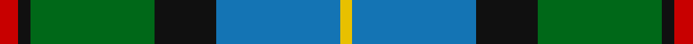
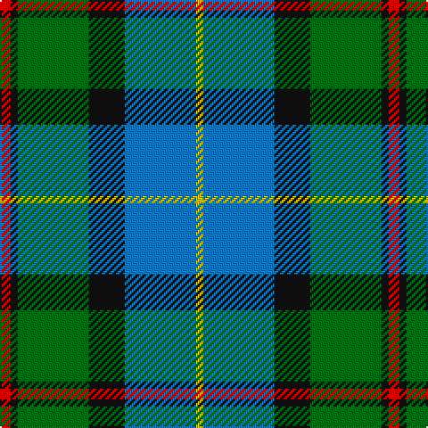

In pattern [RKGKBY](/stripes/rkgkby/).

This was sourced from register-of-tartans.  It is a [6 stripe tartan](/stripes/stripes6/).

Original link https://www.tartanregister.gov.uk/tartanDetails.aspx?ref=2636

## Attestations

This cloth appears in 2 source records; the oldest owns this page.

- 01/01/1831 — MacLeod of Assynt (register-of-tartans, [record](https://www.tartanregister.gov.uk/tartanDetails.aspx?ref=2636))
- 1831 — MacLeod of Assynt (Clan) (tartans-authority, [record](http://www.tartansauthority.com/tartan-ferret/display/1582/))

## Register references

External register numbers recorded for this tartan.

- Scottish Register of Tartans: [2636](https://www.tartanregister.gov.uk/tartanDetails.aspx?ref=2636)
- Scottish Tartans Authority (ITI): 1582
- Scottish Tartans World Register: 1582

## Thread count
R/6 K4 G40 K20 B40 Y/4

## Palette
Each colour and its ΔE from the base-6 reference it is a variant of.

| Colour | Shade | Base | ΔE (OKLab) |
|---|---|---|---|
| B | <code style="background-color:#1474B4;">#1474B4</code> `#1474B4` | B <code style="background-color:#2A418A;">#2A418A</code> | 0.15 |
| G | <code style="background-color:#006818;">#006818</code> `#006818` | G <code style="background-color:#006100;">#006100</code> | 0.02 |
| K | <code style="background-color:#101010;">#101010</code> `#101010` | K <code style="background-color:#000000;">#000000</code> | 0.17 |
| R | <code style="background-color:#C80000;">#C80000</code> `#C80000` | R <code style="background-color:#CC0000;">#CC0000</code> | 0.01 |
| Y | <code style="background-color:#E8C000;">#E8C000</code> `#E8C000` | Y <code style="background-color:#F2BF00;">#F2BF00</code> | 0.02 |

# Sample pattern

## Nearest tartans

The nearest existing variants by ΔTartan distance.

1. [Royal Ashburn Golf Club](/setts/s6/g2b22r2k21g23ly2~x2/) — ΔT 0.35
1. [Green MacLeod](/setts/s7/ly4k2b20k10g15k2r3~x2/) — ΔT 0.59
1. [Dick (Personal)](/setts/s7/k5g30ly3b15k15b7w3~x2/) — ΔT 0.72
1. [Colquhoun #2](/setts/s7/r2g8w1k8b8k1b1~x6/) — ΔT 0.85
1. [DeLoughery (Personal)](/setts/s6/db20k6lo4db3g20w2~x2/) — ΔT 0.85
1. [MacWilliam (Clan)](/setts/s6/dy2g12k10r1b16r2~x4/) — ΔT 0.86
1. [Bhatti (Name)](/setts/s5/k7lb3g18db18w2~x2/) — ΔT 0.86
1. [Royal College of Physicians (Corp)](/setts/s6/db18r3k9r3g23ly3~x2/) — ΔT 0.89
1. [Ednie (Personal)](/setts/s7/b11k4g4m1g4k1r1~x4/) — ΔT 0.90
1. [Turnbull, hunting](/setts/s5/r7ly3g28db28w3~x2/) — ΔT 0.90

## Neighbour map

Every grey dot is one of 14299 variants placed by the first two principal components of the ΔTartan feature space (44% of its variance). Red is this tartan; blue dots are its nearest — click one to open its page.

<svg viewBox="0 0 640 380" role="img" style="max-width:100%;height:auto;border:1px solid #e0e0e0;border-radius:4px;display:block" xmlns="http://www.w3.org/2000/svg"><image href="/nn/cloud.v1.png" width="640" height="380"/><a href="/setts/s6/g2b22r2k21g23ly2~x2/"><circle cx="175.6" cy="199.3" r="4" fill="#3465a4"><title>Royal Ashburn Golf Club</title></circle></a><a href="/setts/s7/ly4k2b20k10g15k2r3~x2/"><circle cx="148.4" cy="188.3" r="4" fill="#3465a4"><title>Green MacLeod</title></circle></a><a href="/setts/s7/k5g30ly3b15k15b7w3~x2/"><circle cx="160.2" cy="190.6" r="4" fill="#3465a4"><title>Dick (Personal)</title></circle></a><a href="/setts/s7/r2g8w1k8b8k1b1~x6/"><circle cx="125.1" cy="198.4" r="4" fill="#3465a4"><title>Colquhoun #2</title></circle></a><a href="/setts/s6/db20k6lo4db3g20w2~x2/"><circle cx="206.8" cy="203.1" r="4" fill="#3465a4"><title>DeLoughery (Personal)</title></circle></a><a href="/setts/s6/dy2g12k10r1b16r2~x4/"><circle cx="193.5" cy="191.5" r="4" fill="#3465a4"><title>MacWilliam (Clan)</title></circle></a><a href="/setts/s5/k7lb3g18db18w2~x2/"><circle cx="167.9" cy="220.5" r="4" fill="#3465a4"><title>Bhatti (Name)</title></circle></a><a href="/setts/s6/db18r3k9r3g23ly3~x2/"><circle cx="168.7" cy="210.9" r="4" fill="#3465a4"><title>Royal College of Physicians (Corp)</title></circle></a><a href="/setts/s7/b11k4g4m1g4k1r1~x4/"><circle cx="213.1" cy="194.5" r="4" fill="#3465a4"><title>Ednie (Personal)</title></circle></a><a href="/setts/s5/r7ly3g28db28w3~x2/"><circle cx="207.2" cy="208.8" r="4" fill="#3465a4"><title>Turnbull, hunting</title></circle></a><circle cx="169.5" cy="202.8" r="5" fill="#c00000"/></svg>

ID: /setts/s6/r3k2g20k10b20ly2~x2/
