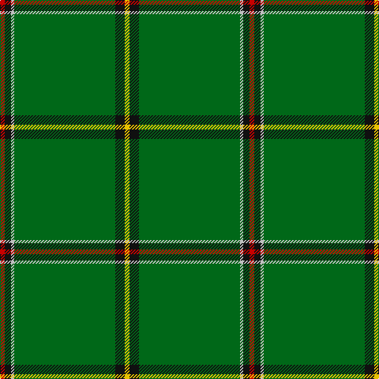

**Bands:** [RKWGKY](/stripes/rkwgky/) · **Stripes:** [R K LB G K LY](/stripes/stripes6/) R K LB G K LY

This was sourced from register-of-tartans.  It is a [6 band tartan](/bands/bands6/).

Original link https://www.tartanregister.gov.uk/tartanDetails.aspx?ref=336

## Attestations

This cloth appears in 2 source records; the oldest owns this page.

- 19/08/2003 — Braemar Royal Highland Gathering (register-of-tartans, [record](https://www.tartanregister.gov.uk/tartanDetails.aspx?ref=336))
- August 2003 — Braemar Royal Highland Gathering (C) (tartans-authority, [record](http://www.tartansauthority.com/tartan-ferret/display/6025/))

## Register references

External register numbers recorded for this tartan.

- Scottish Register of Tartans: [336](https://www.tartanregister.gov.uk/tartanDetails.aspx?ref=336)
- Scottish Tartans Authority (ITI): 6025
- Scottish Tartans World Register: 2972

## Thread count
R/6 K8 N4 G128 K12 Y/6

## Palette
Each colour and its ΔE from the base-6 reference it is a variant of.

| Colour | Shade | Base | ΔE (OKLab) |
|---|---|---|---|
| DG | <code style="background-color:#003820;">#003820</code> `#003820` | G <code style="background-color:#006100;">#006100</code> | 0.15 |
| G | <code style="background-color:#006818;">#006818</code> `#006818` | G <code style="background-color:#006100;">#006100</code> | 0.02 |
| K | <code style="background-color:#101010;">#101010</code> `#101010` | K <code style="background-color:#000000;">#000000</code> | 0.17 |
| N | <code style="background-color:#C0C0C0;">#C0C0C0</code> `#C0C0C0` | W <code style="background-color:#F7F7F7;">#F7F7F7</code> | 0.17 |
| R | <code style="background-color:#C80000;">#C80000</code> `#C80000` | R <code style="background-color:#CC0000;">#CC0000</code> | 0.01 |
| Y | <code style="background-color:#E8C000;">#E8C000</code> `#E8C000` | Y <code style="background-color:#F2BF00;">#F2BF00</code> | 0.02 |

# Sample pattern

## Nearest tartans

The nearest existing variants by ΔTartan distance.

1. [Mar, Tribe of (Clan)](/setts/s5/r2k4g45k3ly2~x2/) — ΔT 1.27
1. [Crane of Cluny (Personal)](/setts/s8/g82k6g3k9r2k5g2ly2~x2/) — ΔT 1.27
1. [Mar Tribe](/setts/s5/r2k3g45k3ly2/) — ΔT 1.33
1. [Asher (Personal)](/setts/s8/g40ly2db3r4db3ly2g40w3~x2/) — ΔT 1.57
1. [Marshall University](/setts/s8/g25w1dg2w1g6k2w2dg3~x2/) — ΔT 1.59
1. [Kinfauns Castle (Corporate)](/setts/s6/r4dp12g2dp2g46w1~x2/) — ΔT 1.77
1. [Mar, (Tribe of..)](/setts/s5/r2k4g45k3ly2/) — ΔT 1.79
1. [Stirling Castle (Corporate)](/setts/s13/db2k6db2g34w1g5w1g5w1g34ly1k13db1~x2/) — ΔT 1.80
1. [Delta Lambda Phi (Corporate)](/setts/s12/lo5k1lo6g20w1g3w1g3w1g30k1lo2~x2/) — ΔT 1.81
1. [Chapman-Smith, M & L (Personal)](/setts/s11/k2db4g27lo2g1dp4g1lt2g27db4k2~x2/) — ΔT 1.83

## Neighbour map

Every grey dot is one of 14299 variants placed by the first two principal components of the ΔTartan feature space (44% of its variance). Red is this tartan; blue dots are its nearest — click one to open its page.

<svg viewBox="0 0 640 380" role="img" style="max-width:100%;height:auto;border:1px solid #e0e0e0;border-radius:4px;display:block" xmlns="http://www.w3.org/2000/svg"><image href="/nn/cloud.v1.png" width="640" height="380"/><a href="/setts/s5/r2k4g45k3ly2~x2/"><circle cx="577.2" cy="187.3" r="4" fill="#3465a4"><title>Mar, Tribe of (Clan)</title></circle></a><a href="/setts/s8/g82k6g3k9r2k5g2ly2~x2/"><circle cx="589.7" cy="132.9" r="4" fill="#3465a4"><title>Crane of Cluny (Personal)</title></circle></a><a href="/setts/s5/r2k3g45k3ly2/"><circle cx="589.4" cy="184.8" r="4" fill="#3465a4"><title>Mar Tribe</title></circle></a><a href="/setts/s8/g40ly2db3r4db3ly2g40w3~x2/"><circle cx="541.4" cy="156.6" r="4" fill="#3465a4"><title>Asher (Personal)</title></circle></a><a href="/setts/s8/g25w1dg2w1g6k2w2dg3~x2/"><circle cx="472.2" cy="144.1" r="4" fill="#3465a4"><title>Marshall University</title></circle></a><a href="/setts/s6/r4dp12g2dp2g46w1~x2/"><circle cx="518.5" cy="140.9" r="4" fill="#3465a4"><title>Kinfauns Castle (Corporate)</title></circle></a><a href="/setts/s5/r2k4g45k3ly2/"><circle cx="525.2" cy="162.5" r="4" fill="#3465a4"><title>Mar, (Tribe of..)</title></circle></a><a href="/setts/s13/db2k6db2g34w1g5w1g5w1g34ly1k13db1~x2/"><circle cx="479.3" cy="112.5" r="4" fill="#3465a4"><title>Stirling Castle (Corporate)</title></circle></a><a href="/setts/s12/lo5k1lo6g20w1g3w1g3w1g30k1lo2~x2/"><circle cx="514.6" cy="131.6" r="4" fill="#3465a4"><title>Delta Lambda Phi (Corporate)</title></circle></a><a href="/setts/s11/k2db4g27lo2g1dp4g1lt2g27db4k2~x2/"><circle cx="455.5" cy="114.6" r="4" fill="#3465a4"><title>Chapman-Smith, M &amp; L (Personal)</title></circle></a><circle cx="539.5" cy="136.6" r="5" fill="#c00000"/></svg>

ID: /setts/s6/r3k4lb2g64k6ly3~x2/
