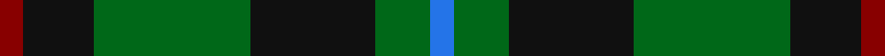
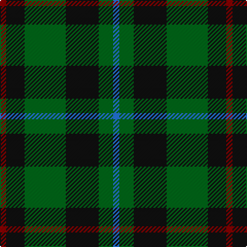

In pattern [BGKGKR](/stripes/bgkgkr/).

This was sourced from tartans-authority.  It is a [6 stripe tartan](/stripes/stripes6/).

Original link http://www.tartansauthority.com/tartan-ferret/display/2646/

## Thread count
DR/6 K18 G40 K32 G14 B/6

## Palette
Each colour and its ΔE from the base-6 reference it is a variant of.

| Colour | Shade | Base | ΔE (OKLab) |
|---|---|---|---|
| B | <code style="background-color:#2474E8;">#2474E8</code> `#2474E8` | B <code style="background-color:#2A418A;">#2A418A</code> | 0.19 |
| DR | <code style="background-color:#880000;">#880000</code> `#880000` | R <code style="background-color:#CC0000;">#CC0000</code> | 0.15 |
| G | <code style="background-color:#006818;">#006818</code> `#006818` | G <code style="background-color:#006100;">#006100</code> | 0.02 |
| K | <code style="background-color:#101010;">#101010</code> `#101010` | K <code style="background-color:#000000;">#000000</code> | 0.17 |

# Sample pattern

## Nearest tartans

The nearest existing variants by ΔTartan distance.

1. [Sinclair Hunting](/setts/s7/dg6r2dg13k6w2k16r3~x2/) — ΔT 0.96
1. [Salvation Army Htg (Corporate)](/setts/s7/db5dg8k1ly2k1dg8db4~x4/) — ΔT 0.96
1. [Menteith](/setts/s6/g9lb1g6k7db7k1~x4/) — ΔT 1.00
1. [Trafalgar (Fashion)](/setts/s6/g3db1g8db7k3ly1~x2/) — ΔT 1.02
1. [Cameron Hunting](/setts/s7/r3dg10r3dg14db16dg3ly2~x2/) — ΔT 1.03
1. [Wcwm 1045](/setts/s6/dg2n8dg2k3dg12r2~x2/) — ΔT 1.05
1. [Cameron Hunting](/setts/s7/r3dg10r3dg14db16dg3ly2/) — ΔT 1.11
1. [Strath Hallidale (Fashion)](/setts/s8/g5k15g5k15g19r2g13lb4~x2/) — ΔT 1.15
1. [Unidentified #28](/setts/s6/k2dg9t1k6b4dg2~x2/) — ΔT 1.18
1. [Coburg](/setts/s6/g18t2g4k14dp12k3~x2/) — ΔT 1.19

## Neighbour map

Every grey dot is one of 14299 variants placed by the first two principal components of the ΔTartan feature space (44% of its variance). Red is this tartan; blue dots are its nearest — click one to open its page.

<svg viewBox="0 0 640 380" role="img" style="max-width:100%;height:auto;border:1px solid #e0e0e0;border-radius:4px;display:block" xmlns="http://www.w3.org/2000/svg"><image href="/nn/cloud.v1.png" width="640" height="380"/><a href="/setts/s7/dg6r2dg13k6w2k16r3~x2/"><circle cx="254.0" cy="238.3" r="4" fill="#3465a4"><title>Sinclair Hunting</title></circle></a><a href="/setts/s7/db5dg8k1ly2k1dg8db4~x4/"><circle cx="295.5" cy="252.0" r="4" fill="#3465a4"><title>Salvation Army Htg (Corporate)</title></circle></a><a href="/setts/s6/g9lb1g6k7db7k1~x4/"><circle cx="232.9" cy="254.6" r="4" fill="#3465a4"><title>Menteith</title></circle></a><a href="/setts/s6/g3db1g8db7k3ly1~x2/"><circle cx="248.8" cy="247.4" r="4" fill="#3465a4"><title>Trafalgar (Fashion)</title></circle></a><a href="/setts/s7/r3dg10r3dg14db16dg3ly2~x2/"><circle cx="285.4" cy="241.4" r="4" fill="#3465a4"><title>Cameron Hunting</title></circle></a><a href="/setts/s6/dg2n8dg2k3dg12r2~x2/"><circle cx="294.4" cy="259.4" r="4" fill="#3465a4"><title>Wcwm 1045</title></circle></a><a href="/setts/s7/r3dg10r3dg14db16dg3ly2/"><circle cx="263.7" cy="229.7" r="4" fill="#3465a4"><title>Cameron Hunting</title></circle></a><a href="/setts/s8/g5k15g5k15g19r2g13lb4~x2/"><circle cx="279.5" cy="238.2" r="4" fill="#3465a4"><title>Strath Hallidale (Fashion)</title></circle></a><a href="/setts/s6/k2dg9t1k6b4dg2~x2/"><circle cx="229.3" cy="242.6" r="4" fill="#3465a4"><title>Unidentified #28</title></circle></a><a href="/setts/s6/g18t2g4k14dp12k3~x2/"><circle cx="229.5" cy="248.4" r="4" fill="#3465a4"><title>Coburg</title></circle></a><circle cx="252.3" cy="262.9" r="5" fill="#c00000"/></svg>

ID: /setts/s6/r3k9g20k16g7b3~x2/
