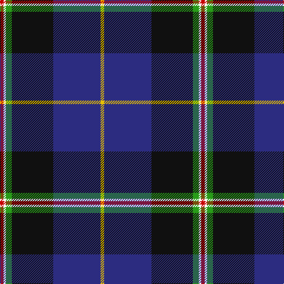

In pattern [RWGKBY](/stripes/rwgkby/).

This was sourced from register-of-tartans.  It is a [6 stripe tartan](/stripes/stripes6/).

Original link https://www.tartanregister.gov.uk/tartanDetails.aspx?ref=1871

## Attestations

This cloth appears in 2 source records; the oldest owns this page.

- 01/01/2004 — Italian National (register-of-tartans, [record](https://www.tartanregister.gov.uk/tartanDetails.aspx?ref=1871))
- pre 2004 — Italian National (Fashion) (tartans-authority, [record](http://www.tartansauthority.com/tartan-ferret/display/6315/))

## Register references

External register numbers recorded for this tartan.

- Scottish Register of Tartans: [1871](https://www.tartanregister.gov.uk/tartanDetails.aspx?ref=1871)
- Scottish Tartans Authority (ITI): 6315

## Thread count
R/6 W4 G10 K70 DB80 Y/6

## Palette
Each colour and its ΔE from the base-6 reference it is a variant of.

| Colour | Shade | Base | ΔE (OKLab) |
|---|---|---|---|
| B | <code style="background-color:#1474B4;">#1474B4</code> `#1474B4` | B <code style="background-color:#2A418A;">#2A418A</code> | 0.15 |
| DB | <code style="background-color:#2C2C80;">#2C2C80</code> `#2C2C80` | B <code style="background-color:#2A418A;">#2A418A</code> | 0.06 |
| G | <code style="background-color:#289C18;">#289C18</code> `#289C18` | G <code style="background-color:#006100;">#006100</code> | 0.19 |
| K | <code style="background-color:#101010;">#101010</code> `#101010` | K <code style="background-color:#000000;">#000000</code> | 0.17 |
| R | <code style="background-color:#C80000;">#C80000</code> `#C80000` | R <code style="background-color:#CC0000;">#CC0000</code> | 0.01 |
| W | <code style="background-color:#FCFCFC;">#FCFCFC</code> `#FCFCFC` | W <code style="background-color:#F7F7F7;">#F7F7F7</code> | 0.01 |
| Y | <code style="background-color:#E8C000;">#E8C000</code> `#E8C000` | Y <code style="background-color:#F2BF00;">#F2BF00</code> | 0.02 |

# Sample pattern

## Nearest tartans

The nearest existing variants by ΔTartan distance.

1. [Atlantic Police Academy (Corporate)](/setts/s6/k33ly4w3db33r2g2~x2/) — ΔT 0.37
1. [Atlantic Police Academy](/setts/s6/k33ly4w3db33r2dg2~x2/) — ΔT 0.69
1. [Pipers' Trail, The](/setts/s6/w4db54k53dp4t8ly4/) — ΔT 0.71
1. [LLoyd of Astargus Canadian Family Tartan Tartan Number: 5771. Earliest known date: 2001 The designer of this tartan is of Welsh & Scottish blood and sees this tartan as being appropriate for any Lloyds with Scottish blood. The 'Astargus' derives from Gaelic - 'Astar' being said to mean "travelling or making distance" and 'gus' meaning "until I come back" See products available Copyright © Blair Urquhart, Comrie, 2015](/setts/s6/r3db38k13w3o20ly2~x2/) — ΔT 0.82
1. [Canadian Centennial](/setts/s8/r3w6r2dg32db36k2db4lo2~x2/) — ΔT 0.96
1. [Hatfield & Mize (Personal)](/setts/s6/dg10w2dt10lo5db35r6~x2/) — ΔT 0.98
1. [Pipers' Trail, The](/setts/s6/w4dt54k53dp4b8lo4/) — ΔT 0.99
1. [Gamblin Thompson (Personal)](/setts/s6/t2g13r2k6db23w1~x4/) — ΔT 1.14
1. [Shearer (2016)](/setts/s6/k4n4dt32r4t17w2~x2/) — ΔT 1.19
1. [Fuller of Hopewell (Personal)](/setts/s7/k1w1k18db20w1r1lo1~x4/) — ΔT 1.19

## Neighbour map

Every grey dot is one of 14299 variants placed by the first two principal components of the ΔTartan feature space (44% of its variance). Red is this tartan; blue dots are its nearest — click one to open its page.

<svg viewBox="0 0 640 380" role="img" style="max-width:100%;height:auto;border:1px solid #e0e0e0;border-radius:4px;display:block" xmlns="http://www.w3.org/2000/svg"><image href="/nn/cloud.v1.png" width="640" height="380"/><a href="/setts/s6/k33ly4w3db33r2g2~x2/"><circle cx="245.2" cy="148.5" r="4" fill="#3465a4"><title>Atlantic Police Academy (Corporate)</title></circle></a><a href="/setts/s6/k33ly4w3db33r2dg2~x2/"><circle cx="239.9" cy="151.6" r="4" fill="#3465a4"><title>Atlantic Police Academy</title></circle></a><a href="/setts/s6/w4db54k53dp4t8ly4/"><circle cx="232.7" cy="158.7" r="4" fill="#3465a4"><title>Pipers' Trail, The</title></circle></a><a href="/setts/s6/r3db38k13w3o20ly2~x2/"><circle cx="236.9" cy="145.6" r="4" fill="#3465a4"><title>LLoyd of Astargus Canadian Family Tartan Tartan Number: 5771. Earliest known date: 2001 The designer of this tartan is of Welsh &amp; Scottish blood and sees this tartan as being appropriate for any Lloyds with Scottish blood. The 'Astargus' derives from Gaelic - 'Astar' being said to mean &quot;travelling or making distance&quot; and 'gus' meaning &quot;until I come back&quot; See products available Copyright © Blair Urquhart, Comrie, 2015</title></circle></a><a href="/setts/s8/r3w6r2dg32db36k2db4lo2~x2/"><circle cx="263.7" cy="132.6" r="4" fill="#3465a4"><title>Canadian Centennial</title></circle></a><a href="/setts/s6/dg10w2dt10lo5db35r6~x2/"><circle cx="254.4" cy="156.5" r="4" fill="#3465a4"><title>Hatfield &amp; Mize (Personal)</title></circle></a><a href="/setts/s6/w4dt54k53dp4b8lo4/"><circle cx="245.8" cy="170.1" r="4" fill="#3465a4"><title>Pipers' Trail, The</title></circle></a><a href="/setts/s6/t2g13r2k6db23w1~x4/"><circle cx="268.5" cy="149.0" r="4" fill="#3465a4"><title>Gamblin Thompson (Personal)</title></circle></a><a href="/setts/s6/k4n4dt32r4t17w2~x2/"><circle cx="249.5" cy="150.3" r="4" fill="#3465a4"><title>Shearer (2016)</title></circle></a><a href="/setts/s7/k1w1k18db20w1r1lo1~x4/"><circle cx="313.5" cy="144.1" r="4" fill="#3465a4"><title>Fuller of Hopewell (Personal)</title></circle></a><circle cx="260.7" cy="143.3" r="5" fill="#c00000"/></svg>

ID: /setts/s6/r3w2g5k35db40ly3~x2/
