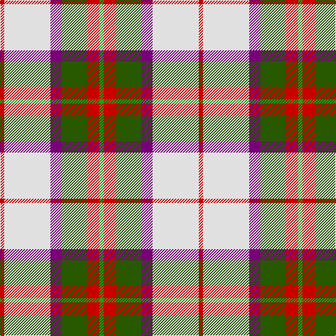

In pattern [GRGBWR](/stripes/grgbwr/).

This was sourced from register-of-tartans.  It is a [6 stripe tartan](/stripes/stripes6/).

Original link https://www.tartanregister.gov.uk/tartanDetails.aspx?ref=2570

## Attestations

This cloth appears in 2 source records; the oldest owns this page.

- 01/01/2005 — MacKintosh Dress (Dance) (register-of-tartans, [record](https://www.tartanregister.gov.uk/tartanDetails.aspx?ref=2570))
- pre 2005 — MacKintosh Dress - 2005 (Dance) (tartans-authority, [record](http://www.tartansauthority.com/tartan-ferret/display/6562/))

## Register references

External register numbers recorded for this tartan.

- Scottish Register of Tartans: [2570](https://www.tartanregister.gov.uk/tartanDetails.aspx?ref=2570)
- Scottish Tartans Authority (ITI): 6562

## Thread count
R/6 LN66 P16 Ga36 R18 G/6

## Palette
Each colour and the base-6 reference it is a variant of.

| Colour | Shade | Base |
|---|---|---|
| G | <code style="background-color:#289C18;">#289C18</code> `oklch(60.6% 0.191 141.6)` <small>#289C18</small> | G <code style="background-color:#006100;">#006100</code> |
| Ga | <code style="background-color:#285800;">#285800</code> `oklch(41.0% 0.122 135.8)` <small>#285800</small> | G <code style="background-color:#006100;">#006100</code> |
| LN | <code style="background-color:#E0E0E0;">#E0E0E0</code> `oklch(90.7% 0.000 89.9)` <small>#E0E0E0</small> | W <code style="background-color:#F7F7F7;">#F7F7F7</code> |
| P | <code style="background-color:#780078;">#780078</code> `oklch(40.2% 0.185 328.4)` <small>#780078</small> | B <code style="background-color:#2A418A;">#2A418A</code> |
| R | <code style="background-color:#C80000;">#C80000</code> `oklch(52.3% 0.215 29.2)` <small>#C80000</small> | R <code style="background-color:#CC0000;">#CC0000</code> |

# Sample pattern

## Nearest tartans

The nearest existing variants by ΔTartan distance, with this tartan at the top so the swatches line up against it.

ΔTartan

Tartan

Sett

—

<a href="/ttd/edit/#slug=r3w33dp8dg18r9g3~x2">MacKintosh Dress (Dance)</a> <a class="nn-out" href="/setts/s6/r3w33dp8dg18r9g3~x2/" title="open its dictionary page">↗</a>

0.71

<a href="/ttd/edit/#slug=r1w12g6r8lb3lo1~x4">MacLean Dress (Lumsden)</a> <a class="nn-out" href="/setts/s6/r1w12g6r8lb3lo1~x4/" title="open its dictionary page">↗</a>

0.78

<a href="/ttd/edit/#slug=w39db9k10dg11r7k3r7~x2">MacDuff Dress #5</a> <a class="nn-out" href="/setts/s7/w39db9k10dg11r7k3r7~x2/" title="open its dictionary page">↗</a>

0.80

<a href="/ttd/edit/#slug=r1w12g6r8t3ly1~x4">MacLean, dress</a> <a class="nn-out" href="/setts/s6/r1w12g6r8t3ly1~x4/" title="open its dictionary page">↗</a>

0.92

<a href="/ttd/edit/#slug=w39db9k10g11r7k3r7~x2">MacDuff dress</a> <a class="nn-out" href="/setts/s7/w39db9k10g11r7k3r7~x2/" title="open its dictionary page">↗</a>

0.94

<a href="/ttd/edit/#slug=w4k13w17lo2r2lo24w2w2~x2">Lalage (Personal)</a> <a class="nn-out" href="/setts/s8/w4k13w17lo2r2lo24w2w2~x2/" title="open its dictionary page">↗</a>

0.99

<a href="/ttd/edit/#slug=r34w3g4g23w24k3g4~x2">MacLachlan Dress Clan Tartan Tartan Number: 828. Earliest known date: 1990 Based on the MacLachlan pattern in Old And Rare See products available Copyright © Blair Urquhart, Comrie, 2015</a> <a class="nn-out" href="/setts/s7/r34w3g4g23w24k3g4~x2/" title="open its dictionary page">↗</a>

1.02

<a href="/ttd/edit/#slug=db2w14p4ly1g8db2~x2">Manx Laxey, dress green</a> <a class="nn-out" href="/setts/s6/db2w14p4ly1g8db2~x2/" title="open its dictionary page">↗</a>

1.04

<a href="/ttd/edit/#slug=g4ly7o9ly9db20w2db2~x2">Tombow 140th Anniversary, The</a> <a class="nn-out" href="/setts/s7/g4ly7o9ly9db20w2db2~x2/" title="open its dictionary page">↗</a>

1.05

<a href="/ttd/edit/#slug=r4ly30k6w13k13w3~x2">Thomson, Camel (Fashion)</a> <a class="nn-out" href="/setts/s6/r4ly30k6w13k13w3~x2/" title="open its dictionary page">↗</a>

1.05

<a href="/ttd/edit/#slug=w8g5t10dp24w30g2lp2~x2">Shiel, Purple (Dance)</a> <a class="nn-out" href="/setts/s7/w8g5t10dp24w30g2lp2~x2/" title="open its dictionary page">↗</a>

## Neighbour map

Every grey dot is one of 14299 variants placed by the first two principal components of the ΔTartan feature space (44% of its variance). Red is this tartan; blue dots are its nearest — click one to open its page.

<svg viewBox="0 0 640 380" role="img" style="max-width:100%;height:auto;border:1px solid #e0e0e0;border-radius:4px;display:block" xmlns="http://www.w3.org/2000/svg"><image href="/nn/cloud.v1.png" width="640" height="380"/><a href="/setts/s6/r1w12g6r8lb3lo1~x4/"><circle cx="149.5" cy="158.8" r="4" fill="#3465a4"><title>MacLean Dress (Lumsden)</title></circle></a><a href="/setts/s7/w39db9k10dg11r7k3r7~x2/"><circle cx="171.3" cy="138.8" r="4" fill="#3465a4"><title>MacDuff Dress #5</title></circle></a><a href="/setts/s6/r1w12g6r8t3ly1~x4/"><circle cx="158.9" cy="164.8" r="4" fill="#3465a4"><title>MacLean, dress</title></circle></a><a href="/setts/s7/w39db9k10g11r7k3r7~x2/"><circle cx="165.2" cy="138.0" r="4" fill="#3465a4"><title>MacDuff dress</title></circle></a><a href="/setts/s8/w4k13w17lo2r2lo24w2w2~x2/"><circle cx="166.7" cy="133.9" r="4" fill="#3465a4"><title>Lalage (Personal)</title></circle></a><a href="/setts/s7/r34w3g4g23w24k3g4~x2/"><circle cx="154.6" cy="155.2" r="4" fill="#3465a4"><title>MacLachlan Dress Clan Tartan Tartan Number: 828. Earliest known date: 1990 Based on the MacLachlan pattern in Old And Rare See products available Copyright © Blair Urquhart, Comrie, 2015</title></circle></a><a href="/setts/s6/db2w14p4ly1g8db2~x2/"><circle cx="187.5" cy="152.3" r="4" fill="#3465a4"><title>Manx Laxey, dress green</title></circle></a><a href="/setts/s7/g4ly7o9ly9db20w2db2~x2/"><circle cx="156.1" cy="170.7" r="4" fill="#3465a4"><title>Tombow 140th Anniversary, The</title></circle></a><a href="/setts/s6/r4ly30k6w13k13w3~x2/"><circle cx="185.9" cy="183.4" r="4" fill="#3465a4"><title>Thomson, Camel (Fashion)</title></circle></a><a href="/setts/s7/w8g5t10dp24w30g2lp2~x2/"><circle cx="198.8" cy="137.3" r="4" fill="#3465a4"><title>Shiel, Purple (Dance)</title></circle></a><circle cx="176.2" cy="158.0" r="5" fill="#c00000"/></svg>

ID: /setts/s6/r3w33dp8dg18r9g3~x2/
