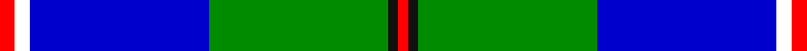
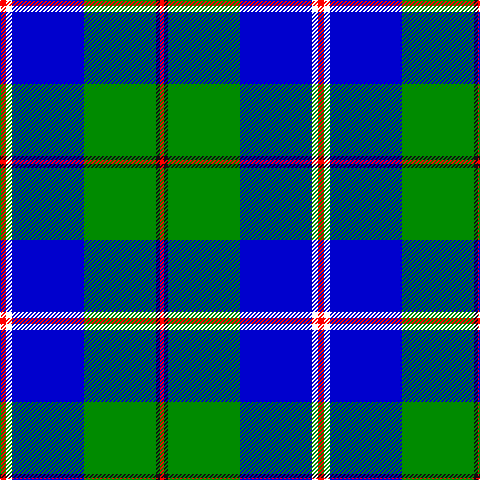

In pattern [RKGBWR](/stripes/rkgbwr/).

This was sourced from register-of-tartans.  It is a [6 stripe tartan](/stripes/stripes6/).

Original link https://www.tartanregister.gov.uk/tartanDetails.aspx?ref=10309

## Also known as

This cloth is also recorded under:

- Militello, Massimiliano

## Attestations

This cloth appears in 2 source records; the oldest owns this page.

- 02/11/2010 — Militello (Palermo) Dress (Personal) (register-of-tartans, [record](https://www.tartanregister.gov.uk/tartanDetails.aspx?ref=10309))
- 2nd Nov.2010 — Militello, Massimiliano (Personal) (tartans-authority, [record](http://www.tartansauthority.com/tartan-ferret/display/10309/))

## Register references

External register numbers recorded for this tartan.

- Scottish Register of Tartans: [10309](https://www.tartanregister.gov.uk/tartanDetails.aspx?ref=10309)

## Thread count
R/6 W6 B72 G72 K4 R/4

## Palette
Each colour and the base-6 reference it is a variant of.

| Colour | Shade | Base |
|---|---|---|
| B | <code style="background-color:#0000CD;">#0000CD</code> `oklch(38.3% 0.266 264.1)` <small>#0000CD</small> | B <code style="background-color:#2A418A;">#2A418A</code> |
| G | <code style="background-color:#008B00;">#008B00</code> `oklch(55.2% 0.188 142.5)` <small>#008B00</small> | G <code style="background-color:#006100;">#006100</code> |
| K | <code style="background-color:#101010;">#101010</code> `oklch(17.3% 0.000 89.9)` <small>#101010</small> | K <code style="background-color:#000000;">#000000</code> |
| R | <code style="background-color:#FF0000;">#FF0000</code> `oklch(62.8% 0.258 29.2)` <small>#FF0000</small> | R <code style="background-color:#CC0000;">#CC0000</code> |
| W | <code style="background-color:#FFFFFF;">#FFFFFF</code> `oklch(100.0% 0.000 89.9)` <small>#FFFFFF</small> | W <code style="background-color:#F7F7F7;">#F7F7F7</code> |

# Sample pattern

## Nearest tartans

The nearest existing variants by ΔTartan distance, with this tartan at the top so the swatches line up against it.

ΔTartan

Tartan

Sett

—

<a href="/ttd/edit/#slug=r3w3db36g36k2r2~x2">Militello (Palermo) Dress (Personal)</a> <a class="nn-out" href="/setts/s6/r3w3db36g36k2r2~x2/" title="open its dictionary page">↗</a>

1.20

<a href="/ttd/edit/#slug=db3g4db20g24k2lb3r1~x2">Nowell/Noel (Name)</a> <a class="nn-out" href="/setts/s7/db3g4db20g24k2lb3r1~x2/" title="open its dictionary page">↗</a>

1.24

<a href="/ttd/edit/#slug=r2w7b30dg36ly2~x2">Centennial-King George Lodge No.171</a> <a class="nn-out" href="/setts/s5/r2w7b30dg36ly2~x2/" title="open its dictionary page">↗</a>

1.24

<a href="/ttd/edit/#slug=w15ly2k5lb3b40k10">Herriot New Zealand</a> <a class="nn-out" href="/setts/s6/w15ly2k5lb3b40k10/" title="open its dictionary page">↗</a>

1.26

<a href="/ttd/edit/#slug=k4t24k2g13t2k3~x4">Vance (Family Association) Corporate Family Tartan Tartan Number: 2208. Earliest known date: December 1994 Designed and Copyrighted in the US by Mark W. Vance. Details from Vance Family Association website. See products available Copyright © Blair Urquhart, Comrie, 2015</a> <a class="nn-out" href="/setts/s6/k4t24k2g13t2k3~x4/" title="open its dictionary page">↗</a>

1.27

<a href="/ttd/edit/#slug=w3b12db1g15m3w1~x4">Eeraerts, Laurent (Personal)</a> <a class="nn-out" href="/setts/s6/w3b12db1g15m3w1~x4/" title="open its dictionary page">↗</a>

1.33

<a href="/ttd/edit/#slug=g2db14lg6lr1g1lr6r1~x4">Loch Ness in Scotland</a> <a class="nn-out" href="/setts/s7/g2db14lg6lr1g1lr6r1~x4/" title="open its dictionary page">↗</a>

1.38

<a href="/ttd/edit/#slug=b20r1w3db1w2db8g3w1~x4">Kruenaegel and Schropp (Name)</a> <a class="nn-out" href="/setts/s8/b20r1w3db1w2db8g3w1~x4/" title="open its dictionary page">↗</a>

1.40

<a href="/ttd/edit/#slug=g4ly2g24w12db26r1~x2">Vancouver Centennial</a> <a class="nn-out" href="/setts/s6/g4ly2g24w12db26r1~x2/" title="open its dictionary page">↗</a>

1.43

<a href="/ttd/edit/#slug=k4ly1g2ly1g32lt1g3db32lt3~x2">McClurg</a> <a class="nn-out" href="/setts/s9/k4ly1g2ly1g32lt1g3db32lt3~x2/" title="open its dictionary page">↗</a>

1.45

<a href="/ttd/edit/#slug=dt42t2w2t2dt5k12w32db4~x2">Comrie, Navy Blue (Dance)</a> <a class="nn-out" href="/setts/s8/dt42t2w2t2dt5k12w32db4~x2/" title="open its dictionary page">↗</a>

## Neighbour map

Every grey dot is one of 14299 variants placed by the first two principal components of the ΔTartan feature space (44% of its variance). Red is this tartan; blue dots are its nearest — click one to open its page.

<svg viewBox="0 0 640 380" role="img" style="max-width:100%;height:auto;border:1px solid #e0e0e0;border-radius:4px;display:block" xmlns="http://www.w3.org/2000/svg"><image href="/nn/cloud.v1.png" width="640" height="380"/><a href="/setts/s7/db3g4db20g24k2lb3r1~x2/"><circle cx="283.7" cy="146.2" r="4" fill="#3465a4"><title>Nowell/Noel (Name)</title></circle></a><a href="/setts/s5/r2w7b30dg36ly2~x2/"><circle cx="255.8" cy="173.5" r="4" fill="#3465a4"><title>Centennial-King George Lodge No.171</title></circle></a><a href="/setts/s6/w15ly2k5lb3b40k10/"><circle cx="252.3" cy="138.4" r="4" fill="#3465a4"><title>Herriot New Zealand</title></circle></a><a href="/setts/s6/k4t24k2g13t2k3~x4/"><circle cx="261.1" cy="178.2" r="4" fill="#3465a4"><title>Vance (Family Association) Corporate Family Tartan Tartan Number: 2208. Earliest known date: December 1994 Designed and Copyrighted in the US by Mark W. Vance. Details from Vance Family Association website. See products available Copyright © Blair Urquhart, Comrie, 2015</title></circle></a><a href="/setts/s6/w3b12db1g15m3w1~x4/"><circle cx="205.0" cy="164.7" r="4" fill="#3465a4"><title>Eeraerts, Laurent (Personal)</title></circle></a><a href="/setts/s7/g2db14lg6lr1g1lr6r1~x4/"><circle cx="200.2" cy="156.6" r="4" fill="#3465a4"><title>Loch Ness in Scotland</title></circle></a><a href="/setts/s8/b20r1w3db1w2db8g3w1~x4/"><circle cx="264.7" cy="123.2" r="4" fill="#3465a4"><title>Kruenaegel and Schropp (Name)</title></circle></a><a href="/setts/s6/g4ly2g24w12db26r1~x2/"><circle cx="194.2" cy="141.6" r="4" fill="#3465a4"><title>Vancouver Centennial</title></circle></a><a href="/setts/s9/k4ly1g2ly1g32lt1g3db32lt3~x2/"><circle cx="275.9" cy="99.4" r="4" fill="#3465a4"><title>McClurg</title></circle></a><a href="/setts/s8/dt42t2w2t2dt5k12w32db4~x2/"><circle cx="230.7" cy="115.3" r="4" fill="#3465a4"><title>Comrie, Navy Blue (Dance)</title></circle></a><circle cx="244.1" cy="148.1" r="5" fill="#c00000"/></svg>

ID: /setts/s6/r3w3db36g36k2r2~x2/
