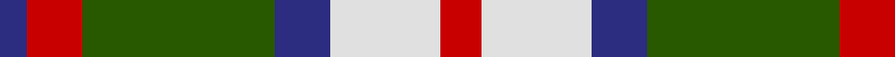
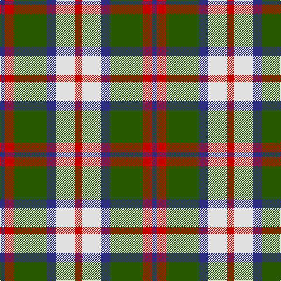

In pattern [BRGBWR](/patterns/brgbwr/).

This was sourced from register-of-tartans.  It is a [6 stripes tartan](/stripes/stripes6/).

Original link https://www.tartanregister.gov.uk/tartanDetails.aspx?ref=2571

## Attestations

This cloth appears in 2 source records; the oldest owns this page.

- 01/01/2002 — MacKintosh Dress (Scott Adie) (register-of-tartans, [record](https://www.tartanregister.gov.uk/tartanDetails.aspx?ref=2571))
- pre 2002 — MacKintosh Dress - 1930 (Clan?) (tartans-authority, [record](http://www.tartansauthority.com/tartan-ferret/display/538/))

## Thread count
DB/8 R16 G56 DB16 LN32 R/12

## Palette
Each colour and its ΔE from the base-6 reference it is a variant of.

| Colour | Shade | Base | ΔE (OKLab) |
|---|---|---|---|
| DB | <code style="background-color:#2C2C80;">#2C2C80</code> `#2C2C80` | B <code style="background-color:#2A418A;">#2A418A</code> | 0.06 |
| G | <code style="background-color:#285800;">#285800</code> `#285800` | G <code style="background-color:#006100;">#006100</code> | 0.03 |
| LN | <code style="background-color:#E0E0E0;">#E0E0E0</code> `#E0E0E0` | W <code style="background-color:#F7F7F7;">#F7F7F7</code> | 0.07 |
| R | <code style="background-color:#C80000;">#C80000</code> `#C80000` | R <code style="background-color:#CC0000;">#CC0000</code> | 0.01 |

# Sample pattern

## Nearest tartans

The nearest existing variants by ΔTartan distance.

1. [MacIntosh Dress Clan Tartan Tartan Number: 538. Earliest known date: pre 2003 From an old pattern book in possesion of Messrs Scott Adie of London. See products available Copyright © Blair Urquhart, Comrie, 2015](/setts/s6/r3w8b4g14r4b2~b2c2c80-g006818-rc80000-we0e0e0~x2/) — ΔT 0.28
1. [Thompson Grey Dress](/setts/s6/r1ra6k1w3k3r1~k101010-r880000-ra888888-we0e0e0~x8/) — ΔT 0.62
1. [Un-named (D C Dalgliesh) #3](/setts/s6/g3y24k15r3g25k3~g408060-k101010-ra888b4-ye09894~x2/) — ΔT 0.68
1. [Fraser Dress](/setts/s6/r6k14r6g14w27k4~g005020-k101010-rdc0000-we0e0e0/) — ΔT 0.71
1. [MacIntosh, dress](/setts/s6/r3w8b4g14r4b2~b304080-g008000-rc00000-we0e0e0~x2/) — ΔT 0.75
1. [Thompson Camel Clan Tartan Tartan Number: 2421. Earliest known date: 1967 Designed by Scotty Thompson. It it a simple colour variation on the usual blue Thompson, but is often confused with the Burberry Check. See products available Copyright © Blair Urquhart, Comrie, 2015](/setts/s6/r2y20k5w10k10w2~k101010-rc80000-we0e0e0-ya08858~x2/) — ΔT 0.82
1. [Thompson/Thomson/MacTavish special grey](/setts/s6/r3g27k6y13k14r3~g808080-k101010-rdc0000-yc89664~x2/) — ΔT 0.86
1. [Thompson Grey Family Tartan Tartan Number: 1611. Earliest known date: pre 2003 Designed for Lord Thomson of Fleet in 1958 based on a sample in the Moy Hall collection dating from the mid 19th century. The tartan is also suitable for MacTavishs and Thompsons, who claim descent from the Clan MacIntosh. See products available Copyright © Blair Urquhart, Comrie, 2015](/setts/s6/r2ra20k5w10k10r2~k101010-rc80000-ra888888-we0e0e0~x2/) — ΔT 0.87
1. [Fraser, dress](/setts/s6/r6k14r6g14w27k4~g008000-k000000-rc00000-we0e0e0/) — ΔT 0.87
1. [Thomson Camel](/setts/s6/r4y30k6w13k13w3~k101010-rc80000-we0e0e0-ya08858~x2/) — ΔT 0.91

## Neighbour map

Every grey dot is one of 15726 variants placed by the first two principal components of the ΔTartan feature space (44% of its variance). Red is this tartan; blue dots are its nearest — click one to open its page.

<svg viewBox="0 0 640 380" role="img" style="max-width:100%;height:auto;border:1px solid #e0e0e0;border-radius:4px;display:block" xmlns="http://www.w3.org/2000/svg"><image href="/nn/cloud.v1.png" width="640" height="380"/><a href="/setts/s6/r3w8b4g14r4b2~b2c2c80-g006818-rc80000-we0e0e0~x2/"><circle cx="146.8" cy="216.7" r="4" fill="#3465a4"><title>MacIntosh Dress Clan Tartan Tartan Number: 538. Earliest known date: pre 2003 From an old pattern book in possesion of Messrs Scott Adie of London. See products available Copyright © Blair Urquhart, Comrie, 2015</title></circle></a><a href="/setts/s6/r1ra6k1w3k3r1~k101010-r880000-ra888888-we0e0e0~x8/"><circle cx="142.4" cy="217.2" r="4" fill="#3465a4"><title>Thompson Grey Dress</title></circle></a><a href="/setts/s6/g3y24k15r3g25k3~g408060-k101010-ra888b4-ye09894~x2/"><circle cx="177.6" cy="207.2" r="4" fill="#3465a4"><title>Un-named (D C Dalgliesh) #3</title></circle></a><a href="/setts/s6/r6k14r6g14w27k4~g005020-k101010-rdc0000-we0e0e0/"><circle cx="118.1" cy="212.0" r="4" fill="#3465a4"><title>Fraser Dress</title></circle></a><a href="/setts/s6/r3w8b4g14r4b2~b304080-g008000-rc00000-we0e0e0~x2/"><circle cx="148.8" cy="217.6" r="4" fill="#3465a4"><title>MacIntosh, dress</title></circle></a><a href="/setts/s6/r2y20k5w10k10w2~k101010-rc80000-we0e0e0-ya08858~x2/"><circle cx="174.2" cy="194.0" r="4" fill="#3465a4"><title>Thompson Camel Clan Tartan Tartan Number: 2421. Earliest known date: 1967 Designed by Scotty Thompson. It it a simple colour variation on the usual blue Thompson, but is often confused with the Burberry Check. See products available Copyright © Blair Urquhart, Comrie, 2015</title></circle></a><a href="/setts/s6/r3g27k6y13k14r3~g808080-k101010-rdc0000-yc89664~x2/"><circle cx="190.4" cy="208.1" r="4" fill="#3465a4"><title>Thompson/Thomson/MacTavish special grey</title></circle></a><a href="/setts/s6/r2ra20k5w10k10r2~k101010-rc80000-ra888888-we0e0e0~x2/"><circle cx="172.2" cy="195.7" r="4" fill="#3465a4"><title>Thompson Grey Family Tartan Tartan Number: 1611. Earliest known date: pre 2003 Designed for Lord Thomson of Fleet in 1958 based on a sample in the Moy Hall collection dating from the mid 19th century. The tartan is also suitable for MacTavishs and Thompsons, who claim descent from the Clan MacIntosh. See products available Copyright © Blair Urquhart, Comrie, 2015</title></circle></a><a href="/setts/s6/r6k14r6g14w27k4~g008000-k000000-rc00000-we0e0e0/"><circle cx="110.6" cy="212.0" r="4" fill="#3465a4"><title>Fraser, dress</title></circle></a><a href="/setts/s6/r4y30k6w13k13w3~k101010-rc80000-we0e0e0-ya08858~x2/"><circle cx="188.6" cy="191.0" r="4" fill="#3465a4"><title>Thomson Camel</title></circle></a><circle cx="148.3" cy="216.1" r="5" fill="#c00000"/></svg>

ID: /setts/s6/r3w8b4g14r4b2~b2c2c80-g285800-rc80000-we0e0e0~x4/
