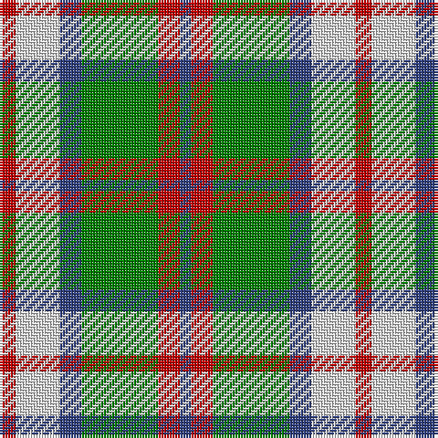

In pattern [BRGBWR](/stripes/brgbwr/).

This was sourced from weddslist.  It is a [6 stripe tartan](/stripes/stripes6/).

Original link http://www.weddslist.com/cgi-bin/tartans/pg.pl?source=sts

## Also known as

This cloth is also recorded under:

- MacIntosh, dress

## Attestations

This cloth appears in 2 source records; the oldest owns this page.

- undated — MacIntosh, dress (weddslist, [record](http://www.weddslist.com/cgi-bin/tartans/pg.pl?source=sts))
- undated — MacIntosh Dress Clan Tartan Tartan Number: 538. Earliest known date: pre 2003 From an old pattern book in possesion of Messrs Scott Adie of London. See products available Copyright © Blair Urquhart, Comrie, 2015 (house-of-tartan, [record](http://www.house-of-tartan.scotland.net/house/TartanViewjs.asp?colr=Def&tnam=538))

## Thread count
R/6 LN16 B8 G28 R8 B/4

## Palette
Each colour and the base-6 reference it is a variant of.

| Colour | Shade | Base |
|---|---|---|
| B | <code style="background-color:#304080;">#304080</code> `oklch(39.4% 0.109 270.2)` <small>#304080</small> | B <code style="background-color:#2A418A;">#2A418A</code> |
| G | <code style="background-color:#008000;">#008000</code> `oklch(52.0% 0.177 142.5)` <small>#008000</small> | G <code style="background-color:#006100;">#006100</code> |
| LN | <code style="background-color:#E0E0E0;">#E0E0E0</code> `oklch(90.7% 0.000 89.9)` <small>#E0E0E0</small> | W <code style="background-color:#F7F7F7;">#F7F7F7</code> |
| R | <code style="background-color:#C00000;">#C00000</code> `oklch(50.7% 0.208 29.2)` <small>#C00000</small> | R <code style="background-color:#CC0000;">#CC0000</code> |

# Sample pattern

## Nearest tartans

The nearest existing variants by ΔTartan distance.

1. [MacKintosh Dress (Scott Adie)](/setts/s6/r3w8db4dg14r4db2~x4/) — ΔT 0.76
1. [Un-named (D C Dalgliesh) #3](/setts/s6/k3g25o3k15lr24g3~x2/) — ΔT 0.99
1. [Cape Breton District Tartan Tartan Number: 1883. Earliest known date: 1957 In 1907, Mrs Lillian Crewe Walsh of Glace Bay, Cape Breton, wrote a poem in praise of Cape Breton. This poem was given by Mrs Walsh to Mrs Grant in 1957 and the tartan designed to accord with the poem. Grey for our Cape Breton Steel, Green for our lofty See products available Copyright © Blair Urquhart, Comrie, 2015](/setts/s7/ly5k5g17k6o24k6ly3~x2/) — ΔT 1.02
1. [Birnham, Blue (Dance)](/setts/s6/k3w25g16w3n25w3~x2/) — ΔT 1.03
1. [Wilson's No.179](/setts/s8/g6ly1r1t2r2~x4/) — ΔT 1.07
1. [Bannockbane Dark Green](/setts/s7/dg4g3dg24w15lo21g3lo4~x2/) — ΔT 1.10
1. [Thompson Camel Clan Tartan Tartan Number: 2421. Earliest known date: 1967 Designed by Scotty Thompson. It it a simple colour variation on the usual blue Thompson, but is often confused with the Burberry Check. See products available Copyright © Blair Urquhart, Comrie, 2015](/setts/s6/r2lo20k5w10k10w2~x2/) — ΔT 1.16
1. [Fraser Dress](/setts/s6/r6k14r6dg14w27k4/) — ΔT 1.19
1. [Thomson Camel](/setts/s6/r4lo30k6w13k13w3~x2/) — ΔT 1.20
1. [Northern Ontario](/setts/s7/dy17g5db2w12db2ly4g7~x4/) — ΔT 1.21

## Neighbour map

Every grey dot is one of 14299 variants placed by the first two principal components of the ΔTartan feature space (44% of its variance). Red is this tartan; blue dots are its nearest — click one to open its page.

<svg viewBox="0 0 640 380" role="img" style="max-width:100%;height:auto;border:1px solid #e0e0e0;border-radius:4px;display:block" xmlns="http://www.w3.org/2000/svg"><image href="/nn/cloud.v1.png" width="640" height="380"/><a href="/setts/s6/r3w8db4dg14r4db2~x4/"><circle cx="150.6" cy="213.9" r="4" fill="#3465a4"><title>MacKintosh Dress (Scott Adie)</title></circle></a><a href="/setts/s6/k3g25o3k15lr24g3~x2/"><circle cx="180.1" cy="205.9" r="4" fill="#3465a4"><title>Un-named (D C Dalgliesh) #3</title></circle></a><a href="/setts/s7/ly5k5g17k6o24k6ly3~x2/"><circle cx="152.5" cy="207.8" r="4" fill="#3465a4"><title>Cape Breton District Tartan Tartan Number: 1883. Earliest known date: 1957 In 1907, Mrs Lillian Crewe Walsh of Glace Bay, Cape Breton, wrote a poem in praise of Cape Breton. This poem was given by Mrs Walsh to Mrs Grant in 1957 and the tartan designed to accord with the poem. Grey for our Cape Breton Steel, Green for our lofty See products available Copyright © Blair Urquhart, Comrie, 2015</title></circle></a><a href="/setts/s6/k3w25g16w3n25w3~x2/"><circle cx="180.6" cy="199.4" r="4" fill="#3465a4"><title>Birnham, Blue (Dance)</title></circle></a><a href="/setts/s8/g6ly1r1t2r2~x4/"><circle cx="162.1" cy="212.9" r="4" fill="#3465a4"><title>Wilson's No.179</title></circle></a><a href="/setts/s7/dg4g3dg24w15lo21g3lo4~x2/"><circle cx="144.8" cy="184.5" r="4" fill="#3465a4"><title>Bannockbane Dark Green</title></circle></a><a href="/setts/s6/r2lo20k5w10k10w2~x2/"><circle cx="176.4" cy="189.9" r="4" fill="#3465a4"><title>Thompson Camel Clan Tartan Tartan Number: 2421. Earliest known date: 1967 Designed by Scotty Thompson. It it a simple colour variation on the usual blue Thompson, but is often confused with the Burberry Check. See products available Copyright © Blair Urquhart, Comrie, 2015</title></circle></a><a href="/setts/s6/r6k14r6dg14w27k4/"><circle cx="120.4" cy="207.7" r="4" fill="#3465a4"><title>Fraser Dress</title></circle></a><a href="/setts/s6/r4lo30k6w13k13w3~x2/"><circle cx="190.6" cy="186.9" r="4" fill="#3465a4"><title>Thomson Camel</title></circle></a><a href="/setts/s7/dy17g5db2w12db2ly4g7~x4/"><circle cx="103.4" cy="175.6" r="4" fill="#3465a4"><title>Northern Ontario</title></circle></a><circle cx="151.1" cy="216.1" r="5" fill="#c00000"/></svg>

ID: /setts/s6/r3w8db4g14r4db2~x2/
