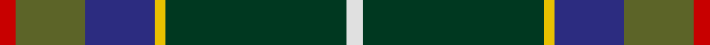
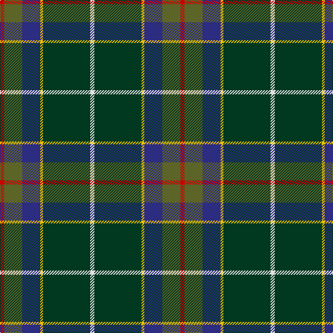

This page is one **sett** — a single exact thread-count. It belongs to the [tartan](/tartans/r3g13db13y2dg34ln3/)
(the same proportion at any scale), whose colour order is pattern [RGBYGW](/stripes/rgbygw/).

Sourced from tartans-authority.  It is a [6 stripe tartan](/stripes/stripes6/).

Original link http://www.tartansauthority.com/tartan-ferret/display/10451/

## Thread count
R/6 G26 DB26 Y4 DG68 LN/6

## Palette
Each colour and the base-6 reference it is a variant of.

| Colour | Shade | Base |
|---|---|---|
| DB | <code style="background-color:#2C2C80;">#2C2C80</code> `oklch(35.0% 0.138 276.6)` <small>#2C2C80</small> | B <code style="background-color:#2A418A;">#2A418A</code> |
| DG | <code style="background-color:#003820;">#003820</code> `oklch(30.0% 0.070 158.3)` <small>#003820</small> | G <code style="background-color:#006100;">#006100</code> |
| G | <code style="background-color:#5C6428;">#5C6428</code> `oklch(48.3% 0.084 116.0)` <small>#5C6428</small> | G <code style="background-color:#006100;">#006100</code> |
| LN | <code style="background-color:#E0E0E0;">#E0E0E0</code> `oklch(90.7% 0.000 89.9)` <small>#E0E0E0</small> | W <code style="background-color:#F7F7F7;">#F7F7F7</code> |
| R | <code style="background-color:#C80000;">#C80000</code> `oklch(52.3% 0.215 29.2)` <small>#C80000</small> | R <code style="background-color:#CC0000;">#CC0000</code> |
| Y | <code style="background-color:#E8C000;">#E8C000</code> `oklch(81.9% 0.168 93.7)` <small>#E8C000</small> | Y <code style="background-color:#F2BF00;">#F2BF00</code> |

# Sample pattern

## Nearest tartans

The nearest existing variants by ΔTartan distance, with this tartan at the top so the swatches line up against it.

ΔTartan

Tartan

Sett

—

<a href="/ttd/edit/#slug=r3y13db13ly2dg34w3~x2">Glencross, Tynron (Name)</a> <a class="nn-out" href="/setts/s6/r3y13db13ly2dg34w3~x2/" title="open its dictionary page">↗</a>

0.88

<a href="/ttd/edit/#slug=r3db6ly2db15g12dg39w3~x2">Wagland (Name)</a> <a class="nn-out" href="/setts/s7/r3db6ly2db15g12dg39w3~x2/" title="open its dictionary page">↗</a>

0.99

<a href="/ttd/edit/#slug=y5lo1r2y25k14db19w2y4~x2">Tooth (Personal)</a> <a class="nn-out" href="/setts/s8/y5lo1r2y25k14db19w2y4~x2/" title="open its dictionary page">↗</a>

1.00

<a href="/ttd/edit/#slug=dg42ly2g16dt7k16r5~x2">Waterford Irish County Tartan Tartan Number: 2255. Earliest known date: 1993 One of a series of Irish District tartans designed by Polly Wittering of the House of Edgar, with colours reminiscent of the Country with soft warm colours dominating. See products available Copyright © Blair Urquhart, Comrie, 2015</a> <a class="nn-out" href="/setts/s6/dg42ly2g16dt7k16r5~x2/" title="open its dictionary page">↗</a>

1.03

<a href="/ttd/edit/#slug=r4db15w2n15g30r2g4~x2">Sinclair Green (Personal)</a> <a class="nn-out" href="/setts/s7/r4db15w2n15g30r2g4~x2/" title="open its dictionary page">↗</a>

1.08

<a href="/ttd/edit/#slug=g4r2g20db8k8db4lb1lo2k1~x2">Dodd of Branford</a> <a class="nn-out" href="/setts/s9/g4r2g20db8k8db4lb1lo2k1~x2/" title="open its dictionary page">↗</a>

1.11

<a href="/ttd/edit/#slug=r3db6ly2db15dg12g39w3~x2">Wagland</a> <a class="nn-out" href="/setts/s7/r3db6ly2db15dg12g39w3~x2/" title="open its dictionary page">↗</a>

1.14

<a href="/ttd/edit/#slug=lo2dg20db8dp3db2dp2db16w1lg2~x2">Scotland’s Golf Coast</a> <a class="nn-out" href="/setts/s9/lo2dg20db8dp3db2dp2db16w1lg2~x2/" title="open its dictionary page">↗</a>

1.16

<a href="/ttd/edit/#slug=w1dt16lo1r3lo1dg6y2dg6w1~x2">Kleto, Susan (Personal)</a> <a class="nn-out" href="/setts/s9/w1dt16lo1r3lo1dg6y2dg6w1~x2/" title="open its dictionary page">↗</a>

1.18

<a href="/ttd/edit/#slug=r4lb1y6g25k8db15lb2~x2">Jones (Name)</a> <a class="nn-out" href="/setts/s7/r4lb1y6g25k8db15lb2~x2/" title="open its dictionary page">↗</a>

1.19

<a href="/ttd/edit/#slug=db25k84w5g32ly5dp8~x2">Woodward, R Glenn</a> <a class="nn-out" href="/setts/s6/db25k84w5g32ly5dp8~x2/" title="open its dictionary page">↗</a>

## Neighbour map

Every grey dot is one of 14299 variants placed by the first two principal components of the ΔTartan feature space (44% of its variance). Red is this tartan; blue dots are its nearest — click one to open its page.

<svg viewBox="0 0 640 380" role="img" style="max-width:100%;height:auto;border:1px solid #e0e0e0;border-radius:4px;display:block" xmlns="http://www.w3.org/2000/svg"><image href="/nn/cloud.v1.png" width="640" height="380"/><a href="/setts/s7/r3db6ly2db15g12dg39w3~x2/"><circle cx="271.9" cy="154.2" r="4" fill="#3465a4"><title>Wagland (Name)</title></circle></a><a href="/setts/s8/y5lo1r2y25k14db19w2y4~x2/"><circle cx="257.8" cy="137.5" r="4" fill="#3465a4"><title>Tooth (Personal)</title></circle></a><a href="/setts/s6/dg42ly2g16dt7k16r5~x2/"><circle cx="250.6" cy="170.9" r="4" fill="#3465a4"><title>Waterford Irish County Tartan Tartan Number: 2255. Earliest known date: 1993 One of a series of Irish District tartans designed by Polly Wittering of the House of Edgar, with colours reminiscent of the Country with soft warm colours dominating. See products available Copyright © Blair Urquhart, Comrie, 2015</title></circle></a><a href="/setts/s7/r4db15w2n15g30r2g4~x2/"><circle cx="255.1" cy="182.9" r="4" fill="#3465a4"><title>Sinclair Green (Personal)</title></circle></a><a href="/setts/s9/g4r2g20db8k8db4lb1lo2k1~x2/"><circle cx="240.5" cy="136.2" r="4" fill="#3465a4"><title>Dodd of Branford</title></circle></a><a href="/setts/s7/r3db6ly2db15dg12g39w3~x2/"><circle cx="281.6" cy="156.6" r="4" fill="#3465a4"><title>Wagland</title></circle></a><a href="/setts/s9/lo2dg20db8dp3db2dp2db16w1lg2~x2/"><circle cx="258.8" cy="135.7" r="4" fill="#3465a4"><title>Scotland’s Golf Coast</title></circle></a><a href="/setts/s9/w1dt16lo1r3lo1dg6y2dg6w1~x2/"><circle cx="218.5" cy="134.9" r="4" fill="#3465a4"><title>Kleto, Susan (Personal)</title></circle></a><a href="/setts/s7/r4lb1y6g25k8db15lb2~x2/"><circle cx="209.6" cy="147.1" r="4" fill="#3465a4"><title>Jones (Name)</title></circle></a><a href="/setts/s6/db25k84w5g32ly5dp8~x2/"><circle cx="265.7" cy="155.3" r="4" fill="#3465a4"><title>Woodward, R Glenn</title></circle></a><circle cx="259.6" cy="164.7" r="5" fill="#c00000"/></svg>

ID: /setts/s6/r3y13db13ly2dg34w3~x2/
