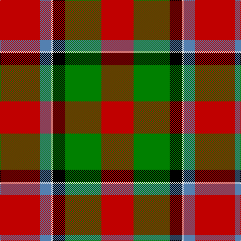

In pattern [RBWKGR](/patterns/rbwkgr/).

This was sourced from weddslist.  It is a [6 stripes tartan](/stripes/stripes6/).

Original link http://www.weddslist.com/cgi-bin/tartans/pg.pl?source=sts

## Thread count
R/80 B22 LN4 K24 G72 R/64

## Palette
Each colour and its ΔE from the base-6 reference it is a variant of.

| Colour | Shade | Base | ΔE (OKLab) |
|---|---|---|---|
| B | <code style="background-color:#5480B0;">#5480B0</code> `#5480B0` | B <code style="background-color:#2A418A;">#2A418A</code> | 0.19 |
| G | <code style="background-color:#008000;">#008000</code> `#008000` | G <code style="background-color:#006100;">#006100</code> | 0.10 |
| K | <code style="background-color:#000000;">#000000</code> `#000000` | K <code style="background-color:#000000;">#000000</code> | 0.00 |
| LN | <code style="background-color:#E0E0E0;">#E0E0E0</code> `#E0E0E0` | W <code style="background-color:#F7F7F7;">#F7F7F7</code> | 0.07 |
| R | <code style="background-color:#C00000;">#C00000</code> `#C00000` | R <code style="background-color:#CC0000;">#CC0000</code> | 0.03 |

# Sample pattern

## Nearest tartans

The nearest existing variants by ΔTartan distance.

1. [Thompson/Thomson/MacTavish (Mackinlay)](/setts/s6/r40b11w2k12g36r32x2~b3c82af-g005020-k101010-rdc0000-we0e0e0/) — ΔT 0.62
1. [Sturrock](/setts/s7/r52b16k16g22r16y3r16~b304080-g008000-k000000-rc00000-yf0c000/) — ΔT 0.95
1. [Caithness (1848) (District?)](/setts/s6/r40b11w2k12g36r32x2~b5c8ca8-g408060-k101010-rc80000-wf8f8f8/) — ΔT 1.03
1. [Sturrock, Blue/Black (Clan)](/setts/s7/r52b16k16g22r16y3r16x2~b1870a4-g006818-k101010-rc80000-yd09800/) — ΔT 1.16
1. [Sturrock Family Tartan Tartan Number: 1359. Earliest known date: From collection dating 1930-5 The thread count of the cloth sample has been divided by two for display. The Register contains two Sturrock counts. In this version blue replaces part of the black stripe, making a small change to the appearance that could easily go unnoticed. It is likely that the second pattern came about by the use of a very dark blue that was later mistaken for black. See products available Copyright © Blair Urquhart, Comrie, 2015](/setts/s7/r52b16k16g22r16y3r16~b2c2c80-g006818-k101010-rc80000-ye8c000/) — ΔT 1.20
1. [MacDuff](/setts/s7/r96b16g34ga48r18k6r9~b304080-g003000-ga008000-k000000-rc00000/) — ΔT 1.21
1. [Nisbet Family Tartan Tartan Number: 2115. Earliest known date: 1842 This is the sett that appears in the Vestiarium Scoticum as Mackintosh. There is no connection between the names, historically, to explain the position and it is interesting to note the similarity with the Dunbar tartan which also originates in the Vestiarium. The Nisbets came from the old barony of Nisbet in the parish of Edrom, Berwickshire, as early as 1160. See products available Copyright © Blair Urquhart, Comrie, 2015](/setts/s6/r5w2r28k12g16r3x2~g006818-k101010-rc80000-we0e0e0/) — ΔT 1.30
1. [MacDuff](/setts/s7/r96b16g34ga48r18k6r9~b2c4084-g002814-ga005020-k101010-rdc0000/) — ΔT 1.30
1. [MacAulay](/setts/s6/k2r16g6r3g8w1~g004c00-k000000-rc80000-wd0d0d0/) — ΔT 1.34
1. [MacDuff #6](/setts/s7/r36w9k12g17r10k3r10x2~g006818-k101010-rc80000-w82cffd/) — ΔT 1.37

## Neighbour map

Every grey dot is one of 15726 variants placed by the first two principal components of the ΔTartan feature space (44% of its variance). Red is this tartan; blue dots are its nearest — click one to open its page.

<svg viewBox="0 0 640 380" role="img" style="max-width:100%;height:auto;border:1px solid #e0e0e0;border-radius:4px;display:block" xmlns="http://www.w3.org/2000/svg"><image href="/nn/cloud.v1.png" width="640" height="380"/><a href="/setts/s6/r40b11w2k12g36r32x2~b3c82af-g005020-k101010-rdc0000-we0e0e0/"><circle cx="282.8" cy="176.6" r="4" fill="#3465a4"><title>Thompson/Thomson/MacTavish (Mackinlay)</title></circle></a><a href="/setts/s7/r52b16k16g22r16y3r16~b304080-g008000-k000000-rc00000-yf0c000/"><circle cx="296.4" cy="168.6" r="4" fill="#3465a4"><title>Sturrock</title></circle></a><a href="/setts/s6/r40b11w2k12g36r32x2~b5c8ca8-g408060-k101010-rc80000-wf8f8f8/"><circle cx="294.6" cy="181.1" r="4" fill="#3465a4"><title>Caithness (1848) (District?)</title></circle></a><a href="/setts/s7/r52b16k16g22r16y3r16x2~b1870a4-g006818-k101010-rc80000-yd09800/"><circle cx="317.2" cy="175.2" r="4" fill="#3465a4"><title>Sturrock, Blue/Black (Clan)</title></circle></a><a href="/setts/s7/r52b16k16g22r16y3r16~b2c2c80-g006818-k101010-rc80000-ye8c000/"><circle cx="314.2" cy="173.7" r="4" fill="#3465a4"><title>Sturrock Family Tartan Tartan Number: 1359. Earliest known date: From collection dating 1930-5 The thread count of the cloth sample has been divided by two for display. The Register contains two Sturrock counts. In this version blue replaces part of the black stripe, making a small change to the appearance that could easily go unnoticed. It is likely that the second pattern came about by the use of a very dark blue that was later mistaken for black. See products available Copyright © Blair Urquhart, Comrie, 2015</title></circle></a><a href="/setts/s7/r96b16g34ga48r18k6r9~b304080-g003000-ga008000-k000000-rc00000/"><circle cx="293.2" cy="160.8" r="4" fill="#3465a4"><title>MacDuff</title></circle></a><a href="/setts/s6/r5w2r28k12g16r3x2~g006818-k101010-rc80000-we0e0e0/"><circle cx="305.3" cy="189.8" r="4" fill="#3465a4"><title>Nisbet Family Tartan Tartan Number: 2115. Earliest known date: 1842 This is the sett that appears in the Vestiarium Scoticum as Mackintosh. There is no connection between the names, historically, to explain the position and it is interesting to note the similarity with the Dunbar tartan which also originates in the Vestiarium. The Nisbets came from the old barony of Nisbet in the parish of Edrom, Berwickshire, as early as 1160. See products available Copyright © Blair Urquhart, Comrie, 2015</title></circle></a><a href="/setts/s7/r96b16g34ga48r18k6r9~b2c4084-g002814-ga005020-k101010-rdc0000/"><circle cx="293.8" cy="157.8" r="4" fill="#3465a4"><title>MacDuff</title></circle></a><a href="/setts/s6/k2r16g6r3g8w1~g004c00-k000000-rc80000-wd0d0d0/"><circle cx="321.8" cy="187.6" r="4" fill="#3465a4"><title>MacAulay</title></circle></a><a href="/setts/s7/r36w9k12g17r10k3r10x2~g006818-k101010-rc80000-w82cffd/"><circle cx="292.5" cy="195.0" r="4" fill="#3465a4"><title>MacDuff #6</title></circle></a><circle cx="269.9" cy="175.1" r="5" fill="#c00000"/></svg>

ID: /setts/s6/r40b11w2k12g36r32x2~b5480b0-g008000-k000000-rc00000-we0e0e0/
