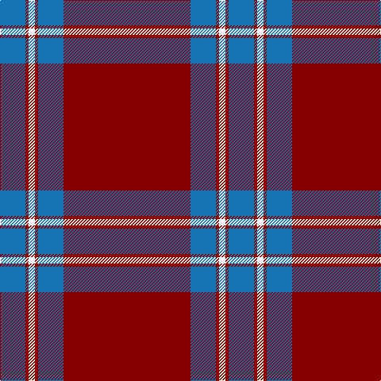

In pattern [BRWRBR](/patterns/brwrbr/).

This was sourced from tartans-authority.  It is a [6 stripes tartan](/stripes/stripes6/).

Original link http://www.tartansauthority.com/tartan-ferret/display/2412/

## Attestations

This cloth appears in 2 source records; the oldest owns this page.

- 1990 — Lyon College (Corporate) (tartans-authority, [record](http://www.tartansauthority.com/tartan-ferret/display/2412/))
- 01/04/1991 — Lyon College (register-of-tartans, [record](https://www.tartanregister.gov.uk/tartanDetails.aspx?ref=2257))

## Thread count
B/32 DR4 W8 DR4 B32 DR/160

## Palette
Each colour and its ΔE from the base-6 reference it is a variant of.

| Colour | Shade | Base | ΔE (OKLab) |
|---|---|---|---|
| B | <code style="background-color:#1474B4;">#1474B4</code> `#1474B4` | B <code style="background-color:#2A418A;">#2A418A</code> | 0.15 |
| DR | <code style="background-color:#880000;">#880000</code> `#880000` | R <code style="background-color:#CC0000;">#CC0000</code> | 0.15 |
| W | <code style="background-color:#F8F8F8;">#F8F8F8</code> `#F8F8F8` | W <code style="background-color:#F7F7F7;">#F7F7F7</code> | 0.00 |

# Sample pattern

## Nearest tartans

The nearest existing variants by ΔTartan distance.

1. [Southern Illinois University (Corp.)](/setts/s9/k5r40k4w2k4r10w4r5w1x2~k101010-r901c38-we0e0e0/) — ΔT 1.15
1. [Southern Illinois University - Carbondale](/setts/s9/k5b40k4w2k4b10w4b5w1x2~b75263d-k101010-wffffff/) — ΔT 1.30
1. [Canadian Legion Branch 50](/setts/s7/r68b9w10b13y1b1y2x2~b202060-r880000-wa8ace8-yd09800/) — ΔT 1.35
1. [Salt Lake County (District)](/setts/s7/k4r40k1r3k1w3k4x2~k101010-r800028-we0e0e0/) — ΔT 1.35
1. [Wcwm 4907-1](/setts/s7/r40b8y8r4y1r4ya8x4~b202060-r800028-yd09800-yab8b8b8/) — ΔT 1.45
1. [Lawers Estate (Corporate)](/setts/s6/r70k1b12k1g12k1x2~b003c64-g408060-k101010-rcc4438/) — ΔT 1.54
1. [Masai Shuka 27 (Artefact)](/setts/s10/r30b8r2k1r2k1r2k1r2b8x2~b2c2c80-k101010-rc80000/) — ΔT 1.57
1. [Canadian Legion Branch 50 Corporate Tartan Tartan Number: 1327. Earliest known date: pre 2003 From a study of the portrait of Lord Loudoun (c 1747) outlined in the proceedings of the STS See products available Copyright © Blair Urquhart, Comrie, 2015](/setts/s7/r68b9ba10b13y1b1y2x2~b2c2c80-ba5c8ca8-rc80000-ye8c000/) — ΔT 1.59
1. [Salt Lake County](/setts/s7/k4r40k1r3k1w3k4x2~k000000-r802040-we0e0e0/) — ΔT 1.60
1. [13, Legion Branch 50](/setts/s7/r68b9ba10b13y1b1y2x2~b304080-ba5480b0-rc00000-yf0c000/) — ΔT 1.63

## Neighbour map

Every grey dot is one of 15726 variants placed by the first two principal components of the ΔTartan feature space (44% of its variance). Red is this tartan; blue dots are its nearest — click one to open its page.

<svg viewBox="0 0 640 380" role="img" style="max-width:100%;height:auto;border:1px solid #e0e0e0;border-radius:4px;display:block" xmlns="http://www.w3.org/2000/svg"><image href="/nn/cloud.v1.png" width="640" height="380"/><a href="/setts/s9/k5r40k4w2k4r10w4r5w1x2~k101010-r901c38-we0e0e0/"><circle cx="525.9" cy="126.0" r="4" fill="#3465a4"><title>Southern Illinois University (Corp.)</title></circle></a><a href="/setts/s9/k5b40k4w2k4b10w4b5w1x2~b75263d-k101010-wffffff/"><circle cx="513.2" cy="126.9" r="4" fill="#3465a4"><title>Southern Illinois University - Carbondale</title></circle></a><a href="/setts/s7/r68b9w10b13y1b1y2x2~b202060-r880000-wa8ace8-yd09800/"><circle cx="484.5" cy="112.0" r="4" fill="#3465a4"><title>Canadian Legion Branch 50</title></circle></a><a href="/setts/s7/k4r40k1r3k1w3k4x2~k101010-r800028-we0e0e0/"><circle cx="595.6" cy="137.7" r="4" fill="#3465a4"><title>Salt Lake County (District)</title></circle></a><a href="/setts/s7/r40b8y8r4y1r4ya8x4~b202060-r800028-yd09800-yab8b8b8/"><circle cx="444.2" cy="127.7" r="4" fill="#3465a4"><title>Wcwm 4907-1</title></circle></a><a href="/setts/s6/r70k1b12k1g12k1x2~b003c64-g408060-k101010-rcc4438/"><circle cx="551.3" cy="120.4" r="4" fill="#3465a4"><title>Lawers Estate (Corporate)</title></circle></a><a href="/setts/s10/r30b8r2k1r2k1r2k1r2b8x2~b2c2c80-k101010-rc80000/"><circle cx="496.6" cy="125.5" r="4" fill="#3465a4"><title>Masai Shuka 27 (Artefact)</title></circle></a><a href="/setts/s7/r68b9ba10b13y1b1y2x2~b2c2c80-ba5c8ca8-rc80000-ye8c000/"><circle cx="485.0" cy="103.6" r="4" fill="#3465a4"><title>Canadian Legion Branch 50 Corporate Tartan Tartan Number: 1327. Earliest known date: pre 2003 From a study of the portrait of Lord Loudoun (c 1747) outlined in the proceedings of the STS See products available Copyright © Blair Urquhart, Comrie, 2015</title></circle></a><a href="/setts/s7/k4r40k1r3k1w3k4x2~k000000-r802040-we0e0e0/"><circle cx="562.9" cy="128.3" r="4" fill="#3465a4"><title>Salt Lake County</title></circle></a><a href="/setts/s7/r68b9ba10b13y1b1y2x2~b304080-ba5480b0-rc00000-yf0c000/"><circle cx="497.9" cy="109.9" r="4" fill="#3465a4"><title>13, Legion Branch 50</title></circle></a><circle cx="529.3" cy="149.6" r="5" fill="#c00000"/></svg>

ID: /setts/s6/r40b8r1w2r1b8x4~b1474b4-r880000-wf8f8f8/
