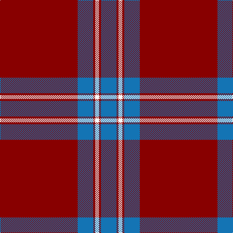

This page is one **sett** — a single exact thread-count. It belongs to the [tartan](/tartans/r40b8r1w2/)
(the same proportion at any scale), whose colour order is pattern [BRWRBR](/stripes/brwrbr/).

Sourced from tartans-authority.  It is a [6 stripe tartan](/stripes/stripes6/).

Original link http://www.tartansauthority.com/tartan-ferret/display/2412/

2 attestations — the source records this cloth was collapsed from (oldest owns this page)

<ul>
<li>1990 — Lyon College (Corporate) (tartans-authority, <a href="http://www.tartansauthority.com/tartan-ferret/display/2412/">record</a>)</li>
<li>01/04/1991 — Lyon College (register-of-tartans, <a href="https://www.tartanregister.gov.uk/tartanDetails.aspx?ref=2257">record</a>)</li>
</ul>

## Register references

External register numbers recorded for this tartan.

- Scottish Register of Tartans: [2257](https://www.tartanregister.gov.uk/tartanDetails.aspx?ref=2257)
- Scottish Tartans Authority (ITI): 2412
- Scottish Tartans World Register: 2412

## Thread count
DR/160 B32 DR4 W8 DR4 B/32

## Palette

Palette: <strong>Tartan Register</strong>
<table><thead><tr><th>Colour</th><th>Threads</th><th>Shade</th><th>Base</th><th>OKLCh</th></tr></thead><tbody><tr><td>DR/</td><td style="text-align:right;font-variant-numeric:tabular-nums">160</td><td><code style="background-color:#880000;">#880000</code> <small style="color:#888">#880000</small></td><td>R <code style="background-color:#CC0000;">#CC0000</code></td><td><small style="color:#888">oklch(39.4% 0.162 29.2)</small></td></tr><tr><td>B</td><td style="text-align:right;font-variant-numeric:tabular-nums">32</td><td><code style="background-color:#1474B4;">#1474B4</code> <small style="color:#888">#1474B4</small></td><td>B <code style="background-color:#2A418A;">#2A418A</code></td><td><small style="color:#888">oklch(54.0% 0.129 245.1)</small></td></tr><tr><td>DR</td><td style="text-align:right;font-variant-numeric:tabular-nums">4</td><td><code style="background-color:#880000;">#880000</code> <small style="color:#888">#880000</small></td><td>R <code style="background-color:#CC0000;">#CC0000</code></td><td><small style="color:#888">oklch(39.4% 0.162 29.2)</small></td></tr><tr><td>W</td><td style="text-align:right;font-variant-numeric:tabular-nums">8</td><td><code style="background-color:#F8F8F8;">#F8F8F8</code> <small style="color:#888">#F8F8F8</small></td><td>W <code style="background-color:#F7F7F7;">#F7F7F7</code></td><td><small style="color:#888">oklch(97.9% 0.000 89.9)</small></td></tr><tr><td>DR</td><td style="text-align:right;font-variant-numeric:tabular-nums">4</td><td><code style="background-color:#880000;">#880000</code> <small style="color:#888">#880000</small></td><td>R <code style="background-color:#CC0000;">#CC0000</code></td><td><small style="color:#888">oklch(39.4% 0.162 29.2)</small></td></tr><tr><td>B/</td><td style="text-align:right;font-variant-numeric:tabular-nums">32</td><td><code style="background-color:#1474B4;">#1474B4</code> <small style="color:#888">#1474B4</small></td><td>B <code style="background-color:#2A418A;">#2A418A</code></td><td><small style="color:#888">oklch(54.0% 0.129 245.1)</small></td></tr></tbody></table>

# Sample pattern

## Nearest tartans

The nearest existing variants by ΔTartan distance, with this tartan at the top so the swatches line up against it.

ΔTartan

Tartan

Sett

—

<a href="/ttd/edit/#slug=r40b8r1w2~x4">Lyon College (Corporate)</a> <a class="nn-out" href="/setts/s6/r40b8r1w2~x4/" title="open its dictionary page">↗</a>

1.15

<a href="/ttd/edit/#slug=k5r40k4w2k4r10w4r5w1~x2">Southern Illinois University (Corp.)</a> <a class="nn-out" href="/setts/s9/k5r40k4w2k4r10w4r5w1~x2/" title="open its dictionary page">↗</a>

1.29

<a href="/ttd/edit/#slug=k5dr40k4w2k4dr10w4dr5w1~x2">Southern Illinois University - Carbondale</a> <a class="nn-out" href="/setts/s9/k5dr40k4w2k4dr10w4dr5w1~x2/" title="open its dictionary page">↗</a>

1.35

<a href="/ttd/edit/#slug=r68db9lb10db13lo1db1lo2~x2">Canadian Legion Branch 50</a> <a class="nn-out" href="/setts/s7/r68db9lb10db13lo1db1lo2~x2/" title="open its dictionary page">↗</a>

1.35

<a href="/ttd/edit/#slug=k4r40k1r3k1w3k4~x2">Salt Lake County (District)</a> <a class="nn-out" href="/setts/s7/k4r40k1r3k1w3k4~x2/" title="open its dictionary page">↗</a>

1.45

<a href="/ttd/edit/#slug=r40db8lo8r4lo1r4lr8~x4">Wcwm 4907-1</a> <a class="nn-out" href="/setts/s7/r40db8lo8r4lo1r4lr8~x4/" title="open its dictionary page">↗</a>

1.54

<a href="/ttd/edit/#slug=r70k1dt12k1g12k1~x2">Lawers Estate (Corporate)</a> <a class="nn-out" href="/setts/s6/r70k1dt12k1g12k1~x2/" title="open its dictionary page">↗</a>

1.57

<a href="/setts/s10/r30db8r2k1r2k1~x2/">Masai Shuka 27 (Artefact)</a>

1.59

<a href="/ttd/edit/#slug=k4m40k1m3k1w3k4~x2">Salt Lake County</a> <a class="nn-out" href="/setts/s7/k4m40k1m3k1w3k4~x2/" title="open its dictionary page">↗</a>

1.63

<a href="/ttd/edit/#slug=r68db9t10db13ly1db1ly2~x2">13, Legion Branch 50</a> <a class="nn-out" href="/setts/s7/r68db9t10db13ly1db1ly2~x2/" title="open its dictionary page">↗</a>

1.69

<a href="/ttd/edit/#slug=r40w1r1dt8r1w1r6w1r1dt8~x2">Miyuki #2</a> <a class="nn-out" href="/setts/s10/r40w1r1dt8r1w1r6w1r1dt8~x2/" title="open its dictionary page">↗</a>

## Neighbour map

Every grey dot is one of 14359 variants placed by the first two principal components of the ΔTartan feature space (44% of its variance). Red is this tartan; blue dots are its nearest — click one to open its page.

<svg viewBox="0 0 640 380" role="img" style="max-width:100%;height:auto;border:1px solid #e0e0e0;border-radius:4px;display:block" xmlns="http://www.w3.org/2000/svg"><image href="/nn/cloud.v1.png" width="640" height="380"/><a href="/setts/s9/k5r40k4w2k4r10w4r5w1~x2/"><circle cx="524.1" cy="119.4" r="4" fill="#3465a4"><title>Southern Illinois University (Corp.)</title></circle></a><a href="/setts/s9/k5dr40k4w2k4dr10w4dr5w1~x2/"><circle cx="512.2" cy="120.4" r="4" fill="#3465a4"><title>Southern Illinois University - Carbondale</title></circle></a><a href="/setts/s7/r68db9lb10db13lo1db1lo2~x2/"><circle cx="483.2" cy="109.4" r="4" fill="#3465a4"><title>Canadian Legion Branch 50</title></circle></a><a href="/setts/s7/k4r40k1r3k1w3k4~x2/"><circle cx="593.5" cy="132.3" r="4" fill="#3465a4"><title>Salt Lake County (District)</title></circle></a><a href="/setts/s7/r40db8lo8r4lo1r4lr8~x4/"><circle cx="442.7" cy="123.8" r="4" fill="#3465a4"><title>Wcwm 4907-1</title></circle></a><a href="/setts/s6/r70k1dt12k1g12k1~x2/"><circle cx="548.7" cy="117.4" r="4" fill="#3465a4"><title>Lawers Estate (Corporate)</title></circle></a><a href="/setts/s10/r30db8r2k1r2k1~x2/"><circle cx="494.5" cy="121.0" r="4" fill="#3465a4"><title>Masai Shuka 27 (Artefact)</title></circle></a><a href="/setts/s7/k4m40k1m3k1w3k4~x2/"><circle cx="561.5" cy="120.3" r="4" fill="#3465a4"><title>Salt Lake County</title></circle></a><a href="/setts/s7/r68db9t10db13ly1db1ly2~x2/"><circle cx="495.6" cy="107.6" r="4" fill="#3465a4"><title>13, Legion Branch 50</title></circle></a><a href="/setts/s10/r40w1r1dt8r1w1r6w1r1dt8~x2/"><circle cx="545.0" cy="99.7" r="4" fill="#3465a4"><title>Miyuki #2</title></circle></a><circle cx="527.8" cy="144.9" r="5" fill="#c00000"/></svg>

ID: /setts/s6/r40b8r1w2~x4/
