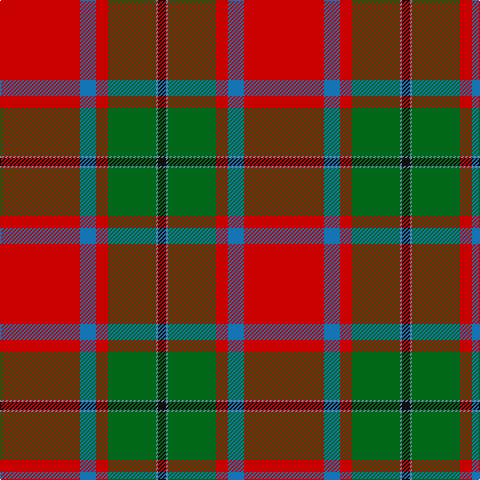

**Bands:** [KBGRBR](/stripes/kbgrbr/) · **Stripes:** [K T G R B R](/stripes/stripes6/) K T G R B R

This was sourced from register-of-tartans.  It is a [6 band tartan](/bands/bands6/).

Original link https://www.tartanregister.gov.uk/tartanDetails.aspx?ref=2696

## Attestations

This cloth appears in 2 source records; the oldest owns this page.

- 01/01/2002 — MacPhail (Blue Bands) (register-of-tartans, [record](https://www.tartanregister.gov.uk/tartanDetails.aspx?ref=2696))
- pre 2002 — MacPhail (Blue bands) (tartans-authority, [record](http://www.tartansauthority.com/tartan-ferret/display/1028/))

## Register references

External register numbers recorded for this tartan.

- Scottish Register of Tartans: [2696](https://www.tartanregister.gov.uk/tartanDetails.aspx?ref=2696)
- Scottish Tartans Authority (ITI): 1028
- Scottish Tartans World Register: 1028

## Thread count
R/80 B16 R12 G48 Ba2 K/8

## Palette
Each colour and its ΔE from the base-6 reference it is a variant of.

| Colour | Shade | Base | ΔE (OKLab) |
|---|---|---|---|
| B | <code style="background-color:#1474B4;">#1474B4</code> `#1474B4` | B <code style="background-color:#2A418A;">#2A418A</code> | 0.15 |
| Ba | <code style="background-color:#5C8CA8;">#5C8CA8</code> `#5C8CA8` | B <code style="background-color:#2A418A;">#2A418A</code> | 0.23 |
| G | <code style="background-color:#006818;">#006818</code> `#006818` | G <code style="background-color:#006100;">#006100</code> | 0.02 |
| K | <code style="background-color:#101010;">#101010</code> `#101010` | K <code style="background-color:#000000;">#000000</code> | 0.17 |
| R | <code style="background-color:#C80000;">#C80000</code> `#C80000` | R <code style="background-color:#CC0000;">#CC0000</code> | 0.01 |

# Sample pattern

## Nearest tartans

The nearest existing variants by ΔTartan distance.

1. [MacPhail](/setts/s6/r25db7r3g13t1k2~x4/) — ΔT 0.82
1. [Sinclair](/setts/s6/r36t8w1k5g20r18~x4/) — ΔT 1.01
1. [MacGleish Formal (Personal)](/setts/s5/o50k25dg10o5ly2~x2/) — ΔT 1.13
1. [MacLeay](/setts/s7/r27y4k4y4k4t6lo1~x4/) — ΔT 1.18
1. [MacLeay (Clan)](/setts/s7/r27g4k4g4k4db6lo1~x4/) — ΔT 1.21
1. [MacPhail](/setts/s6/r25k7r3g13y1k2~x4/) — ΔT 1.25
1. [Shaw of Tordarroch](/setts/s8/t5k1r30p15r8g30r8p2~x2/) — ΔT 1.25
1. [Shaw Red of Tordarroch Dress (Clan 2](/setts/s8/t5k1r30dp15r8g30r8dp2~x2/) — ΔT 1.27
1. [Livingstone MacLay MacLeay](/setts/s7/r28dg4k4dg4k4t6ly1~x2/) — ΔT 1.27
1. [MacGleish Formal (Personal)](/setts/s5/r50k25g10o5ly2~x2/) — ΔT 1.31

## Neighbour map

Every grey dot is one of 14299 variants placed by the first two principal components of the ΔTartan feature space (44% of its variance). Red is this tartan; blue dots are its nearest — click one to open its page.

<svg viewBox="0 0 640 380" role="img" style="max-width:100%;height:auto;border:1px solid #e0e0e0;border-radius:4px;display:block" xmlns="http://www.w3.org/2000/svg"><image href="/nn/cloud.v1.png" width="640" height="380"/><a href="/setts/s6/r25db7r3g13t1k2~x4/"><circle cx="328.4" cy="142.6" r="4" fill="#3465a4"><title>MacPhail</title></circle></a><a href="/setts/s6/r36t8w1k5g20r18~x4/"><circle cx="380.1" cy="147.4" r="4" fill="#3465a4"><title>Sinclair</title></circle></a><a href="/setts/s5/o50k25dg10o5ly2~x2/"><circle cx="341.9" cy="164.9" r="4" fill="#3465a4"><title>MacGleish Formal (Personal)</title></circle></a><a href="/setts/s7/r27y4k4y4k4t6lo1~x4/"><circle cx="325.4" cy="116.8" r="4" fill="#3465a4"><title>MacLeay</title></circle></a><a href="/setts/s7/r27g4k4g4k4db6lo1~x4/"><circle cx="325.9" cy="120.6" r="4" fill="#3465a4"><title>MacLeay (Clan)</title></circle></a><a href="/setts/s6/r25k7r3g13y1k2~x4/"><circle cx="351.6" cy="158.2" r="4" fill="#3465a4"><title>MacPhail</title></circle></a><a href="/setts/s8/t5k1r30p15r8g30r8p2~x2/"><circle cx="285.1" cy="133.7" r="4" fill="#3465a4"><title>Shaw of Tordarroch</title></circle></a><a href="/setts/s8/t5k1r30dp15r8g30r8dp2~x2/"><circle cx="286.1" cy="135.6" r="4" fill="#3465a4"><title>Shaw Red of Tordarroch Dress (Clan 2</title></circle></a><a href="/setts/s7/r28dg4k4dg4k4t6ly1~x2/"><circle cx="325.1" cy="110.2" r="4" fill="#3465a4"><title>Livingstone MacLay MacLeay</title></circle></a><a href="/setts/s5/r50k25g10o5ly2~x2/"><circle cx="322.3" cy="146.3" r="4" fill="#3465a4"><title>MacGleish Formal (Personal)</title></circle></a><circle cx="364.3" cy="130.5" r="5" fill="#c00000"/></svg>

ID: /setts/s6/r40b8r6g24t1k4~x2/
