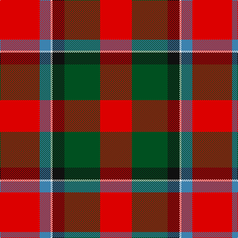

In pattern [RBWKGR](/stripes/rbwkgr/).

This was sourced from register-of-tartans.  It is a [6 stripe tartan](/stripes/stripes6/).

Original link https://www.tartanregister.gov.uk/tartanDetails.aspx?ref=4117

## Register references

External register numbers recorded for this tartan.

- Scottish Register of Tartans: [4117](https://www.tartanregister.gov.uk/tartanDetails.aspx?ref=4117)
- Scottish Tartans World Register: 1439

## Thread count
R/80 B22 LN4 K24 G72 R/64

## Palette
Each colour and its ΔE from the base-6 reference it is a variant of.

| Colour | Shade | Base | ΔE (OKLab) |
|---|---|---|---|
| B | <code style="background-color:#3C82AF;">#3C82AF</code> `#3C82AF` | B <code style="background-color:#2A418A;">#2A418A</code> | 0.19 |
| G | <code style="background-color:#005020;">#005020</code> `#005020` | G <code style="background-color:#006100;">#006100</code> | 0.07 |
| K | <code style="background-color:#101010;">#101010</code> `#101010` | K <code style="background-color:#000000;">#000000</code> | 0.17 |
| LN | <code style="background-color:#E0E0E0;">#E0E0E0</code> `#E0E0E0` | W <code style="background-color:#F7F7F7;">#F7F7F7</code> | 0.07 |
| R | <code style="background-color:#DC0000;">#DC0000</code> `#DC0000` | R <code style="background-color:#CC0000;">#CC0000</code> | 0.03 |

# Sample pattern

## Nearest tartans

The nearest existing variants by ΔTartan distance.

1. [Caithness (1848) (District?)](/setts/s6/r40t11w2k12g36r32~x2/) — ΔT 0.58
1. [Sturrock, Blue/Black (Clan)](/setts/s7/r52b16k16g22r16lo3r16~x2/) — ΔT 0.75
1. [Sturrock](/setts/s7/r52db16k16g22r16ly3r16/) — ΔT 0.83
1. [MacDuff](/setts/s7/r96db16dg34dg48r18k6r9/) — ΔT 1.09
1. [East Kilbride](/setts/s7/y3r10g7db10r15k1w2~x2/) — ΔT 1.22
1. [MacDuff](/setts/s7/r96db16dg34g48r18k6r9/) — ΔT 1.23
1. [MacDuff #6](/setts/s7/r36lt9k12g17r10k3r10~x2/) — ΔT 1.28
1. [MacKintosh #4](/setts/s6/r5w2r28k12dg16r3~x2/) — ΔT 1.28
1. [Sturrock](/setts/s6/r52k32dg22r16ly3r16/) — ΔT 1.29
1. [Templeton (Name?)](/setts/s8/b4r1k11r20k20r20g4ly1~x2/) — ΔT 1.29

## Neighbour map

Every grey dot is one of 14299 variants placed by the first two principal components of the ΔTartan feature space (44% of its variance). Red is this tartan; blue dots are its nearest — click one to open its page.

<svg viewBox="0 0 640 380" role="img" style="max-width:100%;height:auto;border:1px solid #e0e0e0;border-radius:4px;display:block" xmlns="http://www.w3.org/2000/svg"><image href="/nn/cloud.v1.png" width="640" height="380"/><a href="/setts/s6/r40t11w2k12g36r32~x2/"><circle cx="294.5" cy="179.7" r="4" fill="#3465a4"><title>Caithness (1848) (District?)</title></circle></a><a href="/setts/s7/r52b16k16g22r16lo3r16~x2/"><circle cx="317.0" cy="172.8" r="4" fill="#3465a4"><title>Sturrock, Blue/Black (Clan)</title></circle></a><a href="/setts/s7/r52db16k16g22r16ly3r16/"><circle cx="296.5" cy="164.0" r="4" fill="#3465a4"><title>Sturrock</title></circle></a><a href="/setts/s7/r96db16dg34dg48r18k6r9/"><circle cx="294.1" cy="155.8" r="4" fill="#3465a4"><title>MacDuff</title></circle></a><a href="/setts/s7/y3r10g7db10r15k1w2~x2/"><circle cx="238.9" cy="159.6" r="4" fill="#3465a4"><title>East Kilbride</title></circle></a><a href="/setts/s7/r96db16dg34g48r18k6r9/"><circle cx="293.7" cy="159.4" r="4" fill="#3465a4"><title>MacDuff</title></circle></a><a href="/setts/s7/r36lt9k12g17r10k3r10~x2/"><circle cx="292.6" cy="190.1" r="4" fill="#3465a4"><title>MacDuff #6</title></circle></a><a href="/setts/s6/r5w2r28k12dg16r3~x2/"><circle cx="301.3" cy="181.1" r="4" fill="#3465a4"><title>MacKintosh #4</title></circle></a><a href="/setts/s6/r52k32dg22r16ly3r16/"><circle cx="328.7" cy="189.6" r="4" fill="#3465a4"><title>Sturrock</title></circle></a><a href="/setts/s8/b4r1k11r20k20r20g4ly1~x2/"><circle cx="286.4" cy="149.0" r="4" fill="#3465a4"><title>Templeton (Name?)</title></circle></a><circle cx="282.9" cy="173.6" r="5" fill="#c00000"/></svg>

ID: /setts/s6/r40t11w2k12dg36r32~x2/
