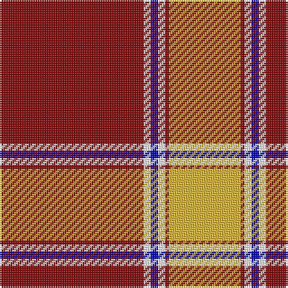

In pattern [RWBWRY](/patterns/rwbwry/).

This was sourced from register-of-tartans.  It is a [6 stripes tartan](/stripes/stripes6/).

Original link https://www.tartanregister.gov.uk/tartanDetails.aspx?ref=10097

## Thread count
DR/80 W4 B4 W4 DR2 Y/40

## Palette
Each colour and its ΔE from the base-6 reference it is a variant of.

| Colour | Shade | Base | ΔE (OKLab) |
|---|---|---|---|
| B | <code style="background-color:#0000CD;">#0000CD</code> `#0000CD` | B <code style="background-color:#2A418A;">#2A418A</code> | 0.14 |
| DR | <code style="background-color:#8B0000;">#8B0000</code> `#8B0000` | R <code style="background-color:#CC0000;">#CC0000</code> | 0.14 |
| W | <code style="background-color:#FFFFFF;">#FFFFFF</code> `#FFFFFF` | W <code style="background-color:#F7F7F7;">#F7F7F7</code> | 0.02 |
| Y | <code style="background-color:#E6B426;">#E6B426</code> `#E6B426` | Y <code style="background-color:#F2BF00;">#F2BF00</code> | 0.04 |

# Sample pattern

## Nearest tartans

The nearest existing variants by ΔTartan distance.

1. [MacGregor #3](/setts/s6/r36g18r4g6k1w2x2~g005020-k101010-rdc0000-we0e0e0/) — ΔT 1.04
1. [Pride of Cleveland Fall](/setts/s7/r17g5w1r5w7g47r7x2~g603800-rfa4b00-wffffff/) — ΔT 1.14
1. [National Defense (Unauthorised)](/setts/s6/r40w2b2w2r1y20x2~b2c2c80-rc80000-we0e0e0-ye8c000/) — ΔT 1.16
1. [MacGregor #4](/setts/s6/r41g19r7g8k1w3x2~g006818-k101010-rc80000-wfcfcfc/) — ΔT 1.25
1. [Davet (2014)](/setts/s6/b5k1w11k1r42k1x2~b5c8ca8-k101010-rc80000-wfcfcfc/) — ΔT 1.25
1. [MacGregor](/setts/s6/r36g18r4g6k1w2x2~g004c00-k000000-rc80000-wd0d0d0/) — ΔT 1.31
1. [MacGregor](/setts/s6/r36g18r4g6k1w2x2~g008000-k000000-rc00000-we0e0e0/) — ΔT 1.33
1. [MacGregor - 1800 (Clan)](/setts/s6/r57g21r8g8k1w3x2~g008c20-k101010-rc80000-wfcfcfc/) — ΔT 1.33
1. [Maver (Buckie)](/setts/s7/g1y1g1w1g10r20y1x4~g006400-rff0000-wffffff-yffe600/) — ΔT 1.34
1. [Colchester & District Pipes & Drums](/setts/s6/g10r4g46r69k2w6~g458b00-k101010-ree0000-wffffff/) — ΔT 1.34

## Neighbour map

Every grey dot is one of 15726 variants placed by the first two principal components of the ΔTartan feature space (44% of its variance). Red is this tartan; blue dots are its nearest — click one to open its page.

<svg viewBox="0 0 640 380" role="img" style="max-width:100%;height:auto;border:1px solid #e0e0e0;border-radius:4px;display:block" xmlns="http://www.w3.org/2000/svg"><image href="/nn/cloud.v1.png" width="640" height="380"/><a href="/setts/s6/r36g18r4g6k1w2x2~g005020-k101010-rdc0000-we0e0e0/"><circle cx="422.5" cy="139.2" r="4" fill="#3465a4"><title>MacGregor #3</title></circle></a><a href="/setts/s7/r17g5w1r5w7g47r7x2~g603800-rfa4b00-wffffff/"><circle cx="418.1" cy="129.7" r="4" fill="#3465a4"><title>Pride of Cleveland Fall</title></circle></a><a href="/setts/s6/r40w2b2w2r1y20x2~b2c2c80-rc80000-we0e0e0-ye8c000/"><circle cx="430.8" cy="112.0" r="4" fill="#3465a4"><title>National Defense (Unauthorised)</title></circle></a><a href="/setts/s6/r41g19r7g8k1w3x2~g006818-k101010-rc80000-wfcfcfc/"><circle cx="428.9" cy="142.0" r="4" fill="#3465a4"><title>MacGregor #4</title></circle></a><a href="/setts/s6/b5k1w11k1r42k1x2~b5c8ca8-k101010-rc80000-wfcfcfc/"><circle cx="465.6" cy="100.1" r="4" fill="#3465a4"><title>Davet (2014)</title></circle></a><a href="/setts/s6/r36g18r4g6k1w2x2~g004c00-k000000-rc80000-wd0d0d0/"><circle cx="426.3" cy="143.7" r="4" fill="#3465a4"><title>MacGregor</title></circle></a><a href="/setts/s6/r36g18r4g6k1w2x2~g008000-k000000-rc00000-we0e0e0/"><circle cx="422.5" cy="142.7" r="4" fill="#3465a4"><title>MacGregor</title></circle></a><a href="/setts/s6/r57g21r8g8k1w3x2~g008c20-k101010-rc80000-wfcfcfc/"><circle cx="479.8" cy="125.9" r="4" fill="#3465a4"><title>MacGregor - 1800 (Clan)</title></circle></a><a href="/setts/s7/g1y1g1w1g10r20y1x4~g006400-rff0000-wffffff-yffe600/"><circle cx="370.1" cy="124.5" r="4" fill="#3465a4"><title>Maver (Buckie)</title></circle></a><a href="/setts/s6/g10r4g46r69k2w6~g458b00-k101010-ree0000-wffffff/"><circle cx="379.4" cy="133.7" r="4" fill="#3465a4"><title>Colchester &amp; District Pipes &amp; Drums</title></circle></a><circle cx="409.7" cy="111.8" r="5" fill="#c00000"/></svg>

ID: /setts/s6/r40w2b2w2r1y20x2~b0000cd-r8b0000-wffffff-ye6b426/
