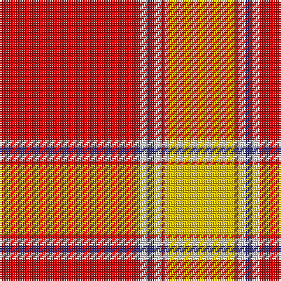

In pattern [RWBWRY](/patterns/rwbwry/).

This was sourced from tartans-authority.  It is a [6 stripes tartan](/stripes/stripes6/).

Original link http://www.tartansauthority.com/tartan-ferret/display/10097/

## Attestations

This cloth appears in 2 source records; the oldest owns this page.

- 13th March 2009 — National Defense (Unauthorised) (tartans-authority, [record](http://www.tartansauthority.com/tartan-ferret/display/10097/))
- undated — National Defense Commemorative Tartan Tartan Number: 10097. Earliest known date: 13th March 2009 Designed by Mark Wright of The Frugal Corner in the USA to honour all those who had been awarded the US Military National Defense Medal and is based on the ribbon colours of that medal. The application reads, "to honour all those who have served in defence of their country." See products available Copyright © Blair Urquhart, Comrie, 2015 (house-of-tartan, [record](http://www.house-of-tartan.scotland.net/house/TartanViewjs.asp?colr=Def&tnam=10097))

## Thread count
R/80 LN4 DB4 LN4 R2 Y/40

## Palette
Each colour and its ΔE from the base-6 reference it is a variant of.

| Colour | Shade | Base | ΔE (OKLab) |
|---|---|---|---|
| DB | <code style="background-color:#2C2C80;">#2C2C80</code> `#2C2C80` | B <code style="background-color:#2A418A;">#2A418A</code> | 0.06 |
| LN | <code style="background-color:#E0E0E0;">#E0E0E0</code> `#E0E0E0` | W <code style="background-color:#F7F7F7;">#F7F7F7</code> | 0.07 |
| R | <code style="background-color:#C80000;">#C80000</code> `#C80000` | R <code style="background-color:#CC0000;">#CC0000</code> | 0.01 |
| Y | <code style="background-color:#E8C000;">#E8C000</code> `#E8C000` | Y <code style="background-color:#F2BF00;">#F2BF00</code> | 0.02 |

# Sample pattern

## Nearest tartans

The nearest existing variants by ΔTartan distance.

1. [National Defense](/setts/s6/r40w2b2w2r1y20~b0000cd-r8b0000-wffffff-ye6b426~x2/) — ΔT 1.16
1. [Fueglistal](/setts/s9/k3y6w13r2w2r32w1r2w1~k101010-rc80000-wc0c0c0-ybc8c00~x2/) — ΔT 1.31
1. [Colchester & District Pipes & Drums](/setts/s6/g10r4g46r69k2w6~g458b00-k101010-ree0000-wffffff/) — ΔT 1.31
1. [MacGregor - 1800 (Clan)](/setts/s6/r57g21r8g8k1w3~g008c20-k101010-rc80000-wfcfcfc~x2/) — ΔT 1.33
1. [Maver (Buckie)](/setts/s7/g1y1g1w1g10r20y1~g006400-rff0000-wffffff-yffe600~x4/) — ΔT 1.40
1. [MacGregor #3](/setts/s6/r36g18r4g6k1w2~g005020-k101010-rdc0000-we0e0e0~x2/) — ΔT 1.40
1. [Davet (2014)](/setts/s6/b5k1w11k1r42k1~b5c8ca8-k101010-rc80000-wfcfcfc~x2/) — ΔT 1.41
1. [Davet (2014)](/setts/s6/y5k1w11k1r42k1~k000000-rdc0000-wffffff-y48a4c0~x2/) — ΔT 1.49
1. [MacGregor #4](/setts/s6/r41g19r7g8k1w3~g006818-k101010-rc80000-wfcfcfc~x2/) — ΔT 1.51
1. [Willis, H Graham](/setts/s4/r60w28y2b3~b2888c4-rdc0000-we0e0e0-ye8c000~x2/) — ΔT 1.56

## Neighbour map

Every grey dot is one of 15726 variants placed by the first two principal components of the ΔTartan feature space (44% of its variance). Red is this tartan; blue dots are its nearest — click one to open its page.

<svg viewBox="0 0 640 380" role="img" style="max-width:100%;height:auto;border:1px solid #e0e0e0;border-radius:4px;display:block" xmlns="http://www.w3.org/2000/svg"><image href="/nn/cloud.v1.png" width="640" height="380"/><a href="/setts/s6/r40w2b2w2r1y20~b0000cd-r8b0000-wffffff-ye6b426~x2/"><circle cx="409.7" cy="111.8" r="4" fill="#3465a4"><title>National Defense</title></circle></a><a href="/setts/s9/k3y6w13r2w2r32w1r2w1~k101010-rc80000-wc0c0c0-ybc8c00~x2/"><circle cx="396.2" cy="100.6" r="4" fill="#3465a4"><title>Fueglistal</title></circle></a><a href="/setts/s6/g10r4g46r69k2w6~g458b00-k101010-ree0000-wffffff/"><circle cx="379.4" cy="133.7" r="4" fill="#3465a4"><title>Colchester &amp; District Pipes &amp; Drums</title></circle></a><a href="/setts/s6/r57g21r8g8k1w3~g008c20-k101010-rc80000-wfcfcfc~x2/"><circle cx="479.8" cy="125.9" r="4" fill="#3465a4"><title>MacGregor - 1800 (Clan)</title></circle></a><a href="/setts/s7/g1y1g1w1g10r20y1~g006400-rff0000-wffffff-yffe600~x4/"><circle cx="370.1" cy="124.5" r="4" fill="#3465a4"><title>Maver (Buckie)</title></circle></a><a href="/setts/s6/r36g18r4g6k1w2~g005020-k101010-rdc0000-we0e0e0~x2/"><circle cx="422.5" cy="139.2" r="4" fill="#3465a4"><title>MacGregor #3</title></circle></a><a href="/setts/s6/b5k1w11k1r42k1~b5c8ca8-k101010-rc80000-wfcfcfc~x2/"><circle cx="465.6" cy="100.1" r="4" fill="#3465a4"><title>Davet (2014)</title></circle></a><a href="/setts/s6/y5k1w11k1r42k1~k000000-rdc0000-wffffff-y48a4c0~x2/"><circle cx="458.8" cy="95.3" r="4" fill="#3465a4"><title>Davet (2014)</title></circle></a><a href="/setts/s6/r41g19r7g8k1w3~g006818-k101010-rc80000-wfcfcfc~x2/"><circle cx="428.9" cy="142.0" r="4" fill="#3465a4"><title>MacGregor #4</title></circle></a><a href="/setts/s4/r60w28y2b3~b2888c4-rdc0000-we0e0e0-ye8c000~x2/"><circle cx="433.1" cy="153.9" r="4" fill="#3465a4"><title>Willis, H Graham</title></circle></a><circle cx="430.8" cy="112.0" r="5" fill="#c00000"/></svg>

ID: /setts/s6/r40w2b2w2r1y20~b2c2c80-rc80000-we0e0e0-ye8c000~x2/
