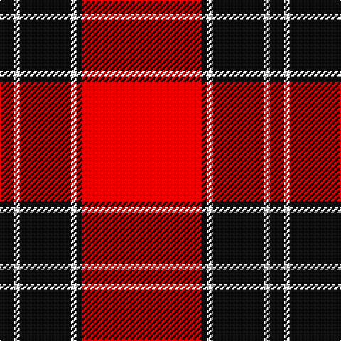

**Bands:** [KWKWKR](/stripes/kwkwkr/) · **Stripes:** [K W K W K R](/stripes/stripes6/) K W K W K R

This was sourced from register-of-tartans.  It is a [6 band tartan](/bands/bands6/).

Original link https://www.tartanregister.gov.uk/tartanDetails.aspx?ref=11623

## Register references

External register numbers recorded for this tartan.

- Scottish Register of Tartans: [11623](https://www.tartanregister.gov.uk/tartanDetails.aspx?ref=11623)

## Thread count
K/10 W4 K36 W4 K4 R/84

## Palette
Each colour and its ΔE from the base-6 reference it is a variant of.

| Colour | Shade | Base | ΔE (OKLab) |
|---|---|---|---|
| K | <code style="background-color:#101010;">#101010</code> `#101010` | K <code style="background-color:#000000;">#000000</code> | 0.17 |
| R | <code style="background-color:#C80000;">#C80000</code> `#C80000` | R <code style="background-color:#CC0000;">#CC0000</code> | 0.01 |
| W | <code style="background-color:#FFFFFF;">#FFFFFF</code> `#FFFFFF` | W <code style="background-color:#F7F7F7;">#F7F7F7</code> | 0.02 |

# Sample pattern

## Nearest tartans

The nearest existing variants by ΔTartan distance.

1. [Masai Shuka 15 (Artefact)](/setts/s5/r20k2r2k15w1~x2/) — ΔT 0.95
1. [Lougheed](/setts/s8/lb3r3k4lb2r18k1r2k2~x4/) — ΔT 0.98
1. [Hopkins (Name)](/setts/s5/r36k18r4k7w2~x2/) — ΔT 0.99
1. [Cunningham](/setts/s7/k3r1k30r28k1r1w3~x2/) — ΔT 1.13
1. [Maxwell](/setts/s7/r3dg16r4k6r28dg1r3/) — ΔT 1.14
1. [Ramsay of Dalhousie](/setts/s6/k4w2k28r30k1r3~x2/) — ΔT 1.15
1. [MacKintosh D](/setts/s6/r22db5r2dg11r3db1~x2/) — ΔT 1.19
1. [Dunbar Ancient](/setts/s6/k13w2k4r28k4w2~x2/) — ΔT 1.23
1. [Cunningham #2](/setts/s7/k3r2k30r28k2r2w3~x2/) — ΔT 1.25
1. [University of South Carolina (Corp)](/setts/s10/r4k4r3k8w3r3k20r40w2r4/) — ΔT 1.25

## Neighbour map

Every grey dot is one of 14313 variants placed by the first two principal components of the ΔTartan feature space (44% of its variance). Red is this tartan; blue dots are its nearest — click one to open its page.

<svg viewBox="0 0 640 380" role="img" style="max-width:100%;height:auto;border:1px solid #e0e0e0;border-radius:4px;display:block" xmlns="http://www.w3.org/2000/svg"><image href="/nn/cloud.v1.png" width="640" height="380"/><a href="/setts/s5/r20k2r2k15w1~x2/"><circle cx="386.6" cy="184.1" r="4" fill="#3465a4"><title>Masai Shuka 15 (Artefact)</title></circle></a><a href="/setts/s8/lb3r3k4lb2r18k1r2k2~x4/"><circle cx="423.8" cy="155.9" r="4" fill="#3465a4"><title>Lougheed</title></circle></a><a href="/setts/s5/r36k18r4k7w2~x2/"><circle cx="399.9" cy="189.7" r="4" fill="#3465a4"><title>Hopkins (Name)</title></circle></a><a href="/setts/s7/k3r1k30r28k1r1w3~x2/"><circle cx="377.4" cy="133.6" r="4" fill="#3465a4"><title>Cunningham</title></circle></a><a href="/setts/s7/r3dg16r4k6r28dg1r3/"><circle cx="419.6" cy="155.6" r="4" fill="#3465a4"><title>Maxwell</title></circle></a><a href="/setts/s6/k4w2k28r30k1r3~x2/"><circle cx="371.0" cy="150.9" r="4" fill="#3465a4"><title>Ramsay of Dalhousie</title></circle></a><a href="/setts/s6/r22db5r2dg11r3db1~x2/"><circle cx="409.0" cy="177.7" r="4" fill="#3465a4"><title>MacKintosh D</title></circle></a><a href="/setts/s6/k13w2k4r28k4w2~x2/"><circle cx="334.7" cy="177.0" r="4" fill="#3465a4"><title>Dunbar Ancient</title></circle></a><a href="/setts/s7/k3r2k30r28k2r2w3~x2/"><circle cx="351.2" cy="167.0" r="4" fill="#3465a4"><title>Cunningham #2</title></circle></a><a href="/setts/s10/r4k4r3k8w3r3k20r40w2r4/"><circle cx="403.0" cy="141.6" r="4" fill="#3465a4"><title>University of South Carolina (Corp)</title></circle></a><circle cx="401.8" cy="151.2" r="5" fill="#c00000"/></svg>

ID: /setts/s6/r42k2w2k18w2k5~x2/
