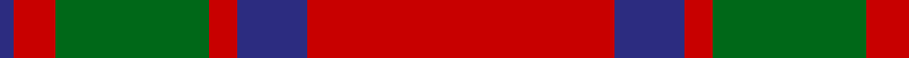

In pattern [BRGRBR](/patterns/brgrbr/).

This was sourced from house-of-tartan.  It is a [6 stripes tartan](/stripes/stripes6/).

Original link http://www.house-of-tartan.scotland.net/house/TartanViewjs.asp?colr=Def&tnam=521

## Thread count
DB/2 R6 G22 R4 DB10 R/44

## Palette
Each colour and its ΔE from the base-6 reference it is a variant of.

| Colour | Shade | Base | ΔE (OKLab) |
|---|---|---|---|
| DB | <code style="background-color:#2C2C80;">#2C2C80</code> `#2C2C80` | B <code style="background-color:#2C4084;">#2C4084</code> | 0.05 |
| G | <code style="background-color:#006818;">#006818</code> `#006818` | G <code style="background-color:#006400;">#006400</code> | 0.02 |
| R | <code style="background-color:#C80000;">#C80000</code> `#C80000` | R <code style="background-color:#C80000;">#C80000</code> | 0.00 |

# Sample pattern

## Nearest tartans

The nearest existing variants by ΔTartan distance.

1. [MacKintosh 1](/setts/s6/r44b10r4g22r6b2-b304080-g008000-rc00000/) — ΔT 0.34
1. [MacKintosh 3](/setts/s6/r136b36r18g68r18b6-b304080-g008000-rc00000/) — ΔT 0.35
1. [MacKintosh #2](/setts/s6/r136b36r18g68r18b6-b2c4084-g005020-rdc0000/) — ΔT 0.40
1. [MacKintosh](/setts/s6/r70b20r10g40r10b3-b2c2c80-g006818-rc80000/) — ΔT 0.43
1. [MacKintosh, Plaid](/setts/s6/r32b12r4g12r4b2-b304080-g008000-rc00000/) — ΔT 0.58
1. [MacKintosh D](/setts/s6/r44b10r4g22r6b2-b000064-g004c00-rc80000/) — ΔT 0.67
1. [MacKintosh Plaid](/setts/s6/r32b12r4g12r4b2-b2c2c80-g285800-rc80000/) — ΔT 0.70
1. [MacKintosh](/setts/s6/r48b12r6g24r8b2-b000064-g004c00-rc80000/) — ΔT 0.72
1. [Maxwell](/setts/s7/r6g32r8k12r56g2r6-g006818-k101010-rc80000/) — ΔT 0.74
1. [MacKintosh D](/setts/s6/r44b10r4g22r6b2-b000052-g11450d-raa0000/) — ΔT 0.77

## Neighbour map

Every grey dot is one of 15726 variants placed by the first two principal components of the ΔTartan feature space (44% of its variance). Red is this tartan; blue dots are its nearest — click one to open its page.

<svg viewBox="0 0 640 380" role="img" style="max-width:100%;height:auto;border:1px solid #e0e0e0;border-radius:4px;display:block" xmlns="http://www.w3.org/2000/svg"><image href="/nn/cloud.v1.png" width="640" height="380"/><a href="/setts/s6/r44b10r4g22r6b2-b304080-g008000-rc00000/"><circle cx="425.9" cy="184.9" r="4" fill="#3465a4"><title>MacKintosh 1</title></circle></a><a href="/setts/s6/r136b36r18g68r18b6-b304080-g008000-rc00000/"><circle cx="420.0" cy="187.5" r="4" fill="#3465a4"><title>MacKintosh 3</title></circle></a><a href="/setts/s6/r136b36r18g68r18b6-b2c4084-g005020-rdc0000/"><circle cx="413.9" cy="181.2" r="4" fill="#3465a4"><title>MacKintosh #2</title></circle></a><a href="/setts/s6/r70b20r10g40r10b3-b2c2c80-g006818-rc80000/"><circle cx="401.9" cy="187.5" r="4" fill="#3465a4"><title>MacKintosh</title></circle></a><a href="/setts/s6/r32b12r4g12r4b2-b304080-g008000-rc00000/"><circle cx="403.8" cy="201.4" r="4" fill="#3465a4"><title>MacKintosh, Plaid</title></circle></a><a href="/setts/s6/r44b10r4g22r6b2-b000064-g004c00-rc80000/"><circle cx="409.4" cy="178.4" r="4" fill="#3465a4"><title>MacKintosh D</title></circle></a><a href="/setts/s6/r32b12r4g12r4b2-b2c2c80-g285800-rc80000/"><circle cx="404.0" cy="199.8" r="4" fill="#3465a4"><title>MacKintosh Plaid</title></circle></a><a href="/setts/s6/r48b12r6g24r8b2-b000064-g004c00-rc80000/"><circle cx="411.9" cy="179.7" r="4" fill="#3465a4"><title>MacKintosh</title></circle></a><a href="/setts/s7/r6g32r8k12r56g2r6-g006818-k101010-rc80000/"><circle cx="437.7" cy="163.6" r="4" fill="#3465a4"><title>Maxwell</title></circle></a><a href="/setts/s6/r44b10r4g22r6b2-b000052-g11450d-raa0000/"><circle cx="428.7" cy="190.5" r="4" fill="#3465a4"><title>MacKintosh D</title></circle></a><circle cx="425.0" cy="183.4" r="5" fill="#c00000"/></svg>

ID: /setts/s6/r44b10r4g22r6b2-b2c2c80-g006818-rc80000/
