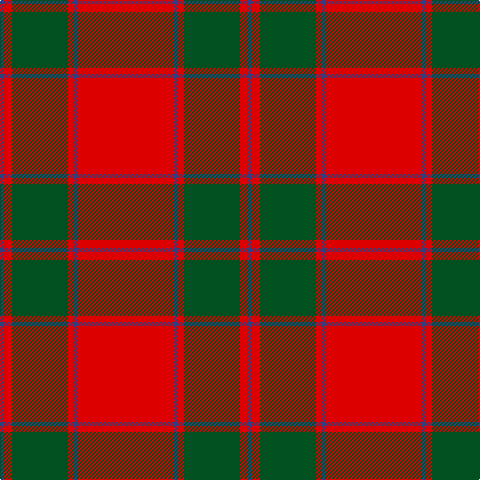

**Bands:** [RBRGRB](/stripes/rbrgrb/) · **Stripes:** [R DB R DG R DB](/stripes/stripes6/) R DB R DG R DB

This was sourced from register-of-tartans.  It is a [6 band tartan](/bands/bands6/).

Original link https://www.tartanregister.gov.uk/tartanDetails.aspx?ref=2561

## Also known as

This cloth is also recorded under:

- MacKintosh #3

## Register references

External register numbers recorded for this tartan.

- Scottish Register of Tartans: [2561](https://www.tartanregister.gov.uk/tartanDetails.aspx?ref=2561)
- Scottish Tartans World Register: 524

## Variants

Other setts woven to the same stripe pattern.

- [MacKintosh](/setts/s6/r24db6r3dg12r4db1/)
- [MacKintosh](/setts/s6/r24db6r3dg12r4db1~x2/)
- [MacKintosh #2](/setts/s6/r68db18r9dg34r9db3~x2/)
- [MacKintosh D](/setts/s6/r22db5r2dg11r3db1/)
- [MacKintosh D](/setts/s6/r22db5r2dg11r3db1~x2/)
- [MacKintosh Plaid](/setts/s6/r16db6r2dg6r2db1~x2/)

## Thread count
R/96 B4 R6 G56 R8 B/4

## Palette
Each colour and its ΔE from the base-6 reference it is a variant of.

| Colour | Shade | Base | ΔE (OKLab) |
|---|---|---|---|
| B | <code style="background-color:#2C4084;">#2C4084</code> `#2C4084` | B <code style="background-color:#2A418A;">#2A418A</code> | 0.01 |
| G | <code style="background-color:#005020;">#005020</code> `#005020` | G <code style="background-color:#006100;">#006100</code> | 0.07 |
| R | <code style="background-color:#DC0000;">#DC0000</code> `#DC0000` | R <code style="background-color:#CC0000;">#CC0000</code> | 0.03 |

# Sample pattern

## Nearest tartans

The nearest existing variants by ΔTartan distance.

1. [MacKintosh 2](/setts/s6/r48db2r3g28r4db2~x2/) — ΔT 0.75
1. [Maxwell](/setts/s7/r3g16r4k6r28g1r3~x2/) — ΔT 0.76
1. [Maxwell Ancient](/setts/s7/r3dg16r4k6r28dg1r3~x2/) — ΔT 0.78
1. [MacKintosh, Red](/setts/s6/r24g5r3g9r3db1~x4/) — ΔT 0.88
1. [MacKintosh 1](/setts/s6/r22db5r2g11r3db1~x2/) — ΔT 0.95
1. [MacKintosh #2](/setts/s6/r68db18r9dg34r9db3~x2/) — ΔT 0.98
1. [Robertson](/setts/s6/r2dg20r2db8r36dg1~x2/) — ΔT 1.06
1. [MacKintosh D](/setts/s6/r22db5r2dg11r3db1/) — ΔT 1.07
1. [MacKintosh 3](/setts/s6/r68db18r9g34r9db3~x2/) — ΔT 1.08
1. [MacDonald #7](/setts/s9/dg2r2db1r24db6r3dg12r4db1~x2/) — ΔT 1.11

## Neighbour map

Every grey dot is one of 14299 variants placed by the first two principal components of the ΔTartan feature space (44% of its variance). Red is this tartan; blue dots are its nearest — click one to open its page.

<svg viewBox="0 0 640 380" role="img" style="max-width:100%;height:auto;border:1px solid #e0e0e0;border-radius:4px;display:block" xmlns="http://www.w3.org/2000/svg"><image href="/nn/cloud.v1.png" width="640" height="380"/><a href="/setts/s6/r48db2r3g28r4db2~x2/"><circle cx="466.9" cy="170.2" r="4" fill="#3465a4"><title>MacKintosh 2</title></circle></a><a href="/setts/s7/r3g16r4k6r28g1r3~x2/"><circle cx="436.9" cy="163.2" r="4" fill="#3465a4"><title>Maxwell</title></circle></a><a href="/setts/s7/r3dg16r4k6r28dg1r3~x2/"><circle cx="428.6" cy="156.0" r="4" fill="#3465a4"><title>Maxwell Ancient</title></circle></a><a href="/setts/s6/r24g5r3g9r3db1~x4/"><circle cx="489.9" cy="183.7" r="4" fill="#3465a4"><title>MacKintosh, Red</title></circle></a><a href="/setts/s6/r22db5r2g11r3db1~x2/"><circle cx="425.0" cy="185.2" r="4" fill="#3465a4"><title>MacKintosh 1</title></circle></a><a href="/setts/s6/r68db18r9dg34r9db3~x2/"><circle cx="412.7" cy="180.5" r="4" fill="#3465a4"><title>MacKintosh #2</title></circle></a><a href="/setts/s6/r2dg20r2db8r36dg1~x2/"><circle cx="424.9" cy="154.0" r="4" fill="#3465a4"><title>Robertson</title></circle></a><a href="/setts/s6/r22db5r2dg11r3db1/"><circle cx="408.7" cy="177.4" r="4" fill="#3465a4"><title>MacKintosh D</title></circle></a><a href="/setts/s6/r68db18r9g34r9db3~x2/"><circle cx="419.1" cy="187.8" r="4" fill="#3465a4"><title>MacKintosh 3</title></circle></a><a href="/setts/s9/dg2r2db1r24db6r3dg12r4db1~x2/"><circle cx="414.5" cy="147.2" r="4" fill="#3465a4"><title>MacDonald #7</title></circle></a><circle cx="460.6" cy="162.7" r="5" fill="#c00000"/></svg>

ID: /setts/s6/r48db2r3dg28r4db2~x2/
