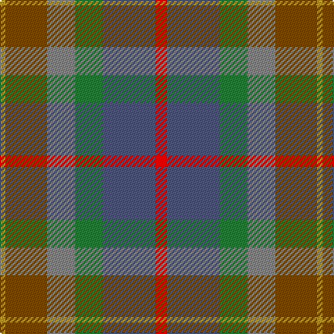

In pattern [RBGRGY](/patterns/rbgrgy/).

This was sourced from tartans-authority.  It is a [6 stripes tartan](/stripes/stripes6/).

Original link http://www.tartansauthority.com/tartan-ferret/display/7819/

## Attestations

This cloth appears in 2 source records; the oldest owns this page.

- November 2008 — Isle of Rona (District) (tartans-authority, [record](http://www.tartansauthority.com/tartan-ferret/display/7819/))
- undated — Isle of Rona (register-of-tartans, [record](https://www.tartanregister.gov.uk/tartanDetails.aspx?ref=5775))

## Thread count
DO/4 T30 Na20 G20 N38 R/8

## Palette
Each colour and its ΔE from the base-6 reference it is a variant of.

| Colour | Shade | Base | ΔE (OKLab) |
|---|---|---|---|
| DO | <code style="background-color:#B49830;">#B49830</code> `#B49830` | Y <code style="background-color:#F2BF00;">#F2BF00</code> | 0.15 |
| G | <code style="background-color:#307840;">#307840</code> `#307840` | G <code style="background-color:#006100;">#006100</code> | 0.09 |
| N | <code style="background-color:#505874;">#505874</code> `#505874` | B <code style="background-color:#2A418A;">#2A418A</code> | 0.10 |
| Na | <code style="background-color:#888888;">#888888</code> `#888888` | R <code style="background-color:#CC0000;">#CC0000</code> | 0.24 |
| R | <code style="background-color:#C80000;">#C80000</code> `#C80000` | R <code style="background-color:#CC0000;">#CC0000</code> | 0.01 |
| T | <code style="background-color:#744C00;">#744C00</code> `#744C00` | G <code style="background-color:#006100;">#006100</code> | 0.14 |

# Sample pattern

## Nearest tartans

The nearest existing variants by ΔTartan distance.

1. [Teallach (Personal)](/setts/s9/y4r24g19w3ga23b13g3ra13g3x2~b5c5c5c-g604000-ga5c6428-rb84c00-ra888888-we0e0e0-ybc8c00/) — ΔT 1.78
1. [Meath Irish County Tartan Tartan Number: 2269. Earliest known date: 1996 One of a series of Irish District tartans designed by Polly Wittering of the House of Edgar, with colours reminiscent of the Country with soft warm colours dominating. See products available Copyright © Blair Urquhart, Comrie, 2015](/setts/s12/y5b2r14g9ga8b3r3b3r3b3ga19ya3x2~b606884-g5c483c-ga385c59-rb45430-yc48800-yac4c4a4/) — ΔT 1.80
1. [Greyfriars](/setts/s11/b30r6g16ba8ga10ba14ga24y4g10ba3g28~b214ea9-ba513871-g4b3b19-ga304824-r7e1907-yda9135/) — ΔT 1.83
1. [Lawrence's Seven Pillars of Khaki](/setts/s9/g3b12g10b6g8ga6g8r23ra3x2~b5f749c-g767e52-ga008b00-rbe7832-rac8002c/) — ΔT 1.85
1. [Caledonian Maple (Fashion)](/setts/s7/r11g1r3ga7g7gb5ra3x4~g004c00-ga7c583c-gb583014-r8c0000-raa47c00/) — ΔT 1.89
1. [House of Bruar (Corporate)](/setts/s6/b6ba26bb28g26bb8ga3x2~b4c0000-ba4c3428-bb14283c-g006818-ga8c7038/) — ΔT 1.90
1. [Auld Scotland](/setts/s10/b2y12b3y3b12g12ba12ga12g1ya2x2~b60082c-ba5c5c5c-g5c6428-ga747c60-ya08858-yad8c888/) — ΔT 1.96
1. [Brocliande (Fashion))](/setts/s8/k3b11g15ga5g10gb14ga14y2x2~b2888c4-g5c6428-ga285800-gb003820-k101010-yd09800/) — ΔT 2.02
1. [Cairngorm #2](/setts/s7/b5ba4b22k15g22r4g4x2~b445464-ba607c88-g406454-k101010-r982c2c/) — ΔT 2.02
1. [Brocéliande (Restricted)](/setts/s8/k3g11ga15gb5ga10gc14gb14y2x2~g4f8e95-ga244528-gb0f3c2d-gc193a1d-k101010-yc4be6a/) — ΔT 2.06

## Neighbour map

Every grey dot is one of 15726 variants placed by the first two principal components of the ΔTartan feature space (44% of its variance). Red is this tartan; blue dots are its nearest — click one to open its page.

<svg viewBox="0 0 640 380" role="img" style="max-width:100%;height:auto;border:1px solid #e0e0e0;border-radius:4px;display:block" xmlns="http://www.w3.org/2000/svg"><image href="/nn/cloud.v1.png" width="640" height="380"/><a href="/setts/s9/y4r24g19w3ga23b13g3ra13g3x2~b5c5c5c-g604000-ga5c6428-rb84c00-ra888888-we0e0e0-ybc8c00/"><circle cx="125.4" cy="187.4" r="4" fill="#3465a4"><title>Teallach (Personal)</title></circle></a><a href="/setts/s12/y5b2r14g9ga8b3r3b3r3b3ga19ya3x2~b606884-g5c483c-ga385c59-rb45430-yc48800-yac4c4a4/"><circle cx="210.2" cy="179.6" r="4" fill="#3465a4"><title>Meath Irish County Tartan Tartan Number: 2269. Earliest known date: 1996 One of a series of Irish District tartans designed by Polly Wittering of the House of Edgar, with colours reminiscent of the Country with soft warm colours dominating. See products available Copyright © Blair Urquhart, Comrie, 2015</title></circle></a><a href="/setts/s11/b30r6g16ba8ga10ba14ga24y4g10ba3g28~b214ea9-ba513871-g4b3b19-ga304824-r7e1907-yda9135/"><circle cx="211.3" cy="213.2" r="4" fill="#3465a4"><title>Greyfriars</title></circle></a><a href="/setts/s9/g3b12g10b6g8ga6g8r23ra3x2~b5f749c-g767e52-ga008b00-rbe7832-rac8002c/"><circle cx="256.5" cy="244.2" r="4" fill="#3465a4"><title>Lawrence's Seven Pillars of Khaki</title></circle></a><a href="/setts/s7/r11g1r3ga7g7gb5ra3x4~g004c00-ga7c583c-gb583014-r8c0000-raa47c00/"><circle cx="241.4" cy="238.2" r="4" fill="#3465a4"><title>Caledonian Maple (Fashion)</title></circle></a><a href="/setts/s6/b6ba26bb28g26bb8ga3x2~b4c0000-ba4c3428-bb14283c-g006818-ga8c7038/"><circle cx="249.8" cy="258.4" r="4" fill="#3465a4"><title>House of Bruar (Corporate)</title></circle></a><a href="/setts/s10/b2y12b3y3b12g12ba12ga12g1ya2x2~b60082c-ba5c5c5c-g5c6428-ga747c60-ya08858-yad8c888/"><circle cx="128.1" cy="176.9" r="4" fill="#3465a4"><title>Auld Scotland</title></circle></a><a href="/setts/s8/k3b11g15ga5g10gb14ga14y2x2~b2888c4-g5c6428-ga285800-gb003820-k101010-yd09800/"><circle cx="142.3" cy="236.1" r="4" fill="#3465a4"><title>Brocliande (Fashion))</title></circle></a><a href="/setts/s7/b5ba4b22k15g22r4g4x2~b445464-ba607c88-g406454-k101010-r982c2c/"><circle cx="216.4" cy="255.4" r="4" fill="#3465a4"><title>Cairngorm #2</title></circle></a><a href="/setts/s8/k3g11ga15gb5ga10gc14gb14y2x2~g4f8e95-ga244528-gb0f3c2d-gc193a1d-k101010-yc4be6a/"><circle cx="174.5" cy="255.2" r="4" fill="#3465a4"><title>Brocéliande (Restricted)</title></circle></a><circle cx="190.3" cy="237.3" r="5" fill="#c00000"/></svg>

ID: /setts/s6/r4b19g10ra10ga15y2x2~b505874-g307840-ga744c00-rc80000-ra888888-yb49830/
