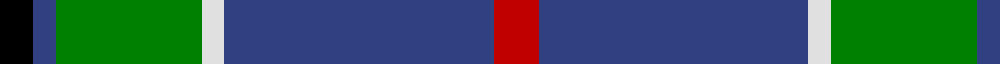

In pattern [KBGWBR](/patterns/kbgwbr/).

This was sourced from weddslist.  It is a [6 stripes tartan](/stripes/stripes6/).

Original link http://www.weddslist.com/cgi-bin/tartans/pg.pl?source=sts

## Thread count
K/12 B8 G52 LN8 B96 R/16

## Palette
Each colour and its ΔE from the base-6 reference it is a variant of.

| Colour | Shade | Base | ΔE (OKLab) |
|---|---|---|---|
| B | <code style="background-color:#304080;">#304080</code> `#304080` | B <code style="background-color:#2A418A;">#2A418A</code> | 0.02 |
| G | <code style="background-color:#008000;">#008000</code> `#008000` | G <code style="background-color:#006100;">#006100</code> | 0.10 |
| K | <code style="background-color:#000000;">#000000</code> `#000000` | K <code style="background-color:#000000;">#000000</code> | 0.00 |
| LN | <code style="background-color:#E0E0E0;">#E0E0E0</code> `#E0E0E0` | W <code style="background-color:#F7F7F7;">#F7F7F7</code> | 0.07 |
| R | <code style="background-color:#C00000;">#C00000</code> `#C00000` | R <code style="background-color:#CC0000;">#CC0000</code> | 0.03 |

# Sample pattern

## Nearest tartans

The nearest existing variants by ΔTartan distance.

1. [Carmichael](/setts/s6/k5g32b32r3b3y3~b2c2c80-g006818-k000000-rc80000-ye8c000~x2/) — ΔT 0.89
1. [Croy, Jake (Personal)](/setts/s8/b10k7w2wa2k27ba7w2ba7~b505050-ba1870a4-k1c1714-w82cffd-wae8ccb8~x2/) — ΔT 0.89
1. [Solberg-Bell (Personal)](/setts/s6/y8k2b20ba4w1k2~b003c64-ba5c8ca8-k101010-wffffff-ye0a126~x4/) — ΔT 0.93
1. [Reese (Personal)](/setts/s6/r4g2r2k5b22w2~b003c64-g006818-k101010-rc80000-we0e0e0~x4/) — ΔT 0.97
1. [Irving of Glentulchan Family Tartan Tartan Number: 1460. Earliest known date: 1987 Glentulchan is situated north of Perth on the river Almond. The sett combines elements of the Irvine and the Malcolm tartans. The design by John Irving, Glenalmond, was accredited by the Scottish Tartans Society in 1987. See products available Copyright © Blair Urquhart, Comrie, 2015](/setts/s6/r1g9b9k1b1w1~b2c2c80-g006818-k101010-rc80000-we0e0e0~x6/) — ΔT 0.97
1. [Pride of Yorkland (Fashion)](/setts/s6/g35k3b26k4ba4w3~b2c2c80-ba1c0070-g006818-k101010-wfcfcfc~x2/) — ΔT 0.99
1. [Vance (Family Association) Corporate Family Tartan Tartan Number: 2208. Earliest known date: December 1994 Designed and Copyrighted in the US by Mark W. Vance. Details from Vance Family Association website. See products available Copyright © Blair Urquhart, Comrie, 2015](/setts/s6/k4b24k2g13b2ka3~b2888c4-g006818-k000000-ka101010~x4/) — ΔT 1.02
1. [Asheville Firefighters, The](/setts/s6/k17g48y4r10w12g4~g004028-k101010-rc80000-wa8ace8-yffe600/) — ΔT 1.02
1. [New York State Troopers](/setts/s7/b6ba4b2w2b25k26y4~b575757-ba551a8b-k101010-wffffff-yd9d919~x2/) — ΔT 1.03
1. [Inglis Family Tartan Tartan Number: 1798. Earliest known date: 1930-50 Inglis, or Ingles, tartan is a variation of the MacIntyre tartan recognised by Lord Lyon. The green stripe of the MacIntyre is replaced by yellow in the Inglis tartan. The pattern comes from the collection of the late James MacKinlay which he called MacIntyre or Inglis. MacKinlay collected samples of tartan between 1930 and 1950 but did not provide details of the origins of the specimens. The original MacIntyre tartan can be seen on a doublet at the Kingussie museum dated 1800. It was registered in the Public Register of All Arms and Bearings in 1955. See products available Copyright © Blair Urquhart, Comrie, 2015](/setts/s6/w4g28b18r4b18y3~b2c2c80-g006818-rc80000-we0e0e0-ye8c000~x2/) — ΔT 1.04

## Neighbour map

Every grey dot is one of 15726 variants placed by the first two principal components of the ΔTartan feature space (44% of its variance). Red is this tartan; blue dots are its nearest — click one to open its page.

<svg viewBox="0 0 640 380" role="img" style="max-width:100%;height:auto;border:1px solid #e0e0e0;border-radius:4px;display:block" xmlns="http://www.w3.org/2000/svg"><image href="/nn/cloud.v1.png" width="640" height="380"/><a href="/setts/s6/k5g32b32r3b3y3~b2c2c80-g006818-k000000-rc80000-ye8c000~x2/"><circle cx="247.5" cy="186.4" r="4" fill="#3465a4"><title>Carmichael</title></circle></a><a href="/setts/s8/b10k7w2wa2k27ba7w2ba7~b505050-ba1870a4-k1c1714-w82cffd-wae8ccb8~x2/"><circle cx="264.0" cy="167.8" r="4" fill="#3465a4"><title>Croy, Jake (Personal)</title></circle></a><a href="/setts/s6/y8k2b20ba4w1k2~b003c64-ba5c8ca8-k101010-wffffff-ye0a126~x4/"><circle cx="278.2" cy="149.1" r="4" fill="#3465a4"><title>Solberg-Bell (Personal)</title></circle></a><a href="/setts/s6/r4g2r2k5b22w2~b003c64-g006818-k101010-rc80000-we0e0e0~x4/"><circle cx="319.9" cy="176.6" r="4" fill="#3465a4"><title>Reese (Personal)</title></circle></a><a href="/setts/s6/r1g9b9k1b1w1~b2c2c80-g006818-k101010-rc80000-we0e0e0~x6/"><circle cx="250.3" cy="194.5" r="4" fill="#3465a4"><title>Irving of Glentulchan Family Tartan Tartan Number: 1460. Earliest known date: 1987 Glentulchan is situated north of Perth on the river Almond. The sett combines elements of the Irvine and the Malcolm tartans. The design by John Irving, Glenalmond, was accredited by the Scottish Tartans Society in 1987. See products available Copyright © Blair Urquhart, Comrie, 2015</title></circle></a><a href="/setts/s6/g35k3b26k4ba4w3~b2c2c80-ba1c0070-g006818-k101010-wfcfcfc~x2/"><circle cx="249.3" cy="185.0" r="4" fill="#3465a4"><title>Pride of Yorkland (Fashion)</title></circle></a><a href="/setts/s6/k4b24k2g13b2ka3~b2888c4-g006818-k000000-ka101010~x4/"><circle cx="257.3" cy="178.0" r="4" fill="#3465a4"><title>Vance (Family Association) Corporate Family Tartan Tartan Number: 2208. Earliest known date: December 1994 Designed and Copyrighted in the US by Mark W. Vance. Details from Vance Family Association website. See products available Copyright © Blair Urquhart, Comrie, 2015</title></circle></a><a href="/setts/s6/k17g48y4r10w12g4~g004028-k101010-rc80000-wa8ace8-yffe600/"><circle cx="259.4" cy="178.9" r="4" fill="#3465a4"><title>Asheville Firefighters, The</title></circle></a><a href="/setts/s7/b6ba4b2w2b25k26y4~b575757-ba551a8b-k101010-wffffff-yd9d919~x2/"><circle cx="255.5" cy="167.0" r="4" fill="#3465a4"><title>New York State Troopers</title></circle></a><a href="/setts/s6/w4g28b18r4b18y3~b2c2c80-g006818-rc80000-we0e0e0-ye8c000~x2/"><circle cx="226.0" cy="208.0" r="4" fill="#3465a4"><title>Inglis Family Tartan Tartan Number: 1798. Earliest known date: 1930-50 Inglis, or Ingles, tartan is a variation of the MacIntyre tartan recognised by Lord Lyon. The green stripe of the MacIntyre is replaced by yellow in the Inglis tartan. The pattern comes from the collection of the late James MacKinlay which he called MacIntyre or Inglis. MacKinlay collected samples of tartan between 1930 and 1950 but did not provide details of the origins of the specimens. The original MacIntyre tartan can be seen on a doublet at the Kingussie museum dated 1800. It was registered in the Public Register of All Arms and Bearings in 1955. See products available Copyright © Blair Urquhart, Comrie, 2015</title></circle></a><circle cx="274.4" cy="178.3" r="5" fill="#c00000"/></svg>

ID: /setts/s6/r4b24w2g13b2k3~b304080-g008000-k000000-rc00000-we0e0e0~x4/
