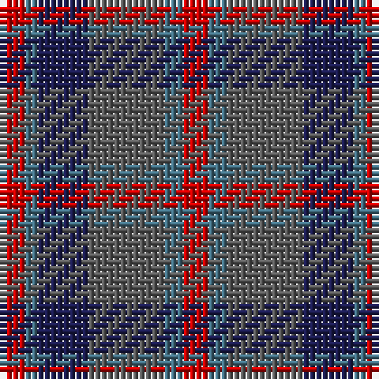

In pattern [RBBBBR](/patterns/rbbbbr/).

This was sourced from tartans-authority.  It is a [6 stripes tartan](/stripes/stripes6/).

Original link http://www.tartansauthority.com/tartan-ferret/display/8057/

## Thread count
R/4 B2 DB8 N12 B3 R/4

## Palette
Each colour and its ΔE from the base-6 reference it is a variant of.

| Colour | Shade | Base | ΔE (OKLab) |
|---|---|---|---|
| B | <code style="background-color:#447084;">#447084</code> `#447084` | B <code style="background-color:#2A418A;">#2A418A</code> | 0.15 |
| DB | <code style="background-color:#1C1C50;">#1C1C50</code> `#1C1C50` | B <code style="background-color:#2A418A;">#2A418A</code> | 0.14 |
| N | <code style="background-color:#5C5C5C;">#5C5C5C</code> `#5C5C5C` | B <code style="background-color:#2A418A;">#2A418A</code> | 0.15 |
| R | <code style="background-color:#C80000;">#C80000</code> `#C80000` | R <code style="background-color:#CC0000;">#CC0000</code> | 0.01 |

# Sample pattern

## Nearest tartans

The nearest existing variants by ΔTartan distance.

1. [Crook](/setts/s9/g4b12r3k3r3g16b2r14k4~b1870a4-g406054-k101010-ra00048~x2/) — ΔT 1.18
1. [Little's Chauffeur Drive](/setts/s6/b1ba8w1b4r8w1~b141e46-ba505050-r781c38-we0e0e0~x6/) — ΔT 1.21
1. [Orban-Prentice (Personal)](/setts/s7/g25b4r24b21ga25b4g3~b2c2c80-g285800-ga604000-rc80000~x2/) — ΔT 1.21
1. [Unamed Riding cloak 1745](/setts/s5/b1ba8r2g8r1~b3c82af-ba2c4084-g503c14-rdc0000~x2/) — ΔT 1.27
1. [St. Edmunds (School)](/setts/s6/r4b3ba11bb8b2r4~b1474b4-ba5c8ca8-bb2c2c80-rc80000/) — ΔT 1.33
1. [Dorward/Dogwood](/setts/s7/g7r3g9ga15b19g14r4~b2c2c80-g604000-ga006818-rc80000~x2/) — ΔT 1.34
1. [Callum (Buchan) (Name)](/setts/s5/b7r1ba6r8y1~b5c5c5c-ba344054-rc80000-ya0a0a0~x8/) — ΔT 1.35
1. [Edinburgh International Conference Centre, The](/setts/s6/g4b20g3k20r24b3~b14283c-g603800-k101010-r98481c~x2/) — ΔT 1.36
1. [Pople (Name)](/setts/s5/k1r9b8g8w1~b5c5c5c-g808080-k101010-r880000-we0e0e0~x2/) — ΔT 1.37
1. [Breon (Jersey Shore, Pennsylvania) (Personal)](/setts/s5/b25g25k6ba10r6~b5f749c-ba433a5a-g23321b-k1c1714-rb62531~x2/) — ΔT 1.41

## Neighbour map

Every grey dot is one of 15726 variants placed by the first two principal components of the ΔTartan feature space (44% of its variance). Red is this tartan; blue dots are its nearest — click one to open its page.

<svg viewBox="0 0 640 380" role="img" style="max-width:100%;height:auto;border:1px solid #e0e0e0;border-radius:4px;display:block" xmlns="http://www.w3.org/2000/svg"><image href="/nn/cloud.v1.png" width="640" height="380"/><a href="/setts/s9/g4b12r3k3r3g16b2r14k4~b1870a4-g406054-k101010-ra00048~x2/"><circle cx="199.4" cy="218.2" r="4" fill="#3465a4"><title>Crook</title></circle></a><a href="/setts/s6/b1ba8w1b4r8w1~b141e46-ba505050-r781c38-we0e0e0~x6/"><circle cx="206.4" cy="225.1" r="4" fill="#3465a4"><title>Little's Chauffeur Drive</title></circle></a><a href="/setts/s7/g25b4r24b21ga25b4g3~b2c2c80-g285800-ga604000-rc80000~x2/"><circle cx="168.6" cy="237.1" r="4" fill="#3465a4"><title>Orban-Prentice (Personal)</title></circle></a><a href="/setts/s5/b1ba8r2g8r1~b3c82af-ba2c4084-g503c14-rdc0000~x2/"><circle cx="272.4" cy="247.1" r="4" fill="#3465a4"><title>Unamed Riding cloak 1745</title></circle></a><a href="/setts/s6/r4b3ba11bb8b2r4~b1474b4-ba5c8ca8-bb2c2c80-rc80000/"><circle cx="155.4" cy="256.4" r="4" fill="#3465a4"><title>St. Edmunds (School)</title></circle></a><a href="/setts/s7/g7r3g9ga15b19g14r4~b2c2c80-g604000-ga006818-rc80000~x2/"><circle cx="228.1" cy="271.9" r="4" fill="#3465a4"><title>Dorward/Dogwood</title></circle></a><a href="/setts/s5/b7r1ba6r8y1~b5c5c5c-ba344054-rc80000-ya0a0a0~x8/"><circle cx="258.3" cy="257.1" r="4" fill="#3465a4"><title>Callum (Buchan) (Name)</title></circle></a><a href="/setts/s6/g4b20g3k20r24b3~b14283c-g603800-k101010-r98481c~x2/"><circle cx="215.8" cy="248.2" r="4" fill="#3465a4"><title>Edinburgh International Conference Centre, The</title></circle></a><a href="/setts/s5/k1r9b8g8w1~b5c5c5c-g808080-k101010-r880000-we0e0e0~x2/"><circle cx="200.0" cy="230.4" r="4" fill="#3465a4"><title>Pople (Name)</title></circle></a><a href="/setts/s5/b25g25k6ba10r6~b5f749c-ba433a5a-g23321b-k1c1714-rb62531~x2/"><circle cx="161.5" cy="273.6" r="4" fill="#3465a4"><title>Breon (Jersey Shore, Pennsylvania) (Personal)</title></circle></a><circle cx="196.0" cy="259.4" r="5" fill="#c00000"/></svg>

ID: /setts/s6/r4b3ba12bb8b2r4~b447084-ba5c5c5c-bb1c1c50-rc80000/
