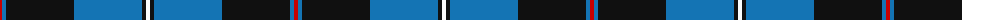

In pattern [RBKBKW](/patterns/rbkbkw/).

This was sourced from tartans-authority.  It is a [6 stripes tartan](/stripes/stripes6/).

Original link http://www.tartansauthority.com/tartan-ferret/display/6313/

## Thread count
R/4 B4 K68 B68 K4 W/4

## Palette
Each colour and its ΔE from the base-6 reference it is a variant of.

| Colour | Shade | Base | ΔE (OKLab) |
|---|---|---|---|
| B | <code style="background-color:#1474B4;">#1474B4</code> `#1474B4` | B <code style="background-color:#2A418A;">#2A418A</code> | 0.15 |
| K | <code style="background-color:#101010;">#101010</code> `#101010` | K <code style="background-color:#000000;">#000000</code> | 0.17 |
| R | <code style="background-color:#C80000;">#C80000</code> `#C80000` | R <code style="background-color:#CC0000;">#CC0000</code> | 0.01 |
| W | <code style="background-color:#FCFCFC;">#FCFCFC</code> `#FCFCFC` | W <code style="background-color:#F7F7F7;">#F7F7F7</code> | 0.01 |

# Sample pattern

## Nearest tartans

The nearest existing variants by ΔTartan distance.

1. [Home (Clan)](/setts/s8/k72r6k6r6k18b72g6b4-b1474b4-g289c18-k101010-rc80000/) — ΔT 0.83
1. [Bro-Spirit of Northmen (Corporate)](/setts/s5/r6k2b54k54w6-b1474b4-k101010-r880000-we0e0e0/) — ΔT 1.03
1. [Oakleigh (Corporate)](/setts/s6/b16k4b80k80y4k16-b1474b4-k101010-ye8c000/) — ΔT 1.10
1. [Wolverine Corporate Tartan Tartan Number: 10748. Earliest known date: 03/12/2012 Created by the designer to celebrate an exclusive group of work colleagues known affectionately as the 'Wolverines'. Many within this close group share a proud Scottish heritage and wished to acknowledge this strong affiliation by commissioning a tartan. Yes. The Wolverine tartan has been created for the exclusive use of the 'Wolverines'. No commercial use of this tartan is permitted without expressed permission from the designer, and any party wishing to use or reproduce this tartan should first seek permission by email from the designer. See products available Copyright © Blair Urquhart, Comrie, 2015](/setts/s6/y16k6b80ka24k6y6-b0c4ba8-k000000-ka101010-yaba712/) — ΔT 1.10
1. [Greenways Marketing Intl (Corporate)](/setts/s7/b48g6b6g6y4g36r4-b1c0070-g006818-r880000-yd09800/) — ΔT 1.10
1. [Sorbie](/setts/s10/k4b68k68b4r4b4k68b68k4w4-b1474b4-k101010-rc80000-wfcfcfc/) — ΔT 1.14
1. [Colvin](/setts/s8/b72w8b8w8b32g128r18b12-b00008c-g004c00-r8c0000-wc8c8c8/) — ΔT 1.16
1. [Ewbank](/setts/s9/r6b28y4k4b28k72y4k4y4-b1474b4-k101010-rc80000-ye8c000/) — ΔT 1.18
1. [MacRobart](/setts/s6/b144k42g32ba6g34ba6-b304080-ba5480b0-g008000-k000000/) — ΔT 1.18
1. [Micron](/setts/s6/k60b80y6b10w4b12-b1474b4-k101010-wfcfcfc-ye8c000/) — ΔT 1.20

## Neighbour map

Every grey dot is one of 15726 variants placed by the first two principal components of the ΔTartan feature space (44% of its variance). Red is this tartan; blue dots are its nearest — click one to open its page.

<svg viewBox="0 0 640 380" role="img" style="max-width:100%;height:auto;border:1px solid #e0e0e0;border-radius:4px;display:block" xmlns="http://www.w3.org/2000/svg"><image href="/nn/cloud.v1.png" width="640" height="380"/><a href="/setts/s8/k72r6k6r6k18b72g6b4-b1474b4-g289c18-k101010-rc80000/"><circle cx="314.6" cy="158.4" r="4" fill="#3465a4"><title>Home (Clan)</title></circle></a><a href="/setts/s5/r6k2b54k54w6-b1474b4-k101010-r880000-we0e0e0/"><circle cx="300.1" cy="172.3" r="4" fill="#3465a4"><title>Bro-Spirit of Northmen (Corporate)</title></circle></a><a href="/setts/s6/b16k4b80k80y4k16-b1474b4-k101010-ye8c000/"><circle cx="349.9" cy="197.9" r="4" fill="#3465a4"><title>Oakleigh (Corporate)</title></circle></a><a href="/setts/s6/y16k6b80ka24k6y6-b0c4ba8-k000000-ka101010-yaba712/"><circle cx="310.8" cy="178.8" r="4" fill="#3465a4"><title>Wolverine Corporate Tartan Tartan Number: 10748. Earliest known date: 03/12/2012 Created by the designer to celebrate an exclusive group of work colleagues known affectionately as the 'Wolverines'. Many within this close group share a proud Scottish heritage and wished to acknowledge this strong affiliation by commissioning a tartan. Yes. The Wolverine tartan has been created for the exclusive use of the 'Wolverines'. No commercial use of this tartan is permitted without expressed permission from the designer, and any party wishing to use or reproduce this tartan should first seek permission by email from the designer. See products available Copyright © Blair Urquhart, Comrie, 2015</title></circle></a><a href="/setts/s7/b48g6b6g6y4g36r4-b1c0070-g006818-r880000-yd09800/"><circle cx="308.6" cy="193.5" r="4" fill="#3465a4"><title>Greenways Marketing Intl (Corporate)</title></circle></a><a href="/setts/s10/k4b68k68b4r4b4k68b68k4w4-b1474b4-k101010-rc80000-wfcfcfc/"><circle cx="311.3" cy="161.5" r="4" fill="#3465a4"><title>Sorbie</title></circle></a><a href="/setts/s8/b72w8b8w8b32g128r18b12-b00008c-g004c00-r8c0000-wc8c8c8/"><circle cx="285.6" cy="173.5" r="4" fill="#3465a4"><title>Colvin</title></circle></a><a href="/setts/s9/r6b28y4k4b28k72y4k4y4-b1474b4-k101010-rc80000-ye8c000/"><circle cx="304.7" cy="141.9" r="4" fill="#3465a4"><title>Ewbank</title></circle></a><a href="/setts/s6/b144k42g32ba6g34ba6-b304080-ba5480b0-g008000-k000000/"><circle cx="323.8" cy="169.9" r="4" fill="#3465a4"><title>MacRobart</title></circle></a><a href="/setts/s6/k60b80y6b10w4b12-b1474b4-k101010-wfcfcfc-ye8c000/"><circle cx="352.2" cy="173.5" r="4" fill="#3465a4"><title>Micron</title></circle></a><circle cx="312.0" cy="170.7" r="5" fill="#c00000"/></svg>

ID: /setts/s6/r4b4k68b68k4w4-b1474b4-k101010-rc80000-wfcfcfc/
