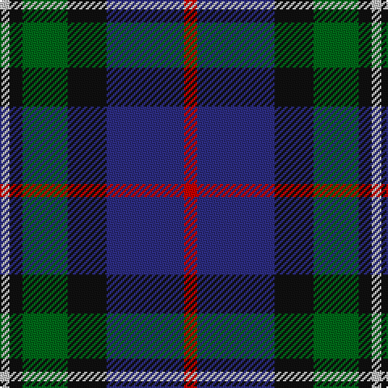

In pattern [RBKGKW](/stripes/rbkgkw/).

This was sourced from register-of-tartans.  It is a [6 stripe tartan](/stripes/stripes6/).

Original link https://www.tartanregister.gov.uk/tartanDetails.aspx?ref=2698

## Also known as

This cloth is also recorded under:

- MacPhail Hunting #2

## Attestations

This cloth appears in 2 source records; the oldest owns this page.

- 01/01/1880 — MacPhail Hunting #2 (register-of-tartans, [record](https://www.tartanregister.gov.uk/tartanDetails.aspx?ref=2698))
- 1880 — MacPhail Htg (tartans-authority, [record](http://www.tartansauthority.com/tartan-ferret/display/2158/))

## Register references

External register numbers recorded for this tartan.

- Scottish Register of Tartans: [2698](https://www.tartanregister.gov.uk/tartanDetails.aspx?ref=2698)
- Scottish Tartans Authority (ITI): 2158
- Scottish Tartans World Register: 2158

## Thread count
R/8 DB48 K24 G28 K8 N/6

## Palette
Each colour and the base-6 reference it is a variant of.

| Colour | Shade | Base |
|---|---|---|
| DB | <code style="background-color:#2C2C80;">#2C2C80</code> `oklch(35.0% 0.138 276.6)` <small>#2C2C80</small> | B <code style="background-color:#2A418A;">#2A418A</code> |
| G | <code style="background-color:#006818;">#006818</code> `oklch(45.0% 0.142 145.0)` <small>#006818</small> | G <code style="background-color:#006100;">#006100</code> |
| K | <code style="background-color:#101010;">#101010</code> `oklch(17.3% 0.000 89.9)` <small>#101010</small> | K <code style="background-color:#000000;">#000000</code> |
| N | <code style="background-color:#C0C0C0;">#C0C0C0</code> `oklch(80.8% 0.000 89.9)` <small>#C0C0C0</small> | W <code style="background-color:#F7F7F7;">#F7F7F7</code> |
| R | <code style="background-color:#C80000;">#C80000</code> `oklch(52.3% 0.215 29.2)` <small>#C80000</small> | R <code style="background-color:#CC0000;">#CC0000</code> |

# Sample pattern

## Nearest tartans

The nearest existing variants by ΔTartan distance, with this tartan at the top so the swatches line up against it.

ΔTartan

Tartan

Sett

—

<a href="/ttd/edit/#slug=r4db24k12g14k4lb3~x2">MacPhail Hunting #2</a> <a class="nn-out" href="/setts/s6/r4db24k12g14k4lb3~x2/" title="open its dictionary page">↗</a>

0.64

<a href="/ttd/edit/#slug=db22w2k10g11r3g4~x2">Paterson Blue (Personal)</a> <a class="nn-out" href="/setts/s6/db22w2k10g11r3g4~x2/" title="open its dictionary page">↗</a>

0.64

<a href="/ttd/edit/#slug=k4t3dp11dg14w2~x2">Wellington No 229</a> <a class="nn-out" href="/setts/s5/k4t3dp11dg14w2~x2/" title="open its dictionary page">↗</a>

0.65

<a href="/ttd/edit/#slug=db15r6dg8k2w2k2~x6">Stovell (2015)</a> <a class="nn-out" href="/setts/s6/db15r6dg8k2w2k2~x6/" title="open its dictionary page">↗</a>

0.66

<a href="/ttd/edit/#slug=k4b21dy10y4k20r6b3~x2">Swankie (Personal)</a> <a class="nn-out" href="/setts/s7/k4b21dy10y4k20r6b3~x2/" title="open its dictionary page">↗</a>

0.66

<a href="/ttd/edit/#slug=g16lb3g3k10db12r2db3~x2">MacLean, Donald (Personal)</a> <a class="nn-out" href="/setts/s7/g16lb3g3k10db12r2db3~x2/" title="open its dictionary page">↗</a>

0.71

<a href="/ttd/edit/#slug=m5g20k13db42k13g20ly5~x2">Newmill</a> <a class="nn-out" href="/setts/s7/m5g20k13db42k13g20ly5~x2/" title="open its dictionary page">↗</a>

0.73

<a href="/ttd/edit/#slug=k4w1g10k10db10r2~x2">Rose Hunting Clan Tartan Tartan Number: 1226. Earliest known date: 1831 First recorded in James Logan's, 'The Scottish Gael' in 1831. See products available Copyright © Blair Urquhart, Comrie, 2015</a> <a class="nn-out" href="/setts/s6/k4w1g10k10db10r2~x2/" title="open its dictionary page">↗</a>

0.74

<a href="/ttd/edit/#slug=db31b4db5k19g20lo4~x2">Midlothian</a> <a class="nn-out" href="/setts/s6/db31b4db5k19g20lo4~x2/" title="open its dictionary page">↗</a>

0.74

<a href="/ttd/edit/#slug=k4w1g10k10db10r2~x4">Rose Hunting</a> <a class="nn-out" href="/setts/s6/k4w1g10k10db10r2~x4/" title="open its dictionary page">↗</a>

0.74

<a href="/ttd/edit/#slug=dg5db2dg9db19dr9ly2~x2">Lyle and Scott</a> <a class="nn-out" href="/setts/s6/dg5db2dg9db19dr9ly2~x2/" title="open its dictionary page">↗</a>

## Neighbour map

Every grey dot is one of 14299 variants placed by the first two principal components of the ΔTartan feature space (44% of its variance). Red is this tartan; blue dots are its nearest — click one to open its page.

<svg viewBox="0 0 640 380" role="img" style="max-width:100%;height:auto;border:1px solid #e0e0e0;border-radius:4px;display:block" xmlns="http://www.w3.org/2000/svg"><image href="/nn/cloud.v1.png" width="640" height="380"/><a href="/setts/s6/db22w2k10g11r3g4~x2/"><circle cx="204.0" cy="204.8" r="4" fill="#3465a4"><title>Paterson Blue (Personal)</title></circle></a><a href="/setts/s5/k4t3dp11dg14w2~x2/"><circle cx="173.1" cy="231.0" r="4" fill="#3465a4"><title>Wellington No 229</title></circle></a><a href="/setts/s6/db15r6dg8k2w2k2~x6/"><circle cx="182.2" cy="210.6" r="4" fill="#3465a4"><title>Stovell (2015)</title></circle></a><a href="/setts/s7/k4b21dy10y4k20r6b3~x2/"><circle cx="147.4" cy="213.4" r="4" fill="#3465a4"><title>Swankie (Personal)</title></circle></a><a href="/setts/s7/g16lb3g3k10db12r2db3~x2/"><circle cx="164.3" cy="215.2" r="4" fill="#3465a4"><title>MacLean, Donald (Personal)</title></circle></a><a href="/setts/s7/m5g20k13db42k13g20ly5~x2/"><circle cx="163.1" cy="220.7" r="4" fill="#3465a4"><title>Newmill</title></circle></a><a href="/setts/s6/k4w1g10k10db10r2~x2/"><circle cx="170.6" cy="225.3" r="4" fill="#3465a4"><title>Rose Hunting Clan Tartan Tartan Number: 1226. Earliest known date: 1831 First recorded in James Logan's, 'The Scottish Gael' in 1831. See products available Copyright © Blair Urquhart, Comrie, 2015</title></circle></a><a href="/setts/s6/db31b4db5k19g20lo4~x2/"><circle cx="191.1" cy="226.6" r="4" fill="#3465a4"><title>Midlothian</title></circle></a><a href="/setts/s6/k4w1g10k10db10r2~x4/"><circle cx="166.4" cy="223.2" r="4" fill="#3465a4"><title>Rose Hunting</title></circle></a><a href="/setts/s6/dg5db2dg9db19dr9ly2~x2/"><circle cx="202.9" cy="221.7" r="4" fill="#3465a4"><title>Lyle and Scott</title></circle></a><circle cx="172.5" cy="220.7" r="5" fill="#c00000"/></svg>

ID: /setts/s6/r4db24k12g14k4lb3~x2/
