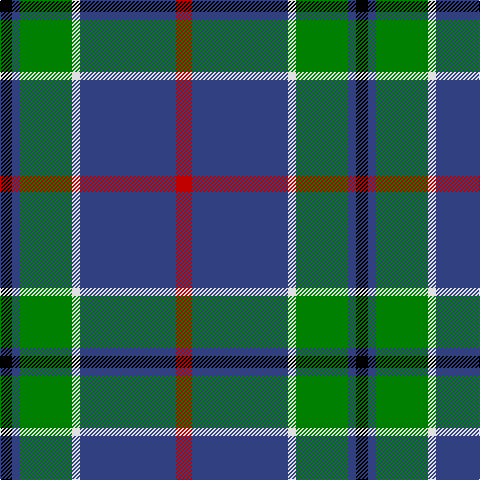

In pattern [KBGWBR](/stripes/kbgwbr/).

This was sourced from weddslist.  It is a [6 stripe tartan](/stripes/stripes6/).

Original link http://www.weddslist.com/cgi-bin/tartans/pg.pl?source=sts

## Thread count
R/16 B96 LN8 G52 B8 K/12

## Palette
Each colour and the base-6 reference it is a variant of.

| Colour | Shade | Base |
|---|---|---|
| B | <code style="background-color:#304080;">#304080</code> `oklch(39.4% 0.109 270.2)` <small>#304080</small> | B <code style="background-color:#2A418A;">#2A418A</code> |
| G | <code style="background-color:#008000;">#008000</code> `oklch(52.0% 0.177 142.5)` <small>#008000</small> | G <code style="background-color:#006100;">#006100</code> |
| K | <code style="background-color:#000000;">#000000</code> `oklch(0.0% 0.000 0.0)` <small>#000000</small> | K <code style="background-color:#000000;">#000000</code> |
| LN | <code style="background-color:#E0E0E0;">#E0E0E0</code> `oklch(90.7% 0.000 89.9)` <small>#E0E0E0</small> | W <code style="background-color:#F7F7F7;">#F7F7F7</code> |
| R | <code style="background-color:#C00000;">#C00000</code> `oklch(50.7% 0.208 29.2)` <small>#C00000</small> | R <code style="background-color:#CC0000;">#CC0000</code> |

# Sample pattern

## Nearest tartans

The nearest existing variants by ΔTartan distance.

1. [Carmichael](/setts/s6/k5g32db32r3db3ly3~x2/) — ΔT 0.89
1. [Croy, Jake (Personal)](/setts/s8/n10k7lt2lb2k27b7lt2b7~x2/) — ΔT 0.89
1. [Solberg-Bell (Personal)](/setts/s6/lo8k2dt20t4w1k2~x4/) — ΔT 0.93
1. [Reese (Personal)](/setts/s6/r4g2r2k5dt22w2~x4/) — ΔT 0.97
1. [Pride of Yorkland (Fashion)](/setts/s6/g35k3db26k4db4w3~x2/) — ΔT 0.99
1. [Asheville Firefighters, The](/setts/s6/k17dg48ly4r10lb12dg4/) — ΔT 1.02
1. [Vance (Family Association) Corporate Family Tartan Tartan Number: 2208. Earliest known date: December 1994 Designed and Copyrighted in the US by Mark W. Vance. Details from Vance Family Association website. See products available Copyright © Blair Urquhart, Comrie, 2015](/setts/s6/k4t24k2g13t2k3~x4/) — ΔT 1.02
1. [New York State Troopers](/setts/s7/n6dp4n2w2n25k26ly4~x2/) — ΔT 1.03
1. [MacIntyre, Inglis](/setts/s6/w4g28db18r4db18ly3~x2/) — ΔT 1.05
1. [Lee (Personal)](/setts/s7/dg2k1dg12r4dg3db9lb2~x4/) — ΔT 1.07

## Neighbour map

Every grey dot is one of 14299 variants placed by the first two principal components of the ΔTartan feature space (44% of its variance). Red is this tartan; blue dots are its nearest — click one to open its page.

<svg viewBox="0 0 640 380" role="img" style="max-width:100%;height:auto;border:1px solid #e0e0e0;border-radius:4px;display:block" xmlns="http://www.w3.org/2000/svg"><image href="/nn/cloud.v1.png" width="640" height="380"/><a href="/setts/s6/k5g32db32r3db3ly3~x2/"><circle cx="250.9" cy="188.4" r="4" fill="#3465a4"><title>Carmichael</title></circle></a><a href="/setts/s8/n10k7lt2lb2k27b7lt2b7~x2/"><circle cx="267.0" cy="169.1" r="4" fill="#3465a4"><title>Croy, Jake (Personal)</title></circle></a><a href="/setts/s6/lo8k2dt20t4w1k2~x4/"><circle cx="281.0" cy="148.0" r="4" fill="#3465a4"><title>Solberg-Bell (Personal)</title></circle></a><a href="/setts/s6/r4g2r2k5dt22w2~x4/"><circle cx="322.4" cy="176.9" r="4" fill="#3465a4"><title>Reese (Personal)</title></circle></a><a href="/setts/s6/g35k3db26k4db4w3~x2/"><circle cx="252.7" cy="188.1" r="4" fill="#3465a4"><title>Pride of Yorkland (Fashion)</title></circle></a><a href="/setts/s6/k17dg48ly4r10lb12dg4/"><circle cx="262.0" cy="178.0" r="4" fill="#3465a4"><title>Asheville Firefighters, The</title></circle></a><a href="/setts/s6/k4t24k2g13t2k3~x4/"><circle cx="261.1" cy="178.2" r="4" fill="#3465a4"><title>Vance (Family Association) Corporate Family Tartan Tartan Number: 2208. Earliest known date: December 1994 Designed and Copyrighted in the US by Mark W. Vance. Details from Vance Family Association website. See products available Copyright © Blair Urquhart, Comrie, 2015</title></circle></a><a href="/setts/s7/n6dp4n2w2n25k26ly4~x2/"><circle cx="258.2" cy="167.0" r="4" fill="#3465a4"><title>New York State Troopers</title></circle></a><a href="/setts/s6/w4g28db18r4db18ly3~x2/"><circle cx="224.0" cy="206.3" r="4" fill="#3465a4"><title>MacIntyre, Inglis</title></circle></a><a href="/setts/s7/dg2k1dg12r4dg3db9lb2~x4/"><circle cx="248.5" cy="194.8" r="4" fill="#3465a4"><title>Lee (Personal)</title></circle></a><circle cx="277.3" cy="178.6" r="5" fill="#c00000"/></svg>

ID: /setts/s6/r4db24w2g13db2k3~x4/
