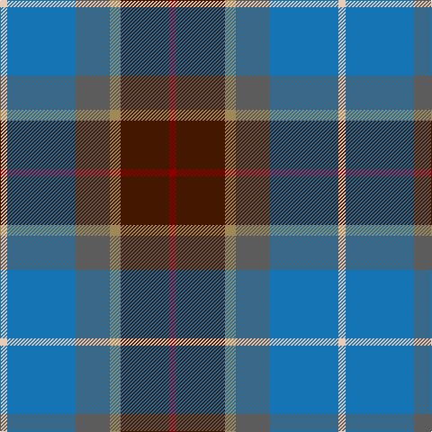

**Bands:** [RBYBBW](/stripes/rbybbw/) · **Stripes:** [R DO LO N B LB](/stripes/stripes6/) R DO LO N B LB

This was sourced from tartans-authority.  It is a [6 band tartan](/bands/bands6/).

Original link http://www.tartansauthority.com/tartan-ferret/display/8636/

## Thread count
LR/8 B76 N38 LT12 DR54 DRa/8

## Palette
Each colour and its ΔE from the base-6 reference it is a variant of.

| Colour | Shade | Base | ΔE (OKLab) |
|---|---|---|---|
| B | <code style="background-color:#1474B4;">#1474B4</code> `#1474B4` | B <code style="background-color:#2A418A;">#2A418A</code> | 0.15 |
| DR | <code style="background-color:#441800;">#441800</code> `#441800` | B <code style="background-color:#2A418A;">#2A418A</code> | 0.23 |
| DRa | <code style="background-color:#880000;">#880000</code> `#880000` | R <code style="background-color:#CC0000;">#CC0000</code> | 0.15 |
| LR | <code style="background-color:#E8CCB8;">#E8CCB8</code> `#E8CCB8` | W <code style="background-color:#F7F7F7;">#F7F7F7</code> | 0.12 |
| LT | <code style="background-color:#A08858;">#A08858</code> `#A08858` | Y <code style="background-color:#F2BF00;">#F2BF00</code> | 0.21 |
| N | <code style="background-color:#5C5C5C;">#5C5C5C</code> `#5C5C5C` | B <code style="background-color:#2A418A;">#2A418A</code> | 0.15 |

# Sample pattern

## Nearest tartans

The nearest existing variants by ΔTartan distance.

1. [McHale, Barry](/setts/s6/t15k10dt30o11w3lg5~x2/) — ΔT 0.85
1. [Allman-Jones (Personal)](/setts/s7/r3w2y7n25k8y15dg2~x2/) — ΔT 0.92
1. [Allman-Jones (Personal)](/setts/s7/r3w2o7n25k8o15dg2~x2/) — ΔT 0.97
1. [Glen Lyon (Fashion)](/setts/s7/o3db1o11w1k5n14lo3~x4/) — ΔT 0.98
1. [Atlantic Ancient Trade Tartan Tartan Number: 1781. Earliest known date: 1968 Also known as Murray of Atholl, it has been authorized by Ian Murray, Duke of Atholl. See products available Copyright © Blair Urquhart, Comrie, 2015](/setts/s6/w3db17dy16db2dg17ly2~x2/) — ΔT 1.06
1. [Balfour](/setts/s6/db30ly3dy11ly3y33r6~x2/) — ΔT 1.07
1. [Atlantic, Ancient](/setts/s6/w3db17o16db2dg17ly2~x2/) — ΔT 1.08
1. [Newmill](/setts/s7/r1o5dt3dt11dt3o5lo1~x8/) — ΔT 1.08
1. [Porteous Family Tartan Tartan Number: 1264. Earliest known date: 1978 Designed for the Porteous Family Association, and submitted to the Monitoring Committee of the Scottish Tartan Society by Captain Barry Porteous who was president of the association at that time. See products available Copyright © Blair Urquhart, Comrie, 2015](/setts/s6/k1ly1db8g10db7w1~x2/) — ΔT 1.08
1. [Renfrewshire District Tartan Tartan Number: 2560. Earliest known date: 1998 Designed for anyone residing in the County of Renfrewshire See products available Copyright © Blair Urquhart, Comrie, 2015](/setts/s7/m4db2t7db20k7g10ly4~x2/) — ΔT 1.11

## Neighbour map

Every grey dot is one of 14299 variants placed by the first two principal components of the ΔTartan feature space (44% of its variance). Red is this tartan; blue dots are its nearest — click one to open its page.

<svg viewBox="0 0 640 380" role="img" style="max-width:100%;height:auto;border:1px solid #e0e0e0;border-radius:4px;display:block" xmlns="http://www.w3.org/2000/svg"><image href="/nn/cloud.v1.png" width="640" height="380"/><a href="/setts/s6/t15k10dt30o11w3lg5~x2/"><circle cx="154.6" cy="192.7" r="4" fill="#3465a4"><title>McHale, Barry</title></circle></a><a href="/setts/s7/r3w2y7n25k8y15dg2~x2/"><circle cx="214.2" cy="174.1" r="4" fill="#3465a4"><title>Allman-Jones (Personal)</title></circle></a><a href="/setts/s7/r3w2o7n25k8o15dg2~x2/"><circle cx="206.2" cy="168.1" r="4" fill="#3465a4"><title>Allman-Jones (Personal)</title></circle></a><a href="/setts/s7/o3db1o11w1k5n14lo3~x4/"><circle cx="181.5" cy="164.0" r="4" fill="#3465a4"><title>Glen Lyon (Fashion)</title></circle></a><a href="/setts/s6/w3db17dy16db2dg17ly2~x2/"><circle cx="132.5" cy="206.4" r="4" fill="#3465a4"><title>Atlantic Ancient Trade Tartan Tartan Number: 1781. Earliest known date: 1968 Also known as Murray of Atholl, it has been authorized by Ian Murray, Duke of Atholl. See products available Copyright © Blair Urquhart, Comrie, 2015</title></circle></a><a href="/setts/s6/db30ly3dy11ly3y33r6~x2/"><circle cx="214.3" cy="196.8" r="4" fill="#3465a4"><title>Balfour</title></circle></a><a href="/setts/s6/w3db17o16db2dg17ly2~x2/"><circle cx="119.6" cy="197.7" r="4" fill="#3465a4"><title>Atlantic, Ancient</title></circle></a><a href="/setts/s7/r1o5dt3dt11dt3o5lo1~x8/"><circle cx="206.0" cy="208.4" r="4" fill="#3465a4"><title>Newmill</title></circle></a><a href="/setts/s6/k1ly1db8g10db7w1~x2/"><circle cx="165.0" cy="201.5" r="4" fill="#3465a4"><title>Porteous Family Tartan Tartan Number: 1264. Earliest known date: 1978 Designed for the Porteous Family Association, and submitted to the Monitoring Committee of the Scottish Tartan Society by Captain Barry Porteous who was president of the association at that time. See products available Copyright © Blair Urquhart, Comrie, 2015</title></circle></a><a href="/setts/s7/m4db2t7db20k7g10ly4~x2/"><circle cx="139.2" cy="183.8" r="4" fill="#3465a4"><title>Renfrewshire District Tartan Tartan Number: 2560. Earliest known date: 1998 Designed for anyone residing in the County of Renfrewshire See products available Copyright © Blair Urquhart, Comrie, 2015</title></circle></a><circle cx="173.8" cy="195.4" r="5" fill="#c00000"/></svg>

ID: /setts/s6/r4do27lo6n19b38lb4~x2/
