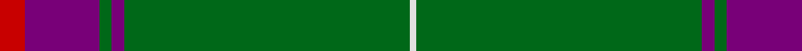

In pattern [RBGBGW](/stripes/rbgbgw/).

This was sourced from tartans-authority.  It is a [6 stripe tartan](/stripes/stripes6/).

Original link http://www.tartansauthority.com/tartan-ferret/display/2535/

## Thread count
R/8 P24 G4 P4 G92 LN/2

## Palette
Each colour and its ΔE from the base-6 reference it is a variant of.

| Colour | Shade | Base | ΔE (OKLab) |
|---|---|---|---|
| G | <code style="background-color:#006818;">#006818</code> `#006818` | G <code style="background-color:#006100;">#006100</code> | 0.02 |
| LN | <code style="background-color:#E0E0E0;">#E0E0E0</code> `#E0E0E0` | W <code style="background-color:#F7F7F7;">#F7F7F7</code> | 0.07 |
| P | <code style="background-color:#780078;">#780078</code> `#780078` | B <code style="background-color:#2A418A;">#2A418A</code> | 0.17 |
| R | <code style="background-color:#C80000;">#C80000</code> `#C80000` | R <code style="background-color:#CC0000;">#CC0000</code> | 0.01 |

# Sample pattern

## Nearest tartans

The nearest existing variants by ΔTartan distance.

1. [Inman (2016)](/setts/s7/r2dg24k2dg12lo6k1r2~x2/) — ΔT 1.40
1. [Masai Shuka 10 (Artefact)](/setts/s6/g53w1r20k1w2r7~x2/) — ΔT 1.41
1. [Crail](/setts/s7/n140k3w16k3do16k3do16/) — ΔT 1.47
1. [Semper](/setts/s8/g16dg1lg4dg41lg1dg6g2dg2~x2/) — ΔT 1.47
1. [Kenspeckle](/setts/s5/g50r1r20k2w1~x2/) — ΔT 1.48
1. [Glenfeshie (Personal)](/setts/s9/r4g3dp3g44dp16g10w2g2dp2~x2/) — ΔT 1.48
1. [MTV](/setts/s7/r5k3r9dg56t4dg2w3/) — ΔT 1.50
1. [Brooks Brothers Signature Corporate Tartan Tartan Number: 10652. Earliest known date: 01/05/2012 Brooks Brothers' Scottish roots originate in Perthshire's Glen Lyon. Thomas Lyon emigrated from Glen Lyon to the USA in the 1600s. It was his granddaughter, Lavinia, who married Henry Sands Brooks, founder of the Brooks empire. Brooks opened his first store in Cherry Street, New York in 1818. This simple and elegant tartan contains elements of the traditional 1819 Campbell tartan (the major clan in Glen Lyon) and incorporates the gold from the Brooks Brothers famous Golden Fleece logo and their equally famous necktie design, No. 1 stripe. See products available Copyright © Blair Urquhart, Comrie, 2015](/setts/s9/dt5ly1g7r1dt45r5ly3dt4ly3~x2/) — ΔT 1.51
1. [Hastings-Stephenson (Personal)](/setts/s8/g44db11g5t3g4db8g4w1~x2/) — ΔT 1.51
1. [Isle of Raasay](/setts/s5/dg60ly16m8t2o3~x2/) — ΔT 1.53

## Neighbour map

Every grey dot is one of 14299 variants placed by the first two principal components of the ΔTartan feature space (44% of its variance). Red is this tartan; blue dots are its nearest — click one to open its page.

<svg viewBox="0 0 640 380" role="img" style="max-width:100%;height:auto;border:1px solid #e0e0e0;border-radius:4px;display:block" xmlns="http://www.w3.org/2000/svg"><image href="/nn/cloud.v1.png" width="640" height="380"/><a href="/setts/s7/r2dg24k2dg12lo6k1r2~x2/"><circle cx="472.7" cy="171.7" r="4" fill="#3465a4"><title>Inman (2016)</title></circle></a><a href="/setts/s6/g53w1r20k1w2r7~x2/"><circle cx="462.1" cy="130.0" r="4" fill="#3465a4"><title>Masai Shuka 10 (Artefact)</title></circle></a><a href="/setts/s7/n140k3w16k3do16k3do16/"><circle cx="502.6" cy="111.6" r="4" fill="#3465a4"><title>Crail</title></circle></a><a href="/setts/s8/g16dg1lg4dg41lg1dg6g2dg2~x2/"><circle cx="503.7" cy="153.1" r="4" fill="#3465a4"><title>Semper</title></circle></a><a href="/setts/s5/g50r1r20k2w1~x2/"><circle cx="498.8" cy="147.5" r="4" fill="#3465a4"><title>Kenspeckle</title></circle></a><a href="/setts/s9/r4g3dp3g44dp16g10w2g2dp2~x2/"><circle cx="449.9" cy="147.7" r="4" fill="#3465a4"><title>Glenfeshie (Personal)</title></circle></a><a href="/setts/s7/r5k3r9dg56t4dg2w3/"><circle cx="470.9" cy="131.9" r="4" fill="#3465a4"><title>MTV</title></circle></a><a href="/setts/s9/dt5ly1g7r1dt45r5ly3dt4ly3~x2/"><circle cx="508.0" cy="114.1" r="4" fill="#3465a4"><title>Brooks Brothers Signature Corporate Tartan Tartan Number: 10652. Earliest known date: 01/05/2012 Brooks Brothers' Scottish roots originate in Perthshire's Glen Lyon. Thomas Lyon emigrated from Glen Lyon to the USA in the 1600s. It was his granddaughter, Lavinia, who married Henry Sands Brooks, founder of the Brooks empire. Brooks opened his first store in Cherry Street, New York in 1818. This simple and elegant tartan contains elements of the traditional 1819 Campbell tartan (the major clan in Glen Lyon) and incorporates the gold from the Brooks Brothers famous Golden Fleece logo and their equally famous necktie design, No. 1 stripe. See products available Copyright © Blair Urquhart, Comrie, 2015</title></circle></a><a href="/setts/s8/g44db11g5t3g4db8g4w1~x2/"><circle cx="502.3" cy="146.5" r="4" fill="#3465a4"><title>Hastings-Stephenson (Personal)</title></circle></a><a href="/setts/s5/dg60ly16m8t2o3~x2/"><circle cx="425.1" cy="151.6" r="4" fill="#3465a4"><title>Isle of Raasay</title></circle></a><circle cx="518.5" cy="140.9" r="5" fill="#c00000"/></svg>

ID: /setts/s6/r4dp12g2dp2g46w1~x2/
