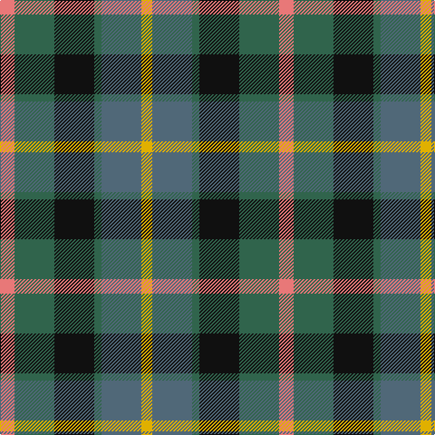

In pattern [RGKGBY](/stripes/rgkgby/).

This was sourced from tartans-authority.  It is a [6 stripe tartan](/stripes/stripes6/).

Original link http://www.tartansauthority.com/tartan-ferret/display/2146/

## Thread count
LR/16 G44 K44 G8 N44 Y/12

## Palette
Each colour and the base-6 reference it is a variant of.

| Colour | Shade | Base |
|---|---|---|
| G | <code style="background-color:#30644C;">#30644C</code> `oklch(46.0% 0.069 161.9)` <small>#30644C</small> | G <code style="background-color:#006100;">#006100</code> |
| K | <code style="background-color:#101010;">#101010</code> `oklch(17.3% 0.000 89.9)` <small>#101010</small> | K <code style="background-color:#000000;">#000000</code> |
| LR | <code style="background-color:#E87878;">#E87878</code> `oklch(70.0% 0.139 21.2)` <small>#E87878</small> | R <code style="background-color:#CC0000;">#CC0000</code> |
| N | <code style="background-color:#506878;">#506878</code> `oklch(50.4% 0.038 237.7)` <small>#506878</small> | B <code style="background-color:#2A418A;">#2A418A</code> |
| Y | <code style="background-color:#E0B000;">#E0B000</code> `oklch(77.9% 0.159 88.8)` <small>#E0B000</small> | Y <code style="background-color:#F2BF00;">#F2BF00</code> |

# Sample pattern

## Nearest tartans

The nearest existing variants by ΔTartan distance, with this tartan at the top so the swatches line up against it.

ΔTartan

Tartan

Sett

—

<a href="/ttd/edit/#slug=r4g11k11g2n11ly3~x4">Casely (Name)</a> <a class="nn-out" href="/setts/s6/r4g11k11g2n11ly3~x4/" title="open its dictionary page">↗</a>

0.71

<a href="/ttd/edit/#slug=g15dg18dt23w4r8~x2">Friebe (2014)</a> <a class="nn-out" href="/setts/s5/g15dg18dt23w4r8~x2/" title="open its dictionary page">↗</a>

0.88

<a href="/ttd/edit/#slug=g15dg18db23w4r8~x2">Friebe (2014)</a> <a class="nn-out" href="/setts/s5/g15dg18db23w4r8~x2/" title="open its dictionary page">↗</a>

0.91

<a href="/ttd/edit/#slug=k4g16k14lo3n16r4~x2">Birse</a> <a class="nn-out" href="/setts/s6/k4g16k14lo3n16r4~x2/" title="open its dictionary page">↗</a>

0.95

<a href="/ttd/edit/#slug=k6t2db12g8r5k2g3~x4">Cooke (Personal)</a> <a class="nn-out" href="/setts/s7/k6t2db12g8r5k2g3~x4/" title="open its dictionary page">↗</a>

0.97

<a href="/ttd/edit/#slug=dp2g6k2db6k1r2~x4">MacCaughan, or MacEachain</a> <a class="nn-out" href="/setts/s6/dp2g6k2db6k1r2~x4/" title="open its dictionary page">↗</a>

1.01

<a href="/ttd/edit/#slug=g4n12lo2k10y10lo3y2~x2">Rothesay</a> <a class="nn-out" href="/setts/s7/g4n12lo2k10y10lo3y2~x2/" title="open its dictionary page">↗</a>

1.02

<a href="/ttd/edit/#slug=dp11y2k10g10lo2~x2">Selkirk (Name)</a> <a class="nn-out" href="/setts/s5/dp11y2k10g10lo2~x2/" title="open its dictionary page">↗</a>

1.03

<a href="/ttd/edit/#slug=r10db6g24db24r6ly3">Canine All Dogs (Fashion)</a> <a class="nn-out" href="/setts/s6/r10db6g24db24r6ly3/" title="open its dictionary page">↗</a>

1.07

<a href="/setts/s8/dp11y2k10g10lo2~x2/">Selkirk (Personal) Original</a>

1.08

<a href="/ttd/edit/#slug=dp11t2k10g10ly3~x2">Nobiliary Fraternity</a> <a class="nn-out" href="/setts/s5/dp11t2k10g10ly3~x2/" title="open its dictionary page">↗</a>

## Neighbour map

Every grey dot is one of 14299 variants placed by the first two principal components of the ΔTartan feature space (44% of its variance). Red is this tartan; blue dots are its nearest — click one to open its page.

<svg viewBox="0 0 640 380" role="img" style="max-width:100%;height:auto;border:1px solid #e0e0e0;border-radius:4px;display:block" xmlns="http://www.w3.org/2000/svg"><image href="/nn/cloud.v1.png" width="640" height="380"/><a href="/setts/s5/g15dg18dt23w4r8~x2/"><circle cx="104.3" cy="261.1" r="4" fill="#3465a4"><title>Friebe (2014)</title></circle></a><a href="/setts/s5/g15dg18db23w4r8~x2/"><circle cx="91.2" cy="249.9" r="4" fill="#3465a4"><title>Friebe (2014)</title></circle></a><a href="/setts/s6/k4g16k14lo3n16r4~x2/"><circle cx="127.2" cy="254.5" r="4" fill="#3465a4"><title>Birse</title></circle></a><a href="/setts/s7/k6t2db12g8r5k2g3~x4/"><circle cx="114.2" cy="235.2" r="4" fill="#3465a4"><title>Cooke (Personal)</title></circle></a><a href="/setts/s6/dp2g6k2db6k1r2~x4/"><circle cx="94.2" cy="225.7" r="4" fill="#3465a4"><title>MacCaughan, or MacEachain</title></circle></a><a href="/setts/s7/g4n12lo2k10y10lo3y2~x2/"><circle cx="104.8" cy="228.7" r="4" fill="#3465a4"><title>Rothesay</title></circle></a><a href="/setts/s5/dp11y2k10g10lo2~x2/"><circle cx="111.8" cy="246.7" r="4" fill="#3465a4"><title>Selkirk (Name)</title></circle></a><a href="/setts/s6/r10db6g24db24r6ly3/"><circle cx="142.2" cy="214.1" r="4" fill="#3465a4"><title>Canine All Dogs (Fashion)</title></circle></a><a href="/setts/s8/dp11y2k10g10lo2~x2/"><circle cx="119.0" cy="236.2" r="4" fill="#3465a4"><title>Selkirk (Personal) Original</title></circle></a><a href="/setts/s5/dp11t2k10g10ly3~x2/"><circle cx="88.0" cy="245.8" r="4" fill="#3465a4"><title>Nobiliary Fraternity</title></circle></a><circle cx="98.5" cy="243.1" r="5" fill="#c00000"/></svg>

ID: /setts/s6/r4g11k11g2n11ly3~x4/
